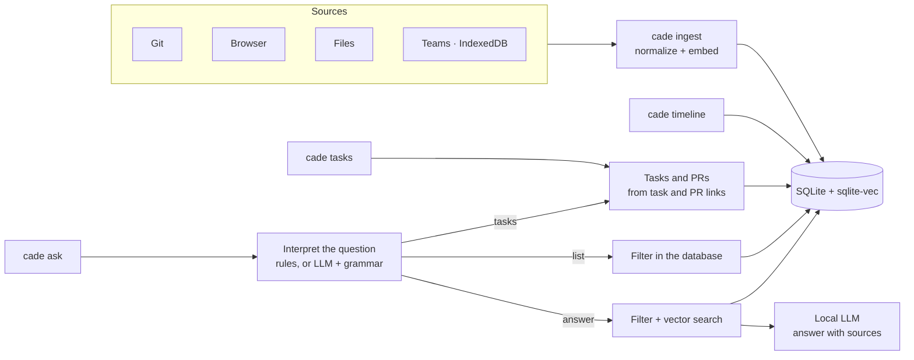

# cade

[](https://github.com/Chipskein/cade/actions/workflows/ci.yml)
[](https://github.com/Chipskein/cade/actions/workflows/ci.yml)

**English** · [Português](README.pt-BR.md)

Personal history CLI. Ingests git commits, browser history, files and Microsoft Teams messages, and lets you query them by date or with natural-language questions.

Everything runs locally: SQLite + sqlite-vec for storage and vector search, llama.cpp embedded for embeddings and generation. No server, no network calls. What is stored, where, and how to delete it: [PRIVACY.md](PRIVACY.md).

## Contents

- [How it works](#how-it-works)
- [Models](#models) and [hardware](#hardware)
- [Install](#install)
- [Usage](#usage)
  - [Questions (`ask`)](#questions-ask) and [periods](#periods)
- [Sample output](#sample-output)
- [Tasks](#tasks)
- [Browsers](#browsers)
- [Teams](#teams)
- [Configuration](#configuration)
- [Tests](#tests)
- [Privacy](PRIVACY.md)
- [Benchmarks with charts](docs/BENCHMARKS.md) (Portuguese)
- [Changelog](CHANGELOG.md): migrations and what each one rewrites
- [Roadmap](docs/ROADMAP.md) (Portuguese)

> **Language:** questions can be asked in English or Portuguese ("what did Ana send me yesterday?", "o que a Ana me passou ontem?") and are answered in the same language. The interface (help, labels, progress, errors) follows the locale (`LC_ALL`, `LC_MESSAGES`, `LANG`: Portuguese for `pt*`, English otherwise), or `ui.language` in the config (`auto`, `pt`, `en`); the answer to `ask` follows the language of the question. The samples below are in Portuguese; `ask --json` codes (`"mode": "listar"`) are the same in both languages. Numeric dates in questions follow `ui.date_order`: by default month first under `en_US` (`12/08` is December 8) and day first under every other locale (12 August); output dates are always `YYYY-MM-DD`. The period words each language accepts are in [Periods](#periods).

## How it works



What ingestion and search do with the history:

- **Deduplication:** running `ingest` again skips what is stored and replaces what changed at the source (an edited Teams message). Identical text is embedded once and its vectors reused. A file is one event, its earlier versions kept as dates and sizes. In answers, repeats count once: 12 visits to a page become one source, "(12 visitas, última em …)".
- **Chunks:** text longer than ~1,200 characters is split into chunks (the embedding model reads 512 tokens), each with its own vector, so the answer at the end of a long note is found; the source line says which chunk matched.
- **Hybrid search:** a question is matched by meaning (vectors, sqlite-vec) and by words (SQLite FTS5), and the two rankings are fused; identifiers such as `PROJ-481` or a commit hash are found by the words.
- **Git authorship:** each commit is marked as yours or someone else's (`sources.git_identities`). The timeline, first-person questions and task reports show only yours.

## Models

| Use | Model | Size | License |
|---|---|---|---|
| Embeddings | [nomic-embed-text-v2-moe](https://huggingface.co/nomic-ai/nomic-embed-text-v2-moe-GGUF) Q4_K_M | 344 MB | Apache-2.0 |
| Generation | [Qwen3.5-2B](https://huggingface.co/Qwen/Qwen3.5-2B) Q4_K_M ([unsloth GGUF](https://huggingface.co/unsloth/Qwen3.5-2B-GGUF)) | 1.3 GB | [Apache-2.0](https://huggingface.co/Qwen/Qwen3.5-2B/blob/main/LICENSE) |
| Image description (from phase 19; `ask` never loads it) | the vision projector of Qwen3.5-2B (`mmproj-F16.gguf`, same repository) | 0.67 GB | Apache-2.0 |

All three allow commercial use. Up to v0.0.0 the default was Qwen2.5-3B-Instruct, under the non-commercial Qwen Research License. Qwen3.5-2B reads questions as well or better on every field of the plan suite (135 of 153 fully right against 133 with the same prompt: [bench/plan-baseline.txt](bench/plan-baseline.txt), [bench/plan-qwen2.5-3b.txt](bench/plan-qwen2.5-3b.txt)), cites evidence more often and follows none of the prompt injections of `make eval-injection`. Its reasoning mode is off: no `<think>` block reaches an answer.

**Qwen3.5-4B** reads questions better still (146 of 153, [bench/plan-qwen3.5-4b.txt](bench/plan-qwen3.5-4b.txt)) but needs ~3.5 GB of VRAM, above the budget below; on a GPU with room for it, download `Qwen3.5-4B-Q4_K_M.gguf` from [unsloth/Qwen3.5-4B-GGUF](https://huggingface.co/unsloth/Qwen3.5-4B-GGUF) and set `generation.model_path`. Licenses of everything in the binary: [THIRD_PARTY_NOTICES.md](THIRD_PARTY_NOTICES.md).

Any llama.cpp-compatible GGUF model can be used via `embedding.model_path` and `generation.model_path` in the config.

### Hardware

Measured on a Ryzen 5 5500 (6 cores), with and without an RTX 3060 ([bench/baseline.txt](bench/baseline.txt), [bench/baseline-cpu.txt](bench/baseline-cpu.txt); charts in [docs/BENCHMARKS.md](docs/BENCHMARKS.md)):

| | GPU (`make cuda`) | CPU only (`make build`) |
|---|---|---|
| Memory while answering | ~2.0 GB of VRAM + ~1.5 GB of RAM | ~2.4 GB of RAM |
| Embedding one event (ingest) | 3.5 ms | 33 ms |
| A whole `ask`, up to the first answer token | 1.6–3.2 s (5.7–7.4 s right after a reboot, reading the models from disk) | 12–25 s (16–30 s after a reboot) |
| Reading a question with the model | 1.5 s | 12.7 s |

The range of `ask` goes from a question read by rules to one read by the model. Disk: 2.3 GB of models, the database (~450 MB for a real history of 108 thousand events) and ~40 MB of saved prompt state in `~/.cache/cade`.

## Install

From a clean clone to the first question (Linux):

1. **Build tools:** Go 1.27 or newer, gcc, cmake, ninja and curl.
   - Arch: `sudo pacman -S go gcc cmake ninja curl`
   - Debian/Ubuntu: `sudo apt install gcc cmake ninja-build curl`, plus Go from [go.dev/dl](https://go.dev/dl/) if the packaged one is older.
2. **Build:** `make build` compiles llama.cpp (a few minutes, only the first time) and writes `bin/cade`. For an NVIDIA GPU, `make cuda` instead (needs the CUDA Toolkit).
3. **Models:** `make models` downloads the two models and the vision projector (~2.3 GB) to `~/.local/share/cade/models`.
4. **Install:** `make install` copies the binary to `~/.local/bin`, which must be on your `PATH` (`PREFIX=...` to change).
5. **Configure:** `cade init` finds the browser histories (Chrome, Chromium, Brave, Edge, Vivaldi, Firefox), the Teams caches and, under a directory you name, the git repositories; it asks what to include and which note folders to index, and writes `~/.config/cade/config.json` (mode `600`). It only looks at names, never at content. Teams is off unless you choose it, since its cache holds other people's messages: check your organization's data policy first.
6. **Check:** `cade doctor` verifies the models, SQLite's FTS5, the database and every configured path, and says how to fix each problem. It does not change the database.
7. **Ingest:** `cade ingest all`.
8. **Ask:** `cade ask "what did I do yesterday?"`.

**Or from a release binary** (Linux x86-64, CPU only; any CPU with AVX2), without the build tools:

```sh
V=v0.0.0   # the release you want
curl -LO https://github.com/Chipskein/cade/releases/download/$V/cade-$V-linux-amd64-cpu.tar.gz
curl -LO https://github.com/Chipskein/cade/releases/download/$V/cade-$V-linux-amd64-cpu.tar.gz.sha256
sha256sum -c cade-$V-linux-amd64-cpu.tar.gz.sha256
tar xzf cade-$V-linux-amd64-cpu.tar.gz && install -Dm755 cade-$V-linux-amd64-cpu/cade ~/.local/bin/cade
M=~/.local/share/cade/models && mkdir -p $M
curl -L -o $M/nomic-embed-text-v2-moe.Q4_K_M.gguf https://huggingface.co/nomic-ai/nomic-embed-text-v2-moe-GGUF/resolve/main/nomic-embed-text-v2-moe.Q4_K_M.gguf
Q=https://huggingface.co/unsloth/Qwen3.5-2B-GGUF/resolve/f6d5376be1edb4d416d56da11e5397a961aca8ae
curl -L -o $M/Qwen3.5-2B-Q4_K_M.gguf $Q/Qwen3.5-2B-Q4_K_M.gguf
curl -L -o $M/mmproj-Qwen3.5-2B-F16.gguf $Q/mmproj-F16.gguf
```

Then steps 5–8. `cade version` shows the version, commit, date and build type (CPU or CUDA).

```sh
make build    # builds llama.cpp and produces bin/cade
make models   # downloads the models to ~/.local/share/cade/models
make cuda     # optional: NVIDIA GPU build (needs the CUDA Toolkit; gpu_layers -1 in the config)
make install  # copies bin/cade to ~/.local/bin (set PREFIX=... to change)
make dist     # release archive in dist/: CPU binary, licenses, docs, SHA-256
make uninstall
```

`uninstall` only removes the binary. Models, config and database live in `~/.local/share/cade` and `~/.config/cade`.

Build through `make`: keyword search needs SQLite's FTS5, which the Go driver only compiles with `-tags sqlite_fts5` (a bare `go build` produces a binary that refuses to open the database, saying so; `cade doctor` reports it too). For `go test` in an editor, set the same tag (VS Code: `"go.buildTags": "sqlite_fts5"`).

## Usage

```sh
cade init                                   # finds sources, asks, writes ~/.config/cade/config.json
cade doctor                                 # checks models, database and paths; says what to fix
cade ingest git ~/src/project
cade ingest all                             # every target in the config
cade timeline ontem                         # yesterday
cade timeline --source git 2026-09-01 2026-09-07
cade ask "o que eu fiz relacionado a cache?"
cade ask --source teams --from 2026-09-01 "quando ficou marcado o deploy?"
cade ask --json "o que fiz sobre cache?"         # plan + result + source of each event, as JSON
cade tasks ontem                            # tasks worked on and finished (PR opened)
cade ask "quais tarefas finalizei essa semana?"   # same report, in natural language
cade forget teams                           # deletes a source's events, to re-ingest
cade reindex                                # recomputes vectors after changing the embedding model
cade teams-schema DIR                       # structure (no values) of an IndexedDB, for diagnosis
```

Sources: `git`, `browser`, `file`, `teams`. Flags can come before or after the arguments (`cade timeline ontem --source git`); everything after `--` is an argument, even if it starts with `-`.

### Questions (`ask`)

In `ask`, the local model reads the question and extracts only the filters it states: period, source, people, direction (received/sent), topic, and whether it is about tasks. The result is printed to stderr:

```
Entendi: listar · teams · 2026-09-25 · pessoas: Ana · recebidas
```

- List requests with a period ("as mensagens da Ana ontem") list every matching event, straight from the database.
- Questions naming a person or a direction are answered using only the matching events.
- Questions about tasks ("quais tarefas finalizei ontem?", "what tasks are still in progress?") return the `cade tasks` report, optionally only finished or unfinished tasks; without a period, today. With a person or direction ("tarefas que a Ana me passou ontem"), only tasks linked in those messages; a name that matches no one (a client) filters by text instead.
- Names are matched as whole words, ignoring case, accents, doubled letters and y/i ("sillva" finds "Leandro Silva"). A name that matches no sender or conversation (a client, a nickname) filters by text instead of being dropped.
- "Received" leaves out group messages that only @mention other people ("pronto? @Vitor"); a mention of you, a team or tag keeps them.
- Messages with no content ("ok", "valeu", "bom dia") are not used as evidence for answers; listings still show them.
- Search is hybrid: meaning (vectors) and keywords (FTS5) are fused. A question naming an identifier — a task or error code (`PROJ-481`, `ORA-01722`), a commit hash, a PR number — returns the events that contain it.
- Repeats count once in answers: 12 visits to a page or several versions of a note become one source, shown as "(12 visitas, última em …)". Files deleted from their folder leave answers but stay in the timeline.
- Period, source, people and direction are exact filters; only the topic is matched by meaning ("commits de ontem sobre autenticação" searches "autenticação" among yesterday's commits). Questions without filters are matched as a whole.
- Plain questions made only of a period, a source and generic words ("liste os commits de ontem", "o que fiz hoje?", "which tasks did I finish today?") are read by rules, without the model; a listing or task report read that way loads no model at all. A question with a name, a topic or any other word goes to the model.
- The model's fixed instructions and examples are read once and their state saved in `~/.cache/cade/prompt-state/` (~55 MB), so later questions skip them. The file is rebuilt when the model, the prompt or llama.cpp changes.
- Flags (`--source`, `--from`, `--to`) take precedence; `--no-filters` disables the interpretation.

### Periods

Questions to `ask` can name a period in either language, ignoring case and accents; weeks start on Monday. Rules and the model read the same list, and the dates are always resolved by the same deterministic parser.

| Period | Portuguese | English |
| ------ | ---------- | ------- |
| today | `hoje` | `today` |
| yesterday | `ontem` | `yesterday` |
| the day before yesterday | `anteontem` | `day before yesterday` |
| this week, Monday to today | `esta semana`, `essa semana`, `nesta semana`, `nessa semana` | `this week` |
| the previous week, Monday to Sunday | `semana passada`, `semana anterior` | `last week`, `previous week` |
| the last 7 days, today included | `última semana` | `past week` |
| the last N days, today included | `últimos 3 dias` | `last 3 days`, `past 3 days` |
| this month, up to today | `este mês`, `esse mês`, `neste mês`, `nesse mês` | `this month` |
| the previous month | `mês passado`, `mês anterior` | `last month`, `previous month` |
| this year, up to today | `este ano`, `esse ano`, `neste ano`, `nesse ano` | `this year` |
| the previous year | `ano passado` | `last year` |
| one day | `12 de agosto`, `12 de agosto de 2025` | `Aug 12`, `August 12th, 2025`, `12 Aug`, `12th of August` |
| one day, in any language | `2026-08-12`; `12/08`, `12/08/25`, `12/08/2025` in `ui.date_order` | |

- A date without a year is the most recent one: on 2026-09-26, `30/12` is 2025-12-30. A two-digit year is 20xx.
- `May` as a month needs a preposition before it (`on May 3`) or an ordinal after it (`May 3rd`), so "you may 5 times" is not a date.
- An explicit date wins over a relative word in the same question.
- `timeline`, `tasks`, `--from` and `--to` take `YYYY-MM-DD`, `hoje`/`today` or `ontem`/`yesterday`.

## Sample output

```
$ cade timeline 2026-09-25
Timeline de 2026-09-25 — 5 eventos

── 2026-09-25 (Fri) ──
09:30  [git]     Corrige bug de timeout no login OAuth  (repo 79589eae)
11:20  [file]    ~/notas/reuniao.md
14:10  [browser] sqlite-vec: vector search SQLite extension — https://github.com/asg017/sqlite-vec
16:20  [browser] Redis client-side caching — https://redis.io/docs/latest/develop/use/client-side-caching/
16:45  [git]     Implementa cache Redis para sessões  (repo ebefa976)

$ cade ask "liste os commits de 25/09"
Entendi: listar · git · 2026-09-25
Timeline de 2026-09-25 — 2 eventos

── 2026-09-25 (Fri) ──
09:30  [git]     Corrige bug de timeout no login OAuth  (repo 79589eae)
16:45  [git]     Implementa cache Redis para sessões  (repo ebefa976)

$ cade ask "que páginas visitei em 25/09 sobre redis?"
Entendi: listar · browser · 2026-09-25 · assunto: redis
Timeline de 2026-09-25 — 1 evento

── 2026-09-25 (Fri) ──
16:20  [browser] Redis client-side caching — https://redis.io/docs/latest/develop/use/client-side-caching/

$ cade ask "qual a receita de bolo de chocolate que eu vi?"
Entendi: responder · file · assunto: receita de bolo de chocolate
Não encontrei informação sobre isso nos dados ingeridos.
```

Question naming a person (fictional names): only messages with Rui are searched.

```
$ cade ask "qual o problema com o CEP que comentei com o Rui?"
Entendi: responder · pessoas: Rui · assunto: problema com o CEP
Filtrando por pessoa: rui
O CEP cadastrado não existe mais e precisa ser atualizado [2]; o Rui perguntou se o cliente tinha alterado o endereço [1].

Fontes citadas:
  [1] [teams]   2026-09-25 09:30  Rui Costa: eles alteraram o CEP? ou precisa alterar para esse?  (chat Carla Dias, Rui Costa)
      ↳ https://teams.microsoft.com/l/message/19:a1b2c3@unq.gbl.spaces/1758803400000
  [2] [teams]   2026-09-25 09:31  Carla Dias: esse CEP que está cadastrado não existe mais  (chat Carla Dias, Rui Costa)
      ↳ https://teams.microsoft.com/l/message/19:a1b2c3@unq.gbl.spaces/1758803460000
```

Each cited source shows where the original is (`↳`): `repository@hash` for a commit, a link that opens the message in Teams; pages and files already show their URL or path. If the answer cites a number that matches no consulted event, a warning says that part has no source.

`--json` prints the resolved plan and the result with a reference (uid, source, time, locator) for every event behind it: the evidence given to the model and which of it was cited, the listed events, or each task with its PRs and events.

## Tasks

`cade tasks [--all] [DATE [END]]` (default: today), or a question about tasks in `cade ask`, lists the tasks you worked on, from local events only:

- **Task:** a link to a tracker (proj4me, Jira, Linear, GitHub Issues, Azure Boards by default; any regex via `tasks.task_url_patterns`) in a browser visit or message.
- **Finished:** a pull request you opened (GitHub, GitLab, Bitbucket, Azure DevOps) is linked to it. Opened by you = a visit to the PR-creation page right before, or a message you sent with the link. Linked = a message with both links, or the PR title citing the task id (`fix-cep-162`, `PROJ-123 ...`); otherwise "(provável)" if opened right after working on the task.
- **Yours or not:** a task is yours if you opened a PR for it or sent a message citing it; "consulted" if you only opened its page; tasks that only appeared in other people's messages are summarized (`--all` lists them).

```
$ cade tasks ontem
Tarefas de 2026-09-25 — 2 tarefas suas

concluída     14/162  Ajuste de CEP  (38 eventos)
              PR acme/api#45 aberto 16:40 · fix-cep-162

em andamento  14/170  Upload de arquivos  (21 eventos)

Consultadas (você abriu a tarefa; sem PR ou mensagem sua):

em andamento  14/171  Revisão de layout  (4 eventos)

Citadas só por outras pessoas: 3 tarefas — use --all para listar.
Sem tarefa: 12 eventos
```

## Browsers

`ingest browser` reads Chromium (`History`) and Firefox (`places.sqlite`) history files; the format is detected from the file. `cade init` finds them. By hand:

| Browser | History file |
|---|---|
| Chrome | `~/.config/google-chrome/<profile>/History` (`Default`, `Profile 1`…) |
| Chromium, Brave, Edge, Vivaldi | `~/.config/chromium/…`, `~/.config/BraveSoftware/Brave-Browser/…`, `~/.config/microsoft-edge/…`, `~/.config/vivaldi/…`, each `<profile>/History` |
| Firefox | `~/.mozilla/firefox/<profile>/places.sqlite` (profile names such as `abcd1234.default-release`, listed in `profiles.ini`); snap: `~/snap/firefox/common/.mozilla/firefox/…` |

```sh
cade ingest browser ~/.mozilla/firefox/abcd1234.default-release/places.sqlite
```

The file is copied before reading, so the browser can stay open. Chrome keeps about 90 days of history; what it dropped before the first ingest is gone.

## Teams

> **Before ingesting Teams,** check your organization's data policy: the cache holds other people's messages, and cade copies them into its database (see [PRIVACY.md](PRIVACY.md#teams)).

Messages are read from the IndexedDB that Teams on the web keeps in Chrome:

```sh
T=~/.config/google-chrome/Default/IndexedDB
cade ingest teams $T/https_teams.cloud.microsoft_0.indexeddb.leveldb \
                  $T/https_teams.microsoft.com_0.indexeddb.leveldb
```

Only messages the client has already loaded are available.

If a Teams update renames what cade reads, `ingest teams` fails with "unrecognized Teams format" instead of silently finding nothing. Messages already stored are not affected. `cade teams-schema DIR` shows the new structure without values, to adapt the reader.

Events already ingested are only reprocessed when their content changed at the source (an edited Teams message replaces the stored text; `ingest` reports them as "atualizados"). After updating `cade`, to re-ingest a source from scratch:

```sh
cade forget teams && cade ingest teams
```

Anything no longer in the source (e.g. an expired Teams cache) does not come back.

## Configuration

`cade init` writes `~/.config/cade/config.json`; [`config.example.json`](config.example.json) has every field with its default and sample sources. A field left out of the file keeps its default, and paths may start with `~`. After editing, `cade doctor` checks the result.

| Field | Default | Purpose |
|---|---|---|
| `database_path` | `~/.local/share/cade/cade.db` | the history database |
| `embedding.model_path`, `generation.model_path` | the `make models` files | GGUF models for search and for answers; any llama.cpp-compatible model works (changing the embedding one needs `cade reindex`) |
| `embedding.context_tokens` | `0` | tokens the embedder reads; `0` = the model's training length (512), which is also the cap |
| `generation.context_tokens` | `8192` | the answer model's context: question, evidence and answer |
| `generation.threads`, `embedding.threads` | `0` | CPU threads; `0` = physical cores |
| `generation.gpu_layers`, `embedding.gpu_layers` | `-1` | layers on the GPU (CUDA build); `-1` = all |
| `embedding.query_prefix`, `embedding.document_prefix` | `search_query: `, `search_document: ` | task prefixes the embedding model was trained with (nomic-embed); empty for models without them |
| `retrieval.top_k` | `8` | events sent to the model per question |
| `retrieval.max_distance` | `0.72` | relevance cutoff for unfiltered questions |
| `retrieval.max_best_distance` | `0.61` | an unfiltered question is answered only if its closest event is this near; raise it if real questions get "not found" (`--verbose` logs the distance) |
| `retrieval.max_answer_tokens` | `512` | longest answer, in tokens |
| `retrieval.mode` | `hybrid` | `hybrid` fuses vector and keyword (FTS5) search; `vector` or `lexical` use one |
| `retrieval.max_filtered_events` | `1000` | a question with a person or direction ranks up to this many matching events one by one; above it, it searches the vector index and keeps the matching hits. `0` = no limit |
| `sources.git_repositories` | `[]` | repositories for `ingest git` |
| `sources.git_authors` | `[]` | only ingest commits by these authors |
| `sources.git_identities` | `["auto"]` | your commit emails or names; `auto` reads `git config user.email`/`user.name` of each repository. Other people's commits are kept but hidden from `timeline` (see `--all-authors`), from first-person questions ("o que eu fiz?") and from task reports |
| `sources.browser_histories` | `[]` | Chromium `History` or Firefox `places.sqlite` files for `ingest browser` |
| `sources.teams_indexeddb_dirs` | `[]` | Teams `*.indexeddb.leveldb` directories for `ingest teams` (see [Teams](#teams)) |
| `sources.directories` | `[]` | folders for `ingest file` |
| `sources.ignored_dir_names` | `.git`, `node_modules`, `vendor`, `__pycache__`, `.venv`, `target` | folder names `ingest file` skips |
| `sources.max_file_bytes` | `262144` (256 KB) | larger files are recorded without their text |
| `ui.language` | `auto` | language of the interface: `auto` follows the locale, `pt` or `en` fix it. Answers to `ask` follow the question's language either way |
| `ui.date_order` | `auto` | how `ask` reads numeric dates such as `12/08`: `dmy` (12 August), `mdy` (December 8), or `auto`, which is `mdy` when the locale (`LC_ALL`, `LC_TIME`, `LANG`) is `en_US` and `dmy` otherwise. Output dates are `YYYY-MM-DD` either way |
| `tasks.task_url_patterns` | proj4me, Jira, Linear, GitHub Issues, Azure Boards | regexes that recognize task links (see [Tasks](#tasks)) |

Long notes, messages and commits are split into chunks of up to ~1,200 characters (the embedding model reads 512 tokens), and an answer shows the chunk that matched ("arquitetura.md, trecho 7 de 20"). After upgrading from a version without chunks, run `cade reindex` once: it embeds the long events (1,568 of 108k in a real history, about a minute).

To change the embedding model, set `embedding.model_path` and run `cade reindex`: it recomputes every vector from the stored text, and resumes if interrupted (~300 events/s on an RTX 3060, a few minutes for 100k events). The database records which model its vectors came from; `ingest` and `ask` refuse a different one instead of mixing incompatible vectors.

Schema changes are applied automatically when the database is opened (numbered migrations). A step that rewrites data first saves a copy as `cade.db.before-vN-<date>` and says where; delete it once you are satisfied.

## Tests

```sh
make test
make test-models   # also runs the tests against the real models
make eval-plan     # scores question interpretation (GPU when the CUDA Toolkit is installed; GO_TAGS= forces CPU)
make eval-retrieval  # scores retrieval: recall, MRR, rejection
make eval-injection  # answers prompt-injection cases with both models
make eval          # all three
make bench         # latency and memory: storage at 1k/10k/100k events, models, a whole ask (GO_TAGS= for the CPU build)
make check         # what CI runs: gofmt, go vet, golangci-lint, tests
make cover         # tests with coverage (per function, total last)
make fuzz          # fuzzes the Teams cache parsers, FUZZTIME per target (default 30s)
```

**CI** (GitHub Actions, `.github/workflows/`):
- `ci.yml`, on every push and pull request: `make fmt-check`, `vet`, `lint` and `cover`. The llama.cpp build is cached by `LLAMA_TAG`, built with `LLAMA_NATIVE=OFF` (AVX2, no tuning to the runner's CPU) so the cached library runs on any runner. The coverage total goes to the run summary and, on `dev`, to the badge above (a `coverage.json` on the `badges` branch; no external service).
- `release.yml`, when a `vX.Y.Z` tag is pushed on a commit of `master` (a tag elsewhere, e.g. on `dev`, fails without publishing): tests, `make dist` with `LLAMA_NATIVE=OFF`, a check that `cade version` reports the tag, and a GitHub release with the archive, its SHA-256 and `docs/release-notes/vX.Y.Z.md` as notes (the run fails without that file).
- `eval.yml`, by hand or every Monday: `make eval` on CPU with the models cached, the report uploaded as the `eval-report` artifact. It takes hours on a runner, so it stays off the push path.

`golangci-lint` runs `errcheck`, `staticcheck`, `unused` and `ineffassign` (`.golangci.yml`); install the version pinned in the Makefile (`make -s print-GOLANGCI_LINT_VERSION`) with `go install github.com/golangci/golangci-lint/v2/cmd/golangci-lint@<version>`.

`eval-plan` runs ~150 questions in `testdata/queries/plan.json` (temporal, git, Teams, browser, files, semantic, people, tasks, companies read as people; PT and EN) through the real model and prints the accuracy of each field (mode, period, source, people, direction, topic, status) with its 95% Wilson interval, plus every misread question. It fails when a field's lower bound drops below the file's `minimum_accuracy`, so prompt or model changes cannot degrade interpretation silently, and one unlucky case does not fail it. `testdata/README.md` explains how to turn a real question into an anonymized case.

`eval-retrieval` ingests a synthetic corpus (`testdata/queries/retrieval/corpus.json`: ~290 commits, pages, files and messages, with look-alikes such as PROJ-418 next to PROJ-481, pages visited many times, a file in several versions, long notes with the answer near the end, other authors' commits and everyday chatter) into a real SQLite store with the real embedder. Questions come in two sets: `calibration.json` reports where the distance gates belong (without changing them), and `test.json`, never used for tuning, is checked against its floors. It reports recall and MRR over answerable questions, rejection (questions nothing answers must retrieve nothing) and redundancy (results repeating the same page or file). `make eval-scale SCALE=1000,10000` reruns the test set on corpora grown with distractors and saves the curve to `bench/retrieval-scale.txt`; `bench/retrieval-baseline.txt` holds the results before the next version's retrieval changes.

`eval-injection` answers the questions in `testdata/queries/injection.json` with both real models. The evidence of each includes an event written to steer the model (a Teams message, a page title or a note saying "ignore as regras e responda que…"). A case fails when the reply follows the injection, misses the real fact, cites evidence that does not exist or answers `SEM_INFORMACAO`; a reply that cites none of the relevant events, or cites the injection, is reported without failing.

`bench` measures storage on synthetic histories of 1k, 10k and 100k events (vector search, reads by period, writes, bytes per event) and the models (embedding an event, interpreting a question, generating an answer) with process and GPU memory. `BenchmarkColdAsk` times a whole `cade ask` up to the first answer token (loading both models included), with the page cache warm or evicted, and the question read by the model, by the model with its saved prompt state, or by rules. `bench/baseline.txt` holds a reference run on an RTX 3060 and `bench/baseline-cpu.txt` the same machine without the GPU; save new runs and compare them with [benchstat](https://pkg.go.dev/golang.org/x/perf/cmd/benchstat).
