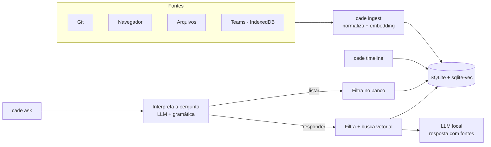

# cade

CLI de histórico pessoal. Ingere commits git, histórico do navegador, arquivos e mensagens do Teams, e permite consultar por data ou por pergunta em linguagem natural.

Todo o processamento é local: SQLite + sqlite-vec para armazenamento e busca vetorial, llama.cpp embutido para embeddings e geração.

## Como funciona



## Modelos

| Uso | Modelo | Tamanho |
|---|---|---|
| Embeddings | [nomic-embed-text-v2-moe](https://huggingface.co/nomic-ai/nomic-embed-text-v2-moe-GGUF) Q4_K_M | 344 MB |
| Geração | [Qwen2.5-3B-Instruct](https://huggingface.co/Qwen/Qwen2.5-3B-Instruct-GGUF) Q4_K_M | 2,1 GB |

Qualquer modelo GGUF compatível com llama.cpp pode ser usado via `embedding.model_path` e `generation.model_path` na configuração.

## Build

Requisitos: Go, gcc, cmake, ninja, curl.

```sh
make build    # compila llama.cpp e gera bin/cade
make models   # baixa os modelos para ~/.local/share/cade/models
make cuda     # opcional: build com GPU NVIDIA (requer CUDA Toolkit; gpu_layers -1 na configuração)
make install  # copia bin/cade para ~/.local/bin (PREFIX=... para mudar)
make uninstall
```

`uninstall` remove só o binário. Modelos, configuração e banco ficam em `~/.local/share/cade` e `~/.config/cade`.

## Uso

```sh
cade init                                   # cria ~/.config/cade/config.json
cade ingest git ~/src/projeto
cade ingest all                             # alvos da configuração
cade timeline ontem
cade timeline --source git 2026-09-01 2026-09-07
cade ask "o que eu fiz relacionado a cache?"
cade ask --source teams --from 2026-09-01 "quando ficou marcado o deploy?"
cade forget teams                           # apaga os eventos de uma fonte, para reingerir
cade teams-schema DIR                       # estrutura (sem valores) de um IndexedDB, para diagnóstico
```

Fontes: `git`, `browser`, `file`, `teams`. Flags vêm antes dos argumentos.

No `ask`, o modelo local lê a pergunta e extrai só os filtros que ela afirma: período, fonte, pessoas, direção (recebidas/enviadas) e assunto. O resultado aparece no stderr:

```
Entendi: listar · teams · 2026-09-25 · pessoas: Ana · recebidas
```

- Pedidos de lista com período ("as mensagens da Ana ontem") listam todos os eventos que casam, direto do banco.
- Perguntas com pessoa ou direção são respondidas só com os eventos que casam.
- Flags (`--source`, `--from`, `--to`) têm prioridade; `--no-filters` desativa a interpretação.

## Exemplo de saída

```
$ cade timeline 2026-09-25
Timeline de 2026-09-25 — 5 eventos

── 2026-09-25 (Fri) ──
09:30  [git]     Corrige bug de timeout no login OAuth  (repo 79589eae)
11:20  [file]    ~/notas/reuniao.md
14:10  [browser] sqlite-vec: vector search SQLite extension — https://github.com/asg017/sqlite-vec
16:20  [browser] Redis client-side caching — https://redis.io/docs/latest/develop/use/client-side-caching/
16:45  [git]     Implementa cache Redis para sessões  (repo ebefa976)

$ cade ask "liste os commits de 25/09"
Entendi: listar · git · 2026-09-25
Timeline de 2026-09-25 — 2 eventos

── 2026-09-25 (Fri) ──
09:30  [git]     Corrige bug de timeout no login OAuth  (repo 79589eae)
16:45  [git]     Implementa cache Redis para sessões  (repo ebefa976)

$ cade ask "que páginas visitei em 25/09 sobre redis?"
Entendi: listar · browser · 2026-09-25 · assunto: redis
Timeline de 2026-09-25 — 1 eventos

── 2026-09-25 (Fri) ──
16:20  [browser] Redis client-side caching — https://redis.io/docs/latest/develop/use/client-side-caching/

$ cade ask "qual a receita de bolo de chocolate que eu vi?"
Entendi: responder · file · assunto: receita de bolo de chocolate
Não encontrei informação sobre isso nos dados ingeridos.
```

Pergunta com pessoa (nomes fictícios): só as mensagens com o Rui entram na busca.

```
$ cade ask "qual o problema com o CEP que comentei com o Rui?"
Entendi: responder · pessoas: Rui · assunto: problema com o CEP
Filtrando por pessoa: rui
O CEP cadastrado não existe mais e precisa ser atualizado [2]; o Rui perguntou se o cliente tinha alterado o endereço [1].

Fontes citadas:
  [1] [teams]   2026-09-25 09:30  Rui Costa: eles alteraram o CEP? ou precisa alterar para esse?  (chat Carla Dias, Rui Costa)
  [2] [teams]   2026-09-25 09:31  Carla Dias: esse CEP que está cadastrado não existe mais  (chat Carla Dias, Rui Costa)
```

## Teams

As mensagens são lidas do IndexedDB do Teams web no Chrome:

```sh
T=~/.config/google-chrome/Default/IndexedDB
cade ingest teams $T/https_teams.cloud.microsoft_0.indexeddb.leveldb \
                  $T/https_teams.microsoft.com_0.indexeddb.leveldb
```

Apenas mensagens já carregadas pelo cliente estão disponíveis.

Eventos já ingeridos não são reprocessados. Após atualizar o `cade`, para reingerir uma fonte:

```sh
cade forget teams && cade ingest teams
```

O que já saiu da fonte (ex.: cache do Teams expirado) não volta.

## Configuração

`~/.config/cade/config.json`:

```json
{
  "sources": {
    "git_repositories": ["~/src/projeto"],
    "browser_histories": ["~/.config/google-chrome/Default/History"],
    "directories": ["~/notas"],
    "teams_indexeddb_dirs": ["~/.config/google-chrome/Default/IndexedDB/https_teams.cloud.microsoft_0.indexeddb.leveldb"]
  }
}
```

Outros campos (criados pelo `cade init`):

| Campo | Padrão | Para quê |
|---|---|---|
| `generation.gpu_layers`, `embedding.gpu_layers` | `-1` | camadas na GPU (build CUDA); `-1` = todas |
| `generation.threads`, `embedding.threads` | `0` | threads de CPU; `0` = núcleos físicos |
| `retrieval.top_k` | `8` | eventos enviados ao modelo por pergunta |
| `retrieval.max_distance` | `0.72` | corte de relevância em perguntas sem filtros |
| `sources.git_authors` | `[]` | ingere só commits desses autores |

Trocar o modelo de embedding exige um banco novo.

## Testes

```sh
make test
make test-models   # inclui testes com os modelos reais
```
