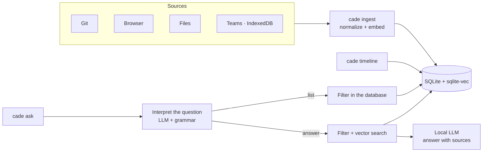

# cade

**English** · [Português](README.pt-BR.md)

Personal history CLI. Ingests git commits, browser history, files and Microsoft Teams messages, and lets you query them by date or with natural-language questions.

Everything runs locally: SQLite + sqlite-vec for storage and vector search, llama.cpp embedded for embeddings and generation. No server, no network calls.

> **Language:** the CLI output, the date parser ("ontem", "semana passada") and the question interpreter are in Brazilian Portuguese. Questions should be asked in Portuguese.

## How it works



## Models

| Use | Model | Size |
|---|---|---|
| Embeddings | [nomic-embed-text-v2-moe](https://huggingface.co/nomic-ai/nomic-embed-text-v2-moe-GGUF) Q4_K_M | 344 MB |
| Generation | [Qwen2.5-3B-Instruct](https://huggingface.co/Qwen/Qwen2.5-3B-Instruct-GGUF) Q4_K_M | 2.1 GB |

Any llama.cpp-compatible GGUF model can be used via `embedding.model_path` and `generation.model_path` in the config.

## Build

Requirements: Go, gcc, cmake, ninja, curl.

```sh
make build    # builds llama.cpp and produces bin/cade
make models   # downloads the models to ~/.local/share/cade/models
make cuda     # optional: NVIDIA GPU build (needs the CUDA Toolkit; gpu_layers -1 in the config)
make install  # copies bin/cade to ~/.local/bin (set PREFIX=... to change)
make uninstall
```

`uninstall` only removes the binary. Models, config and database live in `~/.local/share/cade` and `~/.config/cade`.

## Usage

```sh
cade init                                   # creates ~/.config/cade/config.json
cade ingest git ~/src/project
cade ingest all                             # every target in the config
cade timeline ontem                         # yesterday
cade timeline --source git 2026-09-01 2026-09-07
cade ask "o que eu fiz relacionado a cache?"
cade ask --source teams --from 2026-09-01 "quando ficou marcado o deploy?"
cade forget teams                           # deletes a source's events, to re-ingest
cade teams-schema DIR                       # structure (no values) of an IndexedDB, for diagnosis
```

Sources: `git`, `browser`, `file`, `teams`. Flags go before the arguments.

In `ask`, the local model reads the question and extracts only the filters it states: period, source, people, direction (received/sent) and topic. The result is printed to stderr:

```
Entendi: listar · teams · 2026-09-25 · pessoas: Ana · recebidas
```

- List requests with a period ("as mensagens da Ana ontem") list every matching event, straight from the database.
- Questions naming a person or a direction are answered using only the matching events.
- Flags (`--source`, `--from`, `--to`) take precedence; `--no-filters` disables the interpretation.

## Sample output

```
$ cade timeline 2026-09-25
Timeline de 2026-09-25 — 5 eventos

── 2026-09-25 (Fri) ──
09:30  [git]     Corrige bug de timeout no login OAuth  (repo 79589eae)
11:20  [file]    ~/notas/reuniao.md
14:10  [browser] sqlite-vec: vector search SQLite extension — https://github.com/asg017/sqlite-vec
16:20  [browser] Redis client-side caching — https://redis.io/docs/latest/develop/use/client-side-caching/
16:45  [git]     Implementa cache Redis para sessões  (repo ebefa976)

$ cade ask "liste os commits de 25/09"
Entendi: listar · git · 2026-09-25
Timeline de 2026-09-25 — 2 eventos

── 2026-09-25 (Fri) ──
09:30  [git]     Corrige bug de timeout no login OAuth  (repo 79589eae)
16:45  [git]     Implementa cache Redis para sessões  (repo ebefa976)

$ cade ask "que páginas visitei em 25/09 sobre redis?"
Entendi: listar · browser · 2026-09-25 · assunto: redis
Timeline de 2026-09-25 — 1 eventos

── 2026-09-25 (Fri) ──
16:20  [browser] Redis client-side caching — https://redis.io/docs/latest/develop/use/client-side-caching/

$ cade ask "qual a receita de bolo de chocolate que eu vi?"
Entendi: responder · file · assunto: receita de bolo de chocolate
Não encontrei informação sobre isso nos dados ingeridos.
```

Question naming a person (fictional names): only messages with Rui are searched.

```
$ cade ask "qual o problema com o CEP que comentei com o Rui?"
Entendi: responder · pessoas: Rui · assunto: problema com o CEP
Filtrando por pessoa: rui
O CEP cadastrado não existe mais e precisa ser atualizado [2]; o Rui perguntou se o cliente tinha alterado o endereço [1].

Fontes citadas:
  [1] [teams]   2026-09-25 09:30  Rui Costa: eles alteraram o CEP? ou precisa alterar para esse?  (chat Carla Dias, Rui Costa)
  [2] [teams]   2026-09-25 09:31  Carla Dias: esse CEP que está cadastrado não existe mais  (chat Carla Dias, Rui Costa)
```

## Teams

Messages are read from the IndexedDB that Teams on the web keeps in Chrome:

```sh
T=~/.config/google-chrome/Default/IndexedDB
cade ingest teams $T/https_teams.cloud.microsoft_0.indexeddb.leveldb \
                  $T/https_teams.microsoft.com_0.indexeddb.leveldb
```

Only messages the client has already loaded are available.

Events already ingested are not reprocessed. After updating `cade`, to re-ingest a source:

```sh
cade forget teams && cade ingest teams
```

Anything no longer in the source (e.g. an expired Teams cache) does not come back.

## Configuration

`~/.config/cade/config.json`:

```json
{
  "sources": {
    "git_repositories": ["~/src/project"],
    "browser_histories": ["~/.config/google-chrome/Default/History"],
    "directories": ["~/notes"],
    "teams_indexeddb_dirs": ["~/.config/google-chrome/Default/IndexedDB/https_teams.cloud.microsoft_0.indexeddb.leveldb"]
  }
}
```

Other fields (written by `cade init`):

| Field | Default | Purpose |
|---|---|---|
| `generation.gpu_layers`, `embedding.gpu_layers` | `-1` | layers on the GPU (CUDA build); `-1` = all |
| `generation.threads`, `embedding.threads` | `0` | CPU threads; `0` = physical cores |
| `retrieval.top_k` | `8` | events sent to the model per question |
| `retrieval.max_distance` | `0.72` | relevance cutoff for unfiltered questions |
| `sources.git_authors` | `[]` | only ingest commits by these authors |

Changing the embedding model requires a new database.

## Tests

```sh
make test
make test-models   # also runs the tests against the real models
```
