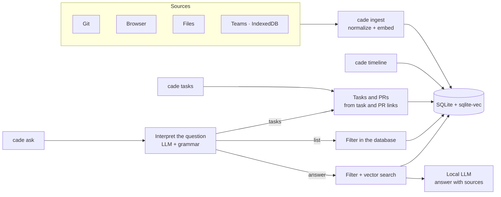

# cade

**English** · [Português](README.pt-BR.md)

Personal history CLI. Ingests git commits, browser history, files and Microsoft Teams messages, and lets you query them by date or with natural-language questions.

Everything runs locally: SQLite + sqlite-vec for storage and vector search, llama.cpp embedded for embeddings and generation. No server, no network calls. What is stored, where, and how to delete it: [PRIVACY.md](PRIVACY.md).

## Contents

- [How it works](#how-it-works)
- [Models](#models)
- [Build](#build)
- [Usage](#usage)
  - [Questions (`ask`)](#questions-ask)
- [Sample output](#sample-output)
- [Tasks](#tasks)
- [Teams](#teams)
- [Configuration](#configuration)
- [Tests](#tests)
- [Privacy](PRIVACY.md)
- [Benchmarks with charts](docs/BENCHMARKS.md) (Portuguese)

> **Language:** questions can be asked in English or Portuguese ("what did Ana send me yesterday?", "o que a Ana me passou ontem?") and are answered in the same language. `cade help` and `cade <command> -h` follow the locale (`LC_ALL`, `LC_MESSAGES`, `LANG`: Portuguese for `pt*`, English otherwise); other CLI labels are in Portuguese. Numeric dates are day/month (`12/08` is 12 August); prefer `Aug 12` or `2026-08-12`.

## How it works



## Models

| Use | Model | Size |
|---|---|---|
| Embeddings | [nomic-embed-text-v2-moe](https://huggingface.co/nomic-ai/nomic-embed-text-v2-moe-GGUF) Q4_K_M | 344 MB |
| Generation | [Qwen2.5-3B-Instruct](https://huggingface.co/Qwen/Qwen2.5-3B-Instruct-GGUF) Q4_K_M | 2.1 GB |

Any llama.cpp-compatible GGUF model can be used via `embedding.model_path` and `generation.model_path` in the config.

## Build

Requirements: Go, gcc, cmake, ninja, curl.

```sh
make build    # builds llama.cpp and produces bin/cade
make models   # downloads the models to ~/.local/share/cade/models
make cuda     # optional: NVIDIA GPU build (needs the CUDA Toolkit; gpu_layers -1 in the config)
make install  # copies bin/cade to ~/.local/bin (set PREFIX=... to change)
make uninstall
```

`uninstall` only removes the binary. Models, config and database live in `~/.local/share/cade` and `~/.config/cade`.

Build through `make`: keyword search needs SQLite's FTS5, which the Go driver only compiles with `-tags sqlite_fts5` (a bare `go build` produces a binary that refuses to open the database, saying so). For `go test` in an editor, set the same tag (VS Code: `"go.buildTags": "sqlite_fts5"`).

## Usage

```sh
cade init                                   # creates ~/.config/cade/config.json
cade ingest git ~/src/project
cade ingest all                             # every target in the config
cade timeline ontem                         # yesterday
cade timeline --source git 2026-09-01 2026-09-07
cade ask "o que eu fiz relacionado a cache?"
cade ask --source teams --from 2026-09-01 "quando ficou marcado o deploy?"
cade ask --json "o que fiz sobre cache?"         # plan + result + source of each event, as JSON
cade tasks ontem                            # tasks worked on and finished (PR opened)
cade ask "quais tarefas finalizei essa semana?"   # same report, in natural language
cade forget teams                           # deletes a source's events, to re-ingest
cade reindex                                # recomputes vectors after changing the embedding model
cade teams-schema DIR                       # structure (no values) of an IndexedDB, for diagnosis
```

Sources: `git`, `browser`, `file`, `teams`. Flags go before the arguments.

### Questions (`ask`)

In `ask`, the local model reads the question and extracts only the filters it states: period, source, people, direction (received/sent), topic, and whether it is about tasks. The result is printed to stderr:

```
Entendi: listar · teams · 2026-09-25 · pessoas: Ana · recebidas
```

- List requests with a period ("as mensagens da Ana ontem") list every matching event, straight from the database.
- Questions naming a person or a direction are answered using only the matching events.
- Questions about tasks ("quais tarefas finalizei ontem?", "what tasks are still in progress?") return the `cade tasks` report, optionally only finished or unfinished tasks; without a period, today. With a person or direction ("tarefas que a Ana me passou ontem"), only tasks linked in those messages; a name that matches no one (a client) filters by text instead.
- Names are matched as whole words, ignoring case, accents, doubled letters and y/i ("sillva" finds "Leandro Silva"). A name that matches no sender or conversation (a client, a nickname) filters by text instead of being dropped.
- "Received" leaves out group messages that only @mention other people ("pronto? @Vitor"); a mention of you, a team or tag keeps them.
- Messages with no content ("ok", "valeu", "bom dia") are not used as evidence for answers; listings still show them.
- Search is hybrid: meaning (vectors) and keywords (FTS5) are fused. A question naming an identifier — a task or error code (`PROJ-481`, `ORA-01722`), a commit hash, a PR number — returns the events that contain it.
- Repeats count once in answers: 12 visits to a page or several versions of a note become one source, shown as "(12 visitas, última em …)". Files deleted from their folder leave answers but stay in the timeline.
- Period, source, people and direction are exact filters; only the topic is matched by meaning ("commits de ontem sobre autenticação" searches "autenticação" among yesterday's commits). Questions without filters are matched as a whole.
- Flags (`--source`, `--from`, `--to`) take precedence; `--no-filters` disables the interpretation.

## Sample output

```
$ cade timeline 2026-09-25
Timeline de 2026-09-25 — 5 eventos

── 2026-09-25 (Fri) ──
09:30  [git]     Corrige bug de timeout no login OAuth  (repo 79589eae)
11:20  [file]    ~/notas/reuniao.md
14:10  [browser] sqlite-vec: vector search SQLite extension — https://github.com/asg017/sqlite-vec
16:20  [browser] Redis client-side caching — https://redis.io/docs/latest/develop/use/client-side-caching/
16:45  [git]     Implementa cache Redis para sessões  (repo ebefa976)

$ cade ask "liste os commits de 25/09"
Entendi: listar · git · 2026-09-25
Timeline de 2026-09-25 — 2 eventos

── 2026-09-25 (Fri) ──
09:30  [git]     Corrige bug de timeout no login OAuth  (repo 79589eae)
16:45  [git]     Implementa cache Redis para sessões  (repo ebefa976)

$ cade ask "que páginas visitei em 25/09 sobre redis?"
Entendi: listar · browser · 2026-09-25 · assunto: redis
Timeline de 2026-09-25 — 1 eventos

── 2026-09-25 (Fri) ──
16:20  [browser] Redis client-side caching — https://redis.io/docs/latest/develop/use/client-side-caching/

$ cade ask "qual a receita de bolo de chocolate que eu vi?"
Entendi: responder · file · assunto: receita de bolo de chocolate
Não encontrei informação sobre isso nos dados ingeridos.
```

Question naming a person (fictional names): only messages with Rui are searched.

```
$ cade ask "qual o problema com o CEP que comentei com o Rui?"
Entendi: responder · pessoas: Rui · assunto: problema com o CEP
Filtrando por pessoa: rui
O CEP cadastrado não existe mais e precisa ser atualizado [2]; o Rui perguntou se o cliente tinha alterado o endereço [1].

Fontes citadas:
  [1] [teams]   2026-09-25 09:30  Rui Costa: eles alteraram o CEP? ou precisa alterar para esse?  (chat Carla Dias, Rui Costa)
      ↳ https://teams.microsoft.com/l/message/19:a1b2c3@unq.gbl.spaces/1758803400000
  [2] [teams]   2026-09-25 09:31  Carla Dias: esse CEP que está cadastrado não existe mais  (chat Carla Dias, Rui Costa)
      ↳ https://teams.microsoft.com/l/message/19:a1b2c3@unq.gbl.spaces/1758803460000
```

Each cited source shows where the original is (`↳`): `repository@hash` for a commit, a link that opens the message in Teams; pages and files already show their URL or path. If the answer cites a number that matches no consulted event, a warning says that part has no source.

`--json` prints the resolved plan and the result with a reference (uid, source, time, locator) for every event behind it: the evidence given to the model and which of it was cited, the listed events, or each task with its PRs and events.

## Tasks

`cade tasks [--all] [DATE [END]]` (default: today), or a question about tasks in `cade ask`, lists the tasks you worked on, from local events only:

- **Task:** a link to a tracker (proj4me, Jira, Linear, GitHub Issues, Azure Boards by default; any regex via `tasks.task_url_patterns`) in a browser visit or message.
- **Finished:** a pull request you opened (GitHub, GitLab, Bitbucket, Azure DevOps) is linked to it. Opened by you = a visit to the PR-creation page right before, or a message you sent with the link. Linked = a message with both links, or the PR title citing the task id (`fix-cep-162`, `PROJ-123 ...`); otherwise "(provável)" if opened right after working on the task.
- **Yours or not:** a task is yours if you opened a PR for it or sent a message citing it; "consulted" if you only opened its page; tasks that only appeared in other people's messages are summarized (`--all` lists them).

```
$ cade tasks ontem
Tarefas de 2026-09-25 — 2 suas

concluída     14/162  Ajuste de CEP  (38 eventos)
              PR acme/api#45 aberto 16:40 · fix-cep-162

em andamento  14/170  Upload de arquivos  (21 eventos)

Consultadas (você abriu a tarefa; sem PR ou mensagem sua):

em andamento  14/171  Revisão de layout  (4 eventos)

Citadas só por outras pessoas: 3 tarefas — use --all para listar.
Sem tarefa: 12 eventos
```

## Teams

Messages are read from the IndexedDB that Teams on the web keeps in Chrome:

```sh
T=~/.config/google-chrome/Default/IndexedDB
cade ingest teams $T/https_teams.cloud.microsoft_0.indexeddb.leveldb \
                  $T/https_teams.microsoft.com_0.indexeddb.leveldb
```

Only messages the client has already loaded are available.

If a Teams update renames what cade reads, `ingest teams` fails with "formato do Teams não reconhecido" instead of silently finding nothing. Messages already stored are not affected. `cade teams-schema DIR` shows the new structure without values, to adapt the reader.

Events already ingested are only reprocessed when their content changed at the source (an edited Teams message replaces the stored text; `ingest` reports them as "atualizados"). After updating `cade`, to re-ingest a source from scratch:

```sh
cade forget teams && cade ingest teams
```

Anything no longer in the source (e.g. an expired Teams cache) does not come back.

## Configuration

`~/.config/cade/config.json`:

```json
{
  "sources": {
    "git_repositories": ["~/src/project"],
    "browser_histories": ["~/.config/google-chrome/Default/History"],
    "directories": ["~/notes"],
    "teams_indexeddb_dirs": ["~/.config/google-chrome/Default/IndexedDB/https_teams.cloud.microsoft_0.indexeddb.leveldb"]
  }
}
```

Other fields (written by `cade init`):

| Field | Default | Purpose |
|---|---|---|
| `generation.gpu_layers`, `embedding.gpu_layers` | `-1` | layers on the GPU (CUDA build); `-1` = all |
| `generation.threads`, `embedding.threads` | `0` | CPU threads; `0` = physical cores |
| `retrieval.top_k` | `8` | events sent to the model per question |
| `retrieval.max_distance` | `0.72` | relevance cutoff for unfiltered questions |
| `retrieval.mode` | `hybrid` | `hybrid` fuses vector and keyword (FTS5) search; `vector` or `lexical` use one |
| `retrieval.max_best_distance` | `0.61` | an unfiltered question is answered only if its closest event is this near; raise it if real questions get "not found" (`--verbose` logs the distance) |
| `sources.git_authors` | `[]` | only ingest commits by these authors |

Long notes, messages and commits are split into chunks of up to ~1,200 characters (the embedding model reads 512 tokens), and an answer shows the chunk that matched ("arquitetura.md, trecho 7 de 20"). After upgrading from a version without chunks, run `cade reindex` once: it embeds the long events (1,568 of 108k in a real history, about a minute).

To change the embedding model, set `embedding.model_path` and run `cade reindex`: it recomputes every vector from the stored text, and resumes if interrupted (~300 events/s on an RTX 3060, a few minutes for 100k events). The database records which model its vectors came from; `ingest` and `ask` refuse a different one instead of mixing incompatible vectors.

Schema changes are applied automatically when the database is opened (numbered migrations). A step that rewrites data first saves a copy as `cade.db.before-vN-<date>` and says where; delete it once you are satisfied.

## Tests

```sh
make test
make test-models   # also runs the tests against the real models
make eval-plan     # scores question interpretation (GPU when the CUDA Toolkit is installed; GO_TAGS= forces CPU)
make eval-retrieval  # scores retrieval: recall, MRR, rejection
make eval          # both
make bench         # latency and memory: storage at 1k/10k/100k events, models
```

`eval-plan` runs ~150 questions in `testdata/queries/plan.json` (temporal, git, Teams, browser, files, semantic, people, tasks, companies read as people; PT and EN) through the real model and prints the accuracy of each field (mode, period, source, people, direction, topic, status) with its 95% Wilson interval, plus every misread question. It fails when a field's lower bound drops below the file's `minimum_accuracy`, so prompt or model changes cannot degrade interpretation silently, and one unlucky case does not fail it. `testdata/README.md` explains how to turn a real question into an anonymized case.

`eval-retrieval` ingests a synthetic corpus (`testdata/queries/retrieval/corpus.json`: ~290 commits, pages, files and messages, with look-alikes such as PROJ-418 next to PROJ-481, pages visited many times, a file in several versions, long notes with the answer near the end, other authors' commits and everyday chatter) into a real SQLite store with the real embedder. Questions come in two sets: `calibration.json` reports where the distance gates belong (without changing them), and `test.json`, never used for tuning, is checked against its floors. It reports recall and MRR over answerable questions, rejection (questions nothing answers must retrieve nothing) and redundancy (results repeating the same page or file). `make eval-scale SCALE=1000,10000` reruns the test set on corpora grown with distractors and saves the curve to `bench/retrieval-scale.txt`; `bench/retrieval-baseline.txt` holds the results before the next version's retrieval changes.

`bench` measures storage on synthetic histories of 1k, 10k and 100k events (vector search, reads by period, writes, bytes per event) and the models (embedding an event, interpreting a question, generating an answer) with process and GPU memory. `bench/baseline.txt` holds a reference run on an RTX 3060; save new runs and compare them with [benchstat](https://pkg.go.dev/golang.org/x/perf/cmd/benchstat).
