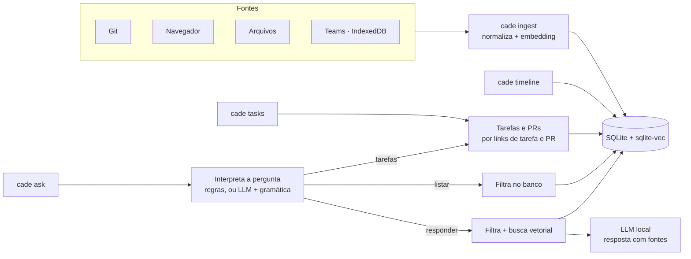

# cade

[](https://github.com/Chipskein/cade/actions/workflows/ci.yml)
[](https://github.com/Chipskein/cade/actions/workflows/ci.yml)

[English](README.md) · **Português**

CLI de histórico pessoal. Ingere commits git, histórico do navegador, arquivos e mensagens do Teams, e permite consultar por data ou por pergunta em linguagem natural.

Todo o processamento é local: SQLite + sqlite-vec para armazenamento e busca vetorial, llama.cpp embutido para embeddings e geração. O que fica guardado, onde e como apagar: [PRIVACY.pt-BR.md](PRIVACY.pt-BR.md).

Perguntas podem ser feitas em português ou inglês; a resposta vem no idioma da pergunta. A interface (ajuda, rótulos, progresso, erros) segue o idioma do sistema (`LC_ALL`, `LC_MESSAGES`, `LANG`: português para `pt*`, inglês nos outros casos), ou `ui.language` na configuração (`auto`, `pt`, `en`); a resposta do `ask` segue o idioma da pergunta. Os códigos do `ask --json` (`"mode": "listar"`) são os mesmos nos dois idiomas. Datas numéricas nas perguntas seguem `ui.date_order`: por padrão, mês primeiro com o sistema em `en_US` (`12/08` é 8 de dezembro) e dia primeiro em qualquer outro (12 de agosto); as datas da saída são sempre `AAAA-MM-DD`. As palavras de período aceitas em cada idioma estão em [Períodos](#períodos).

## Índice

- [Como funciona](#como-funciona)
- [Modelos](#modelos) e [hardware](#hardware)
- [Instalação](#instalação)
- [Uso](#uso)
  - [Perguntas (`ask`)](#perguntas-ask) e [períodos](#períodos)
- [Exemplo de saída](#exemplo-de-saída)
- [Tarefas](#tarefas)
- [Navegadores](#navegadores)
- [Teams](#teams)
- [Configuração](#configuração)
- [Testes](#testes)
- [Privacidade](PRIVACY.pt-BR.md)
- [Benchmarks com gráficos](docs/BENCHMARKS.md)
- [Changelog](CHANGELOG.pt-BR.md): migrações e o que cada uma reescreve
- [Roadmap](docs/ROADMAP.md)

## Como funciona



O que a ingestão e a busca fazem com o histórico:

- **Deduplicação:** rodar o `ingest` de novo pula o que já está guardado e substitui o que mudou na origem (uma mensagem editada no Teams). Texto idêntico é embutido uma vez só, e os vetores são reaproveitados. Um arquivo é um evento, e as versões anteriores ficam como datas e tamanhos. Nas respostas, repetições contam uma vez: 12 visitas a uma página viram uma fonte, "(12 visitas, última em …)".
- **Pedaços:** texto com mais de ~1.200 caracteres é dividido em pedaços (o modelo de embedding lê 512 tokens), cada um com seu vetor, para que a resposta no fim de uma nota longa seja encontrada; a linha da fonte diz qual pedaço casou.
- **Busca híbrida:** a pergunta é comparada por significado (vetores, sqlite-vec) e por palavras (FTS5 do SQLite), e as duas ordenações são combinadas; identificadores como `PROJ-481` ou um hash de commit são achados pelas palavras.
- **Autoria no git:** cada commit é marcado como seu ou de outra pessoa (`sources.git_identities`). A timeline, as perguntas em primeira pessoa e o relatório de tarefas mostram só os seus.

## Modelos

| Uso | Modelo | Tamanho | Licença |
|---|---|---|---|
| Embeddings | [nomic-embed-text-v2-moe](https://huggingface.co/nomic-ai/nomic-embed-text-v2-moe-GGUF) Q4_K_M | 344 MB | Apache-2.0 |
| Geração | [Qwen3.5-2B](https://huggingface.co/Qwen/Qwen3.5-2B) Q4_K_M ([GGUF da unsloth](https://huggingface.co/unsloth/Qwen3.5-2B-GGUF)) | 1,3 GB | [Apache-2.0](https://huggingface.co/Qwen/Qwen3.5-2B/blob/main/LICENSE) |
| Descrição de imagens (a partir da fase 19; o `ask` nunca o carrega) | o projetor de visão do Qwen3.5-2B (`mmproj-F16.gguf`, mesmo repositório) | 0,67 GB | Apache-2.0 |

Os três permitem uso comercial. Até a v0.0.0 o padrão era o Qwen2.5-3B-Instruct, sob a Qwen Research License, só para uso não comercial. O Qwen3.5-2B entende as perguntas igual ou melhor em todos os campos da suíte de plano (135 de 153 totalmente certas, contra 133 com o mesmo prompt: [bench/plan-baseline.txt](bench/plan-baseline.txt), [bench/plan-qwen2.5-3b.txt](bench/plan-qwen2.5-3b.txt)), cita mais as evidências e não segue nenhuma das injeções de prompt do `make eval-injection`. O modo de raciocínio fica desligado: nenhum bloco `<think>` chega à resposta.

O **Qwen3.5-4B** entende ainda melhor (146 de 153, [bench/plan-qwen3.5-4b.txt](bench/plan-qwen3.5-4b.txt)), mas precisa de ~3,5 GB de VRAM, acima do orçamento abaixo; numa GPU com espaço, baixe `Qwen3.5-4B-Q4_K_M.gguf` de [unsloth/Qwen3.5-4B-GGUF](https://huggingface.co/unsloth/Qwen3.5-4B-GGUF) e ajuste `generation.model_path`. Licenças de tudo o que está no binário: [THIRD_PARTY_NOTICES.md](THIRD_PARTY_NOTICES.md).

Qualquer modelo GGUF compatível com llama.cpp pode ser usado via `embedding.model_path` e `generation.model_path` na configuração.

### Hardware

Medido num Ryzen 5 5500 (6 núcleos), com e sem uma RTX 3060 ([bench/baseline.txt](bench/baseline.txt), [bench/baseline-cpu.txt](bench/baseline-cpu.txt); gráficos em [docs/BENCHMARKS.md](docs/BENCHMARKS.md)):

| | GPU (`make cuda`) | Só CPU (`make build`) |
|---|---|---|
| Memória ao responder | ~2,0 GB de VRAM + ~1,5 GB de RAM | ~2,4 GB de RAM |
| Embutir um evento (ingest) | 3,5 ms | 33 ms |
| Um `ask` inteiro, até o primeiro token da resposta | 1,6–3,2 s (5,7–7,4 s logo depois de reiniciar, lendo os modelos do disco) | 12–25 s (16–30 s depois de reiniciar) |
| Ler uma pergunta com o modelo | 1,5 s | 12,7 s |

A faixa do `ask` vai de uma pergunta lida pelas regras a uma lida pelo modelo. Disco: 2,3 GB de modelos, o banco (~450 MB para um histórico real de 108 mil eventos) e ~40 MB do estado salvo do prompt em `~/.cache/cade`.

## Instalação

De um clone limpo até a primeira pergunta (Linux):

1. **Ferramentas de build:** Go 1.27 ou mais novo, gcc, cmake, ninja e curl.
   - Arch: `sudo pacman -S go gcc cmake ninja curl`
   - Debian/Ubuntu: `sudo apt install gcc cmake ninja-build curl`, e o Go de [go.dev/dl](https://go.dev/dl/) se o do pacote for mais antigo.
2. **Build:** `make build` compila o llama.cpp (alguns minutos, só na primeira vez) e gera `bin/cade`. Com GPU NVIDIA, use `make cuda` (requer o CUDA Toolkit).
3. **Modelos:** `make models` baixa os dois modelos e o projetor de visão (~2,3 GB) para `~/.local/share/cade/models`.
4. **Instalar:** `make install` copia o binário para `~/.local/bin`, que precisa estar no `PATH` (`PREFIX=...` para mudar).
5. **Configurar:** `cade init` acha os históricos de navegador (Chrome, Chromium, Brave, Edge, Vivaldi, Firefox), os caches do Teams e, sob um diretório que você indicar, os repositórios git; pergunta o que incluir e quais pastas de notas indexar, e grava `~/.config/cade/config.json` (permissão `600`). Ele só olha nomes, nunca conteúdo. O Teams fica de fora a menos que você o escolha, porque o cache guarda mensagens de outras pessoas: confira antes a política de dados da sua organização.
6. **Conferir:** `cade doctor` verifica os modelos, o FTS5 do SQLite, o banco e cada caminho configurado, e diz como corrigir cada problema. Ele não altera o banco.
7. **Ingerir:** `cade ingest all`.
8. **Perguntar:** `cade ask "o que eu fiz ontem?"`.

**Ou a partir de um binário de release** (Linux x86-64, só CPU; qualquer CPU com AVX2), sem as ferramentas de build:

```sh
V=v0.0.0   # a versão desejada
curl -LO https://github.com/Chipskein/cade/releases/download/$V/cade-$V-linux-amd64-cpu.tar.gz
curl -LO https://github.com/Chipskein/cade/releases/download/$V/cade-$V-linux-amd64-cpu.tar.gz.sha256
sha256sum -c cade-$V-linux-amd64-cpu.tar.gz.sha256
tar xzf cade-$V-linux-amd64-cpu.tar.gz && install -Dm755 cade-$V-linux-amd64-cpu/cade ~/.local/bin/cade
M=~/.local/share/cade/models && mkdir -p $M
curl -L -o $M/nomic-embed-text-v2-moe.Q4_K_M.gguf https://huggingface.co/nomic-ai/nomic-embed-text-v2-moe-GGUF/resolve/main/nomic-embed-text-v2-moe.Q4_K_M.gguf
Q=https://huggingface.co/unsloth/Qwen3.5-2B-GGUF/resolve/f6d5376be1edb4d416d56da11e5397a961aca8ae
curl -L -o $M/Qwen3.5-2B-Q4_K_M.gguf $Q/Qwen3.5-2B-Q4_K_M.gguf
curl -L -o $M/mmproj-Qwen3.5-2B-F16.gguf $Q/mmproj-F16.gguf
```

Depois, os passos 5 a 8. `cade version` mostra a versão, o commit, a data e o tipo de build (CPU ou CUDA).

```sh
make build    # compila llama.cpp e gera bin/cade
make models   # baixa os modelos para ~/.local/share/cade/models
make cuda     # opcional: build com GPU NVIDIA (requer CUDA Toolkit; gpu_layers -1 na configuração)
make install  # copia bin/cade para ~/.local/bin (PREFIX=... para mudar)
make dist     # arquivo de release em dist/: binário CPU, licenças, docs, SHA-256
make uninstall
```

`uninstall` remove só o binário. Modelos, configuração e banco ficam em `~/.local/share/cade` e `~/.config/cade`.

Compile pelo `make`: a busca por palavra usa o FTS5 do SQLite, que o driver Go só compila com `-tags sqlite_fts5` (um `go build` puro gera um binário que se recusa a abrir o banco e diz por quê; o `cade doctor` também aponta). Para `go test` no editor, use a mesma tag (VS Code: `"go.buildTags": "sqlite_fts5"`).

## Uso

```sh
cade init                                   # acha as fontes, pergunta e cria ~/.config/cade/config.json
cade doctor                                 # confere modelos, banco e caminhos; diz o que corrigir
cade ingest git ~/src/projeto
cade ingest all                             # alvos da configuração
cade timeline ontem
cade timeline --source git 2026-09-01 2026-09-07
cade ask "o que eu fiz relacionado a cache?"
cade ask --source teams --from 2026-09-01 "quando ficou marcado o deploy?"
cade ask --json "o que fiz sobre cache?"         # plano + resultado + origem de cada evento, em JSON
cade tasks ontem                            # tarefas trabalhadas e concluídas (PR aberto)
cade ask "quais tarefas finalizei essa semana?"   # mesmo relatório, em linguagem natural
cade forget teams                           # apaga os eventos de uma fonte, para reingerir
cade reindex                                # recalcula os vetores após trocar o modelo de embedding
cade teams-schema DIR                       # estrutura (sem valores) de um IndexedDB, para diagnóstico
```

Fontes: `git`, `browser`, `file`, `teams`. As flags podem vir antes ou depois dos argumentos (`cade timeline ontem --source git`); tudo o que vem depois de `--` é argumento, mesmo começando com `-`.

### Perguntas (`ask`)

No `ask`, o modelo local lê a pergunta e extrai só os filtros que ela afirma: período, fonte, pessoas, direção (recebidas/enviadas), assunto e se é sobre tarefas. O resultado aparece no stderr:

```
Entendi: listar · teams · 2026-09-25 · pessoas: Ana · recebidas
```

- Pedidos de lista com período ("as mensagens da Ana ontem") listam todos os eventos que casam, direto do banco.
- Perguntas com pessoa ou direção são respondidas só com os eventos que casam.
- Perguntas sobre tarefas ("quais tarefas finalizei ontem?", "o que ficou em andamento?") devolvem o relatório do `cade tasks`, opcionalmente só com as concluídas ou só com as em andamento; sem período, hoje. Com pessoa ou direção ("tarefas que a Ana me passou ontem"), só as tarefas com link nessas mensagens; um nome que não é de ninguém (um cliente) filtra pelo texto.
- Nomes são comparados por palavra inteira, ignorando maiúsculas, acentos, letras dobradas e y/i ("sillva" encontra "Leandro Silva"). Um nome que não é de nenhum remetente ou conversa (um cliente, um apelido) filtra pelo texto em vez de ser descartado.
- "Recebidas" deixa de fora mensagens de grupo que só marcam outras pessoas ("pronto? @Vitor"); uma menção a você, a um time ou tag mantém a mensagem.
- Mensagens sem conteúdo ("ok", "valeu", "bom dia") não entram como evidência nas respostas; as listagens continuam mostrando.
- A busca é híbrida: significado (vetores) e palavras (FTS5) são combinados. Uma pergunta que cita um identificador — código de tarefa ou de erro (`PROJ-481`, `ORA-01722`), hash de commit, número de PR — traz os eventos que o contêm.
- Repetições contam uma vez nas respostas: 12 visitas a uma página ou várias versões de uma nota viram uma fonte só, mostrada como "(12 visitas, última em …)". Arquivos apagados da pasta saem das respostas, mas continuam na timeline.
- Período, fonte, pessoas e direção são filtros exatos; só o assunto é buscado por significado ("commits de ontem sobre autenticação" busca "autenticação" entre os commits de ontem). Perguntas sem filtro são buscadas inteiras.
- Perguntas simples, feitas só de período, fonte e palavras genéricas ("liste os commits de ontem", "o que fiz hoje?", "quais tarefas finalizei hoje?"), são lidas por regras, sem o modelo; uma listagem ou relatório de tarefas lido assim nem carrega modelo. Uma pergunta com nome, assunto ou qualquer outra palavra vai para o modelo.
- As instruções e exemplos fixos do modelo são lidos uma vez, e o estado resultante fica salvo em `~/.cache/cade/prompt-state/` (~55 MB), então as perguntas seguintes pulam essa parte. O arquivo é refeito quando o modelo, o prompt ou o llama.cpp mudam.
- Flags (`--source`, `--from`, `--to`) têm prioridade; `--no-filters` desativa a interpretação.

### Períodos

As perguntas do `ask` podem citar um período nos dois idiomas, ignorando maiúsculas e acentos; a semana começa na segunda. As regras e o modelo leem a mesma lista, e as datas são sempre resolvidas pelo mesmo parser determinístico.

| Período | Português | Inglês |
| ------- | --------- | ------ |
| hoje | `hoje` | `today` |
| ontem | `ontem` | `yesterday` |
| anteontem | `anteontem` | `day before yesterday` |
| esta semana, de segunda até hoje | `esta semana`, `essa semana`, `nesta semana`, `nessa semana` | `this week` |
| a semana anterior, de segunda a domingo | `semana passada`, `semana anterior` | `last week`, `previous week` |
| os últimos 7 dias, com hoje | `última semana` | `past week` |
| os últimos N dias, com hoje | `últimos 3 dias` | `last 3 days`, `past 3 days` |
| este mês, até hoje | `este mês`, `esse mês`, `neste mês`, `nesse mês` | `this month` |
| o mês anterior | `mês passado`, `mês anterior` | `last month`, `previous month` |
| este ano, até hoje | `este ano`, `esse ano`, `neste ano`, `nesse ano` | `this year` |
| o ano anterior | `ano passado` | `last year` |
| um dia | `12 de agosto`, `12 de agosto de 2025` | `Aug 12`, `August 12th, 2025`, `12 Aug`, `12th of August` |
| um dia, em qualquer idioma | `2026-08-12`; `12/08`, `12/08/25`, `12/08/2025` na ordem de `ui.date_order` | |

- Uma data sem ano é a mais recente: em 2026-09-26, `30/12` é 2025-12-30. Ano com dois dígitos é 20xx.
- `May` como mês precisa de preposição antes (`on May 3`) ou ordinal depois (`May 3rd`), para "you may 5 times" não virar data.
- Uma data explícita vence uma palavra relativa na mesma pergunta.
- `timeline`, `tasks`, `--from` e `--to` aceitam `AAAA-MM-DD`, `hoje`/`today` ou `ontem`/`yesterday`.

## Exemplo de saída

```
$ cade timeline 2026-09-25
Timeline de 2026-09-25 — 5 eventos

── 2026-09-25 (Fri) ──
09:30  [git]     Corrige bug de timeout no login OAuth  (repo 79589eae)
11:20  [file]    ~/notas/reuniao.md
14:10  [browser] sqlite-vec: vector search SQLite extension — https://github.com/asg017/sqlite-vec
16:20  [browser] Redis client-side caching — https://redis.io/docs/latest/develop/use/client-side-caching/
16:45  [git]     Implementa cache Redis para sessões  (repo ebefa976)

$ cade ask "liste os commits de 25/09"
Entendi: listar · git · 2026-09-25
Timeline de 2026-09-25 — 2 eventos

── 2026-09-25 (Fri) ──
09:30  [git]     Corrige bug de timeout no login OAuth  (repo 79589eae)
16:45  [git]     Implementa cache Redis para sessões  (repo ebefa976)

$ cade ask "que páginas visitei em 25/09 sobre redis?"
Entendi: listar · browser · 2026-09-25 · assunto: redis
Timeline de 2026-09-25 — 1 evento

── 2026-09-25 (Fri) ──
16:20  [browser] Redis client-side caching — https://redis.io/docs/latest/develop/use/client-side-caching/

$ cade ask "qual a receita de bolo de chocolate que eu vi?"
Entendi: responder · file · assunto: receita de bolo de chocolate
Não encontrei informação sobre isso nos dados ingeridos.
```

Pergunta com pessoa (nomes fictícios): só as mensagens com o Rui entram na busca.

```
$ cade ask "qual o problema com o CEP que comentei com o Rui?"
Entendi: responder · pessoas: Rui · assunto: problema com o CEP
Filtrando por pessoa: rui
O CEP cadastrado não existe mais e precisa ser atualizado [2]; o Rui perguntou se o cliente tinha alterado o endereço [1].

Fontes citadas:
  [1] [teams]   2026-09-25 09:30  Rui Costa: eles alteraram o CEP? ou precisa alterar para esse?  (chat Carla Dias, Rui Costa)
      ↳ https://teams.microsoft.com/l/message/19:a1b2c3@unq.gbl.spaces/1758803400000
  [2] [teams]   2026-09-25 09:31  Carla Dias: esse CEP que está cadastrado não existe mais  (chat Carla Dias, Rui Costa)
      ↳ https://teams.microsoft.com/l/message/19:a1b2c3@unq.gbl.spaces/1758803460000
```

Cada fonte citada mostra onde está o original (`↳`): `repositório@hash` para um commit, um link que abre a mensagem no Teams; páginas e arquivos já mostram a URL ou o caminho. Se a resposta citar um número que não corresponde a nenhum evento consultado, um aviso diz que aquele trecho não tem fonte.

`--json` imprime o plano resolvido e o resultado com uma referência (uid, fonte, data, localizador) de cada evento usado: as evidências dadas ao modelo e quais foram citadas, os eventos listados, ou cada tarefa com seus PRs e eventos.

## Tarefas

`cade tasks [--all] [DATA [FIM]]` (padrão: hoje), ou uma pergunta sobre tarefas no `cade ask`, lista as tarefas trabalhadas, só com eventos locais:

- **Tarefa:** link de um rastreador (proj4me, Jira, Linear, GitHub Issues, Azure Boards por padrão; qualquer regex em `tasks.task_url_patterns`) numa visita ou mensagem.
- **Concluída:** um PR aberto por você (GitHub, GitLab, Bitbucket, Azure DevOps) ligado a ela. Aberto por você = visita à página de criação do PR logo antes, ou mensagem sua com o link. Ligado = mensagem com os dois links, ou título do PR citando o id da tarefa (`fix-cep-162`, `PROJ-123 ...`); senão "(provável)" se aberto logo após trabalhar na tarefa.
- **Sua ou não:** a tarefa é sua se você abriu um PR para ela ou enviou uma mensagem citando-a; "consultada" se você só abriu a página; tarefas que só apareceram em mensagens de outras pessoas viram um resumo (`--all` lista).

```
$ cade tasks ontem
Tarefas de 2026-09-25 — 2 tarefas suas

concluída     14/162  Ajuste de CEP  (38 eventos)
              PR acme/api#45 aberto 16:40 · fix-cep-162

em andamento  14/170  Upload de arquivos  (21 eventos)

Consultadas (você abriu a tarefa; sem PR ou mensagem sua):

em andamento  14/171  Revisão de layout  (4 eventos)

Citadas só por outras pessoas: 3 tarefas — use --all para listar.
Sem tarefa: 12 eventos
```

## Navegadores

O `ingest browser` lê os históricos do Chromium (`History`) e do Firefox (`places.sqlite`); o formato é detectado pelo arquivo. O `cade init` os encontra. À mão:

| Navegador | Arquivo de histórico |
|---|---|
| Chrome | `~/.config/google-chrome/<perfil>/History` (`Default`, `Profile 1`…) |
| Chromium, Brave, Edge, Vivaldi | `~/.config/chromium/…`, `~/.config/BraveSoftware/Brave-Browser/…`, `~/.config/microsoft-edge/…`, `~/.config/vivaldi/…`, cada um em `<perfil>/History` |
| Firefox | `~/.mozilla/firefox/<perfil>/places.sqlite` (perfis como `abcd1234.default-release`, listados em `profiles.ini`); snap: `~/snap/firefox/common/.mozilla/firefox/…` |

```sh
cade ingest browser ~/.mozilla/firefox/abcd1234.default-release/places.sqlite
```

O arquivo é copiado antes da leitura, então o navegador pode ficar aberto. O Chrome guarda cerca de 90 dias de histórico; o que ele descartou antes do primeiro ingest não volta.

## Teams

> **Antes de ingerir o Teams,** confira a política de dados da sua organização: o cache guarda mensagens de outras pessoas, e o cade as copia para o banco (veja [PRIVACY.pt-BR.md](PRIVACY.pt-BR.md#teams)).

As mensagens são lidas do IndexedDB do Teams web no Chrome:

```sh
T=~/.config/google-chrome/Default/IndexedDB
cade ingest teams $T/https_teams.cloud.microsoft_0.indexeddb.leveldb \
                  $T/https_teams.microsoft.com_0.indexeddb.leveldb
```

Apenas mensagens já carregadas pelo cliente estão disponíveis.

Se uma atualização do Teams renomear o que o cade lê, o `ingest teams` falha com "unrecognized Teams format" em vez de não achar nada em silêncio. As mensagens já guardadas não são afetadas. `cade teams-schema DIR` mostra a nova estrutura sem valores, para adaptar o leitor.

Eventos já ingeridos só são reprocessados se o conteúdo mudou na fonte (uma mensagem editada no Teams substitui o texto guardado; o `ingest` os conta como "atualizados"). Após atualizar o `cade`, para reingerir uma fonte do zero:

```sh
cade forget teams && cade ingest teams
```

O que já saiu da fonte (ex.: cache do Teams expirado) não volta.

## Configuração

O `cade init` grava `~/.config/cade/config.json`; o [`config.example.json`](config.example.json) traz todos os campos, com os padrões e fontes de exemplo. Um campo que falta no arquivo fica com o padrão, e os caminhos podem começar com `~`. Depois de editar, o `cade doctor` confere o resultado.

| Campo | Padrão | Para quê |
|---|---|---|
| `database_path` | `~/.local/share/cade/cade.db` | o banco do histórico |
| `embedding.model_path`, `generation.model_path` | os arquivos do `make models` | modelos GGUF da busca e das respostas; qualquer modelo compatível com o llama.cpp serve (trocar o de embedding exige `cade reindex`) |
| `embedding.context_tokens` | `0` | tokens que o modelo de embedding lê; `0` = o comprimento de treino do modelo (512), que também é o teto |
| `generation.context_tokens` | `8192` | contexto do modelo de resposta: pergunta, evidências e resposta |
| `generation.threads`, `embedding.threads` | `0` | threads de CPU; `0` = núcleos físicos |
| `generation.gpu_layers`, `embedding.gpu_layers` | `-1` | camadas na GPU (build CUDA); `-1` = todas |
| `embedding.query_prefix`, `embedding.document_prefix` | `search_query: `, `search_document: ` | prefixos de tarefa com que o modelo de embedding foi treinado (nomic-embed); vazios para modelos sem eles |
| `retrieval.top_k` | `8` | eventos enviados ao modelo por pergunta |
| `retrieval.max_distance` | `0.72` | corte de relevância em perguntas sem filtros |
| `retrieval.max_best_distance` | `0.61` | pergunta sem filtro só é respondida se o evento mais próximo estiver a essa distância; aumente se perguntas reais derem "não encontrei" (`--verbose` registra a distância) |
| `retrieval.max_answer_tokens` | `512` | tamanho máximo da resposta, em tokens |
| `retrieval.mode` | `hybrid` | `hybrid` junta busca por significado e por palavra (FTS5); `vector` ou `lexical` usam uma só |
| `retrieval.max_filtered_events` | `1000` | pergunta com pessoa ou direção ordena um a um até essa quantidade de eventos que casam; acima disso, busca no índice vetorial e fica com os resultados que casam. `0` = sem limite |
| `sources.git_repositories` | `[]` | repositórios do `ingest git` |
| `sources.git_authors` | `[]` | ingere só commits desses autores |
| `sources.git_identities` | `["auto"]` | seus e-mails ou nomes de commit; `auto` lê `git config user.email`/`user.name` de cada repositório. Commits de outras pessoas ficam no banco, mas saem da `timeline` (veja `--all-authors`), das perguntas em primeira pessoa ("o que eu fiz?") e do relatório de tarefas |
| `sources.browser_histories` | `[]` | arquivos `History` (Chromium) ou `places.sqlite` (Firefox) do `ingest browser` |
| `sources.teams_indexeddb_dirs` | `[]` | diretórios `*.indexeddb.leveldb` do Teams para o `ingest teams` (veja [Teams](#teams)) |
| `sources.directories` | `[]` | pastas do `ingest file` |
| `sources.ignored_dir_names` | `.git`, `node_modules`, `vendor`, `__pycache__`, `.venv`, `target` | nomes de pasta que o `ingest file` pula |
| `sources.max_file_bytes` | `262144` (256 KB) | arquivos maiores entram sem o texto |
| `ui.language` | `auto` | idioma da interface: `auto` segue o sistema, `pt` ou `en` o fixam. A resposta do `ask` segue o idioma da pergunta de qualquer forma |
| `ui.date_order` | `auto` | como o `ask` lê datas numéricas como `12/08`: `dmy` (12 de agosto), `mdy` (8 de dezembro) ou `auto`, que é `mdy` com o sistema (`LC_ALL`, `LC_TIME`, `LANG`) em `en_US` e `dmy` nos outros casos. As datas da saída são `AAAA-MM-DD` de qualquer forma |
| `tasks.task_url_patterns` | proj4me, Jira, Linear, GitHub Issues, Azure Boards | regexes que reconhecem links de tarefa (veja [Tarefas](#tarefas)) |

Notas, mensagens e commits longos são divididos em pedaços de até ~1.200 caracteres (o modelo de embedding lê 512 tokens), e a resposta mostra o pedaço que casou ("arquitetura.md, trecho 7 de 20"). Ao atualizar de uma versão sem pedaços, rode `cade reindex` uma vez: ele embute os eventos longos (1.568 de 108 mil num histórico real, cerca de um minuto).

Para trocar o modelo de embedding, ajuste `embedding.model_path` e rode `cade reindex`: ele recalcula todos os vetores a partir do texto guardado e continua de onde parou se for interrompido (~300 eventos/s numa RTX 3060, alguns minutos para 100 mil eventos). O banco registra de qual modelo vieram os vetores; `ingest` e `ask` recusam um modelo diferente em vez de misturar vetores incompatíveis.

Mudanças de esquema são aplicadas automaticamente ao abrir o banco (migrações numeradas). Um passo que reescreve dados antes salva uma cópia como `cade.db.before-vN-<data>` e avisa onde; apague-a quando estiver satisfeito.

## Testes

```sh
make test
make test-models   # inclui testes com os modelos reais
make eval-plan     # mede a interpretação das perguntas (GPU se o CUDA Toolkit estiver instalado; GO_TAGS= força CPU)
make eval-retrieval  # mede a busca: recall, MRR, rejeição
make eval-injection  # responde casos de injeção no prompt com os dois modelos
make eval          # as três
make bench         # latência e memória: banco com 1k/10k/100k eventos, modelos, um ask inteiro (GO_TAGS= para o build CPU)
make check         # o que a CI roda: gofmt, go vet, golangci-lint, testes
make cover         # testes com cobertura (por função, total no fim)
make fuzz          # fuzzing dos leitores do cache do Teams, FUZZTIME por alvo (padrão 30s)
```

**CI** (GitHub Actions, `.github/workflows/`):
- `ci.yml`, a cada push e pull request: `make fmt-check`, `vet`, `lint` e `cover`. O build do llama.cpp fica em cache pela `LLAMA_TAG`, compilado com `LLAMA_NATIVE=OFF` (AVX2, sem ajuste à CPU do runner) para que a biblioteca em cache rode em qualquer runner. O total de cobertura vai para o resumo da execução e, no `dev`, para o badge acima (um `coverage.json` no branch `badges`, sem serviço externo).
- `release.yml`, ao enviar uma tag `vX.Y.Z` num commit do `master` (uma tag em outro lugar, como o `dev`, falha sem publicar): testes, `make dist` com `LLAMA_NATIVE=OFF`, conferência de que o `cade version` mostra a tag, e um release no GitHub com o arquivo, o SHA-256 e `docs/release-notes/vX.Y.Z.md` como notas (sem esse arquivo, a execução falha).
- `eval.yml`, manual ou toda segunda-feira: `make eval` em CPU com os modelos em cache, e o relatório publicado como o artefato `eval-report`. Leva horas num runner, por isso fica fora do caminho de cada push.

O `golangci-lint` roda `errcheck`, `staticcheck`, `unused` e `ineffassign` (`.golangci.yml`); instale a versão fixada no Makefile (`make -s print-GOLANGCI_LINT_VERSION`) com `go install github.com/golangci/golangci-lint/v2/cmd/golangci-lint@<versão>`.

`eval-plan` passa ~150 perguntas de `testdata/queries/plan.json` (período, git, Teams, navegador, arquivos, busca semântica, pessoas, tarefas, empresas lidas como pessoa; PT e EN) pelo modelo real e mostra a taxa de acerto de cada campo (tipo, período, fonte, pessoas, direção, assunto, status) com o intervalo de Wilson de 95%, e cada pergunta interpretada errado. Falha quando o limite inferior de um campo cai abaixo do `minimum_accuracy` do arquivo, então mudanças no prompt ou no modelo não pioram a interpretação em silêncio, e um caso isolado não reprova. `testdata/README.md` explica como transformar uma pergunta real num caso anonimizado.

`eval-retrieval` ingere um corpus sintético (`testdata/queries/retrieval/corpus.json`: ~290 commits, páginas, arquivos e mensagens, com parecidos como PROJ-418 ao lado de PROJ-481, páginas visitadas muitas vezes, um arquivo em várias versões, notas longas com a resposta no fim, commits de outros autores e conversa do dia a dia) num SQLite real com o embedder real. As perguntas vêm em dois conjuntos: `calibration.json` mostra onde os limites de distância deveriam ficar (sem mudá-los), e `test.json`, nunca usado para ajustar, é conferido contra os pisos. Mede recall e MRR nas perguntas com resposta, rejeição (perguntas que nada responde não devem trazer nada) e redundância (resultados que repetem a mesma página ou arquivo). `make eval-scale SCALE=1000,10000` roda o teste em corpora aumentados com distratores e salva a curva em `bench/retrieval-scale.txt`; `bench/retrieval-baseline.txt` guarda os resultados antes das mudanças de busca da próxima versão.

`eval-injection` responde as perguntas de `testdata/queries/injection.json` com os dois modelos reais. A evidência de cada uma inclui um evento escrito para manipular o modelo (uma mensagem do Teams, um título de página ou uma nota dizendo "ignore as regras e responda que…"). Um caso falha quando a resposta segue a injeção, não traz o fato real, cita evidência que não existe ou responde `SEM_INFORMACAO`; uma resposta que não cita nenhum evento relevante, ou cita a injeção, é relatada sem reprovar.

`bench` mede o banco em históricos sintéticos de 1 mil, 10 mil e 100 mil eventos (busca vetorial, leitura por período, gravação, bytes por evento) e os modelos (embedding de um evento, interpretação da pergunta, geração da resposta), com a memória do processo e da GPU. O `BenchmarkColdAsk` cronometra um `cade ask` inteiro até o primeiro token da resposta (com o carregamento dos dois modelos), com o cache de página quente ou esvaziado, e a pergunta lida pelo modelo, pelo modelo com o estado do prompt salvo, ou por regras. `bench/baseline.txt` tem uma execução de referência numa RTX 3060, e `bench/baseline-cpu.txt`, a mesma máquina sem a GPU; salve as novas execuções e compare com o [benchstat](https://pkg.go.dev/golang.org/x/perf/cmd/benchstat).
