

  

# cade — arquitetura

Como o código está organizado e qual componente chama qual, no estado da v0.0.0. Os diagramas são em Mermaid e seguem os nomes reais de pacotes, tipos e funções, para servirem de mapa ao ler o código. O que muda na v0.1.0 está no [ROADMAP](ROADMAP.md).

## Índice

- [Como funciona (visao geral)](#como-funciona-visao-geral)
- [Pacotes](#pacotes)
- [Montagem: quem cria as implementações](#montagem-quem-cria-as-implementações)
- [`cade ingest`](#cade-ingest)
- [`cade ask`](#cade-ask)
- [Busca de evidências (`rag.Answerer.Retrieve`)](#busca-de-evidências-raganswererretrieve)
- [`cade timeline` e `cade tasks`](#cade-timeline-e-cade-tasks)
- [`cade reindex`](#cade-reindex)
- [Banco](#banco)

---

## Como funciona (visao geral)

Fluxo de alto nível para lembrar o caminho das fontes até as consultas:

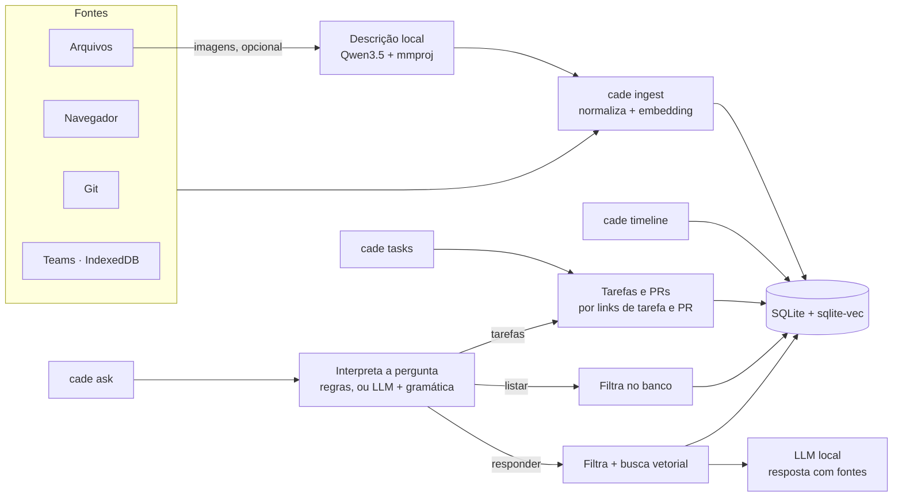

---

## Pacotes

As setas são imports (`A --> B`: A usa B). O núcleo só conhece interfaces (`llm.Embedder`, `llm.Generator`, `storage.EventStore`); as implementações concretas (`llamacpp`, `sqlitestore`) só são importadas pelo `cmd/cade`.

```mermaid
flowchart TD
    main["cmd/cade<br/>main, sources"]

    subgraph interface["Interface"]
        cli["cli<br/>subcomandos, saída, idioma"]
        doctor["doctor"]
        discovery["discovery<br/>(cade init)"]
        config["config"]
    end

    subgraph consulta["Consulta"]
        queryplan["queryplan<br/>regras + planejador"]
        rag["rag<br/>busca e resposta"]
        timeline["timeline<br/>períodos e listagem"]
        tasks["tasks<br/>relatório de tarefas"]
        listing["listing<br/>critérios de pessoa/direção"]
        provenance["provenance<br/>origem de cada evento"]
    end

    subgraph ingestao["Ingestão"]
        ingest["ingest<br/>Pipeline, SourceSpec"]
        sources["ingest/gitsource<br/>ingest/browsersource<br/>ingest/filesource<br/>ingest/teamssource<br/>ingest/idbsource"]
        chunking["chunking"]
        indexeddb["indexeddb (Chromium)<br/>+ leveldbraw, snappyblock,<br/>v8value, filecopy<br/>firefoxidb + smclone (Firefox)"]
        idbmap["idbmap<br/>schema de IndexedDB,<br/>aplicação, deriva, histórico"]
        idbdiscovery["idbdiscovery<br/>schema pelo modelo local"]
        imagecaption["imagecaption<br/>descrição de imagens (fase 19)"]
        imagefile["imagefile<br/>png, jpeg, webp → RGB"]
        ingestrun["ingestrun<br/>estado e trava do ingest (#41)"]
        pacing["pacing<br/>descanso dos modelos (#41)"]
    end

    subgraph portas["Interfaces do núcleo"]
        llm["llm<br/>Embedder, Generator,<br/>StructuredGenerator, ImageDescriber"]
        storage["storage<br/>EventStore, EmbeddingIndex,<br/>ImageCaptionIndex"]
        event["event<br/>Event"]
    end

    subgraph impl["Implementações"]
        llamacpp["llm/llamacpp<br/>(cgo, llama.cpp)"]
        sqlitestore["storage/sqlitestore<br/>(SQLite, sqlite-vec, FTS5)"]
        imagepreview["imagepreview<br/>prévia de imagem citada<br/>(programa chafa, opcional)"]
        procctl["procctl<br/>processo fora do terminal,<br/>parada e prioridade (#41)"]
    end

    main --> cli
    main --> sources
    main --> llamacpp
    main --> sqlitestore
    main --> config
    main --> imagepreview
    main --> procctl

    cli --> doctor
    cli --> discovery
    cli --> queryplan
    cli --> rag
    cli --> timeline
    cli --> tasks
    cli --> ingest
    cli --> imagecaption
    cli --> provenance
    cli --> ingestrun
    cli --> pacing
    cli --> idbdiscovery
    idbdiscovery --> idbmap
    idbdiscovery --> llm

    queryplan --> llm
    queryplan --> listing
    queryplan --> timeline
    rag --> queryplan
    rag --> storage
    rag --> llm
    rag --> chunking
    rag --> provenance
    timeline --> storage

    sources --> ingest
    sources --> indexeddb
    sources --> idbmap
    idbmap --> indexeddb
    ingest --> chunking
    ingest --> llm
    ingest --> storage
    imagecaption --> sources
    imagecaption --> imagefile
    imagecaption --> llm
    imagecaption --> storage
    pacing --> llm

    storage --> listing
    storage --> event
    tasks --> event

    imagepreview --> imagefile

    llamacpp -. implementa .-> llm
    sqlitestore -. implementa .-> storage
```

Pacotes que não aparecem: `textnorm` (normalização de texto, usada por quase todos), `rootfs` (sistema de arquivos para o `init` e o `doctor`), `idbschema` (o resumo sem valores do `cade teams-schema`, que a descoberta e a deriva também usam), `htmltext` (HTML de mensagem para texto, do Teams e do `html_text` dos schemas), `buildinfo` (`cade version`) e os de teste (`testfakes`, `testcheck`, `benchmarks`, `retrievalsuite`, `syntheticimage`, que desenha as imagens de teste, e `evalimages`, que abre o cache das descrições delas).

---

## Montagem: quem cria as implementações

`main` monta um `cli.Toolkit` com funções que abrem o banco e carregam os modelos. O `cli` recebe só essas funções, então os testes trocam tudo por fakes (`internal/testfakes`) sem llama.cpp nem SQLite.

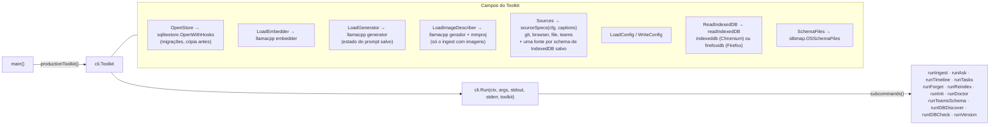

---

## `cade ingest`

Um `ingest` abre o banco, carrega só o modelo de embedding e passa cada coletor pelo mesmo `ingest.Pipeline`. Os coletores não sabem de banco nem de vetores: só emitem `event.Event`.

Com `sources.images` ligado e alvos da fonte `file`, uma primeira etapa (fase 19) descreve as imagens antes de o embedder carregar. O `imagecaption.Planner` percorre as pastas com o mesmo `filesource.Walk` do coletor, e o resultado (`ingest.ImageCaptions`, caminho → `event.Image`) vai para o coletor de arquivos, que usa a descrição como texto do evento. Daí em diante é o pipeline de sempre: máscara de segredos, pedaços, vetores, `chunks_fts`.

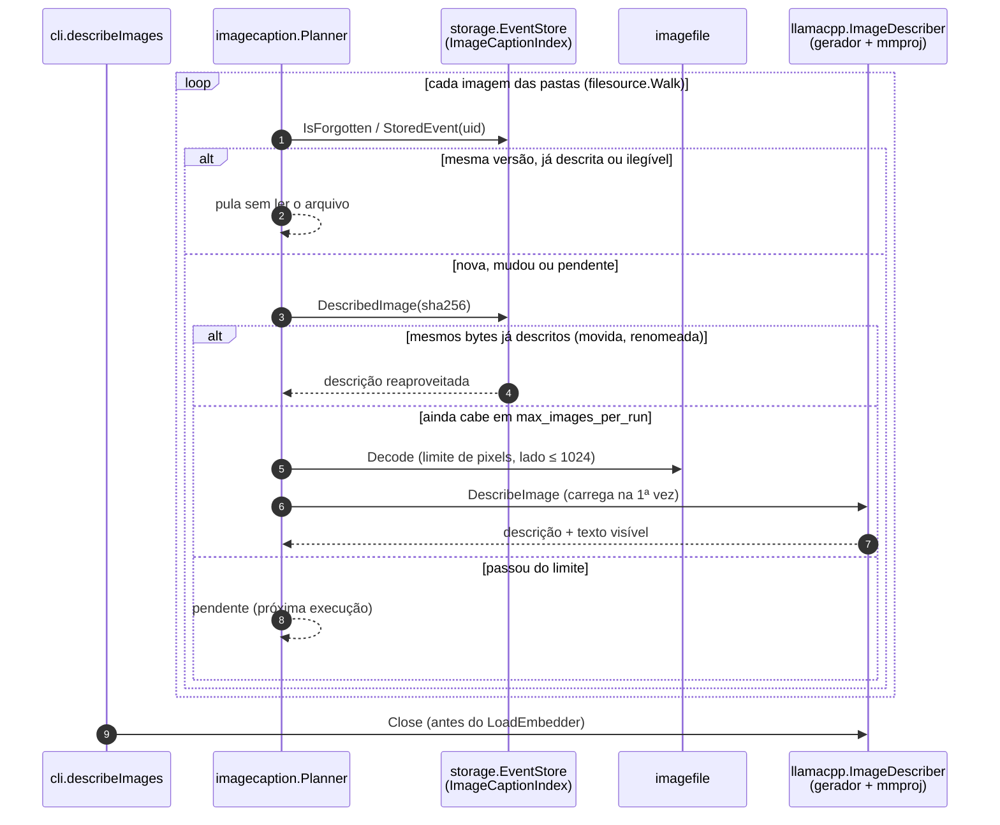

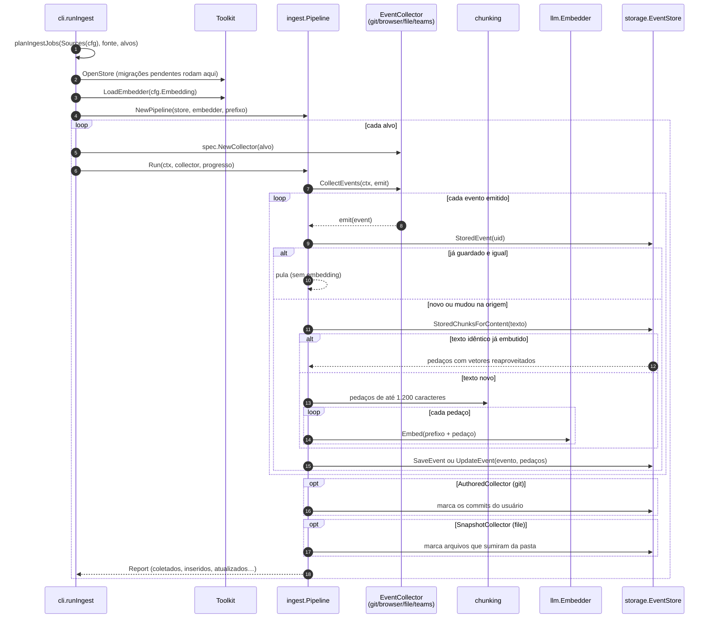

Os coletores de IndexedDB têm um caminho próprio até o evento. O Chromium e o Firefox guardam o IndexedDB em formatos diferentes, mas os dois leitores entregam a mesma árvore `v8value.Value`, então o resto não sabe de que navegador o dado veio:

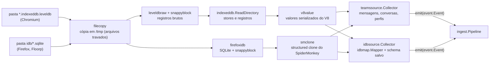

O schema de um aplicativo sai do `cade idb-discover`: o `idbdiscovery` monta um catálogo dos stores (caminhos, tipos e amostras mascaradas), pergunta ao modelo duas vezes sob gramáticas geradas a partir desses caminhos e aplica o schema proposto aos próprios registros antes de salvá-lo. O `cade idb-check` mede a deriva contra a impressão digital do schema e, com `--update`, regenera, compara (`idbmap.CompareSchemas`) e troca guardando a revisão anterior; com `--rekey`, renomeia os UIDs já indexados (`storage.EventStore.RekeyEvents`, com cópia do banco).

### Em segundo plano (`ingest start`, `status`, `pause`, `resume`, `stop`, `--gentle`)

O `cli` não faz nada disso direto: o `Toolkit.IngestRuns` traz o arquivo de estado e a trava (`ingestrun`), o controle de processos (`procctl`) e o relógio do `pacing`, e os testes trocam tudo por fakes.

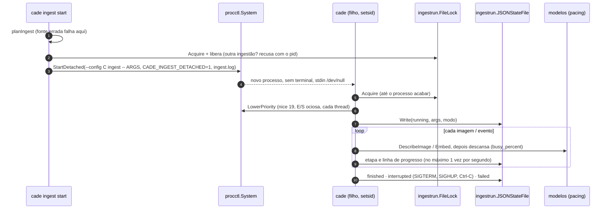

O processo filho é um `cade ingest` comum com `config.WithBackgroundLimits()` (threads, `gpu_layers`, imagens por execução de `ingest.background`) e com o embedder e o descritor de imagens embrulhados em `pacing.PacedEmbedder` e `pacing.PacedDescriber`. `--gentle` faz o mesmo no próprio terminal. `status` lê o estado e confere se o pid ainda existe (o `doctor` mostra a mesma data); `pause` manda SIGSTOP e grava `paused`, já que o processo congelado não grava nada; `stop` manda SIGTERM e SIGCONT, que cancelam o contexto como o Ctrl-C mesmo numa execução pausada; `resume` manda SIGCONT a uma pausada ou roda de novo os argumentos gravados, no mesmo modo, e a deduplicação (RF1.5) pula o que já foi gravado.

---

## `cade ask`

`askWithStore` interpreta a pergunta e escolhe um de três caminhos. Os modelos são carregados sob demanda por `askModels`: uma listagem lida por regras não carrega nenhum.

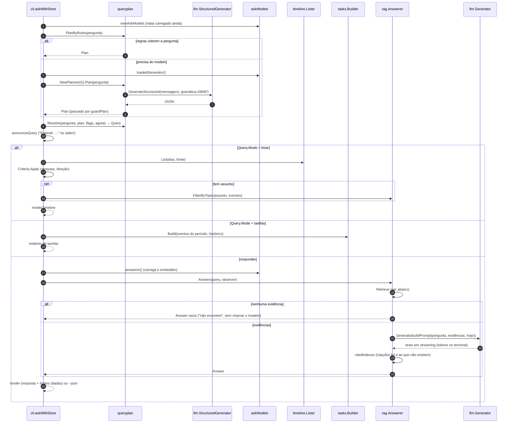

---

## Busca de evidências (`rag.Answerer.Retrieve`)

O caminho depende de a pergunta ter critérios exatos (pessoas, direção), um identificador (`PROJ-481`, hash) ou nenhum dos dois.

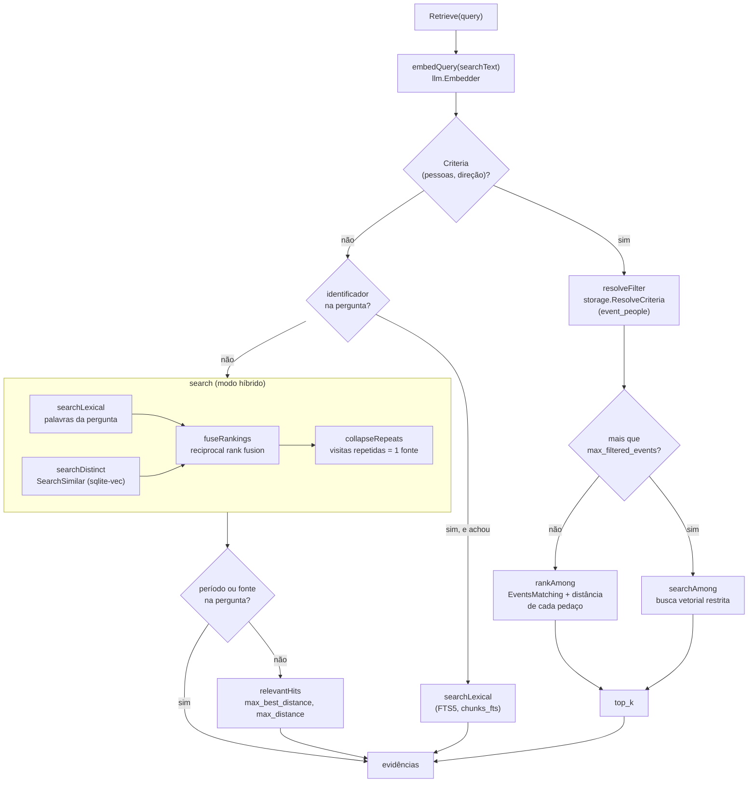

Depois disso, `generate` monta o prompt (`rag/prompt.go`): eventos que dão ordens ao assistente são marcados como não confiáveis e vão sem o texto (`rag/injection.go`), e mensagens sem conteúdo ("ok", "valeu") já ficaram de fora (`rag/chatter.go`).

---

## `cade timeline` e `cade tasks`

Nenhum dos dois carrega modelo.

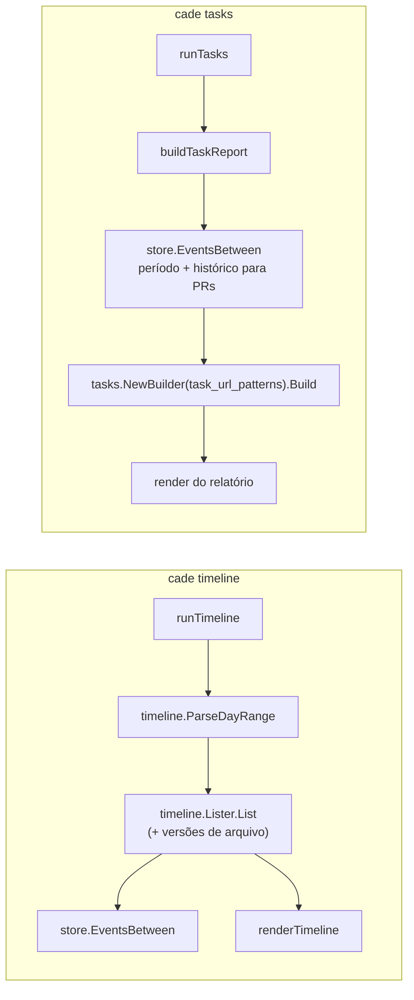

---

## `cade reindex`

Reaproveita o `ingest.Pipeline` sem coletor: só refaz os vetores. Com `--captions`, descreve de novo as imagens cuja descrição veio de outro modelo ou versão do prompt, em lotes de `ingest.max_images_per_run`: em cada lote, o `imagecaption.Recaptioner` descreve com o modelo de visão, que é liberado antes de o embedder carregar para `Pipeline.ReplaceStored` gravar o texto novo (com a máscara).

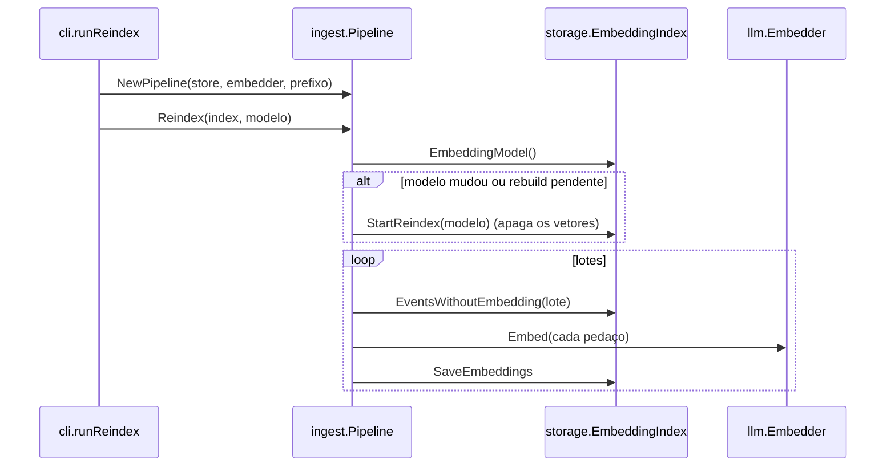

---

## Banco

Um arquivo SQLite (`~/.local/share/cade/cade.db`), com as extensões sqlite-vec e FTS5. As migrações ficam em `internal/storage/sqlitestore/migrations.go` e estão listadas no [CHANGELOG](../CHANGELOG.pt-BR.md#migrações).

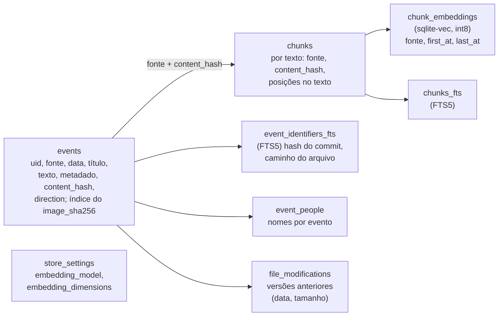

- **Pedaços por texto (#67):** eventos com o mesmo texto e a mesma fonte dividem um conjunto de `chunks`, vetores e entradas no `chunks_fts`; o evento chega a ele pelo `content_hash`. O conjunto é gravado com o primeiro evento do texto e apagado com o último (`releaseText` em `chunks.go`).
- **Filtros na busca vetorial (CA9.1):** a fonte é uma coluna do vec0. A data não pode ser, porque os eventos de um texto podem estar anos distantes: o vec0 guarda a primeira e a última data deles (`first_at`, `last_at`), o KNN fica com os textos cujo intervalo cruza o período, e os eventos decidem. Se menos de k textos têm evento no período, o k aumenta até o limite do sqlite-vec (`search.go`). Cada texto achado vira um resultado por evento dele que passa nos filtros.
- **Identificadores por evento:** o hash de um commit e o caminho de um arquivo ficam no `event_identifiers_fts`, por evento; a busca por palavras junta os dois índices pelo BM25.
