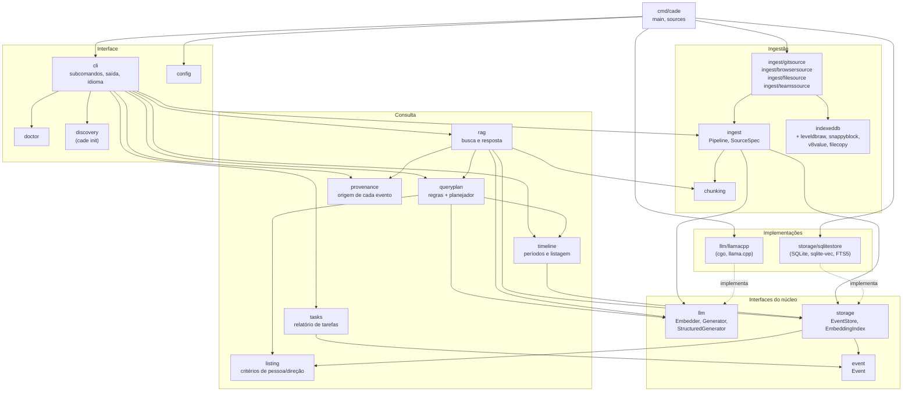
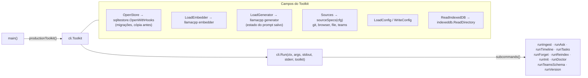
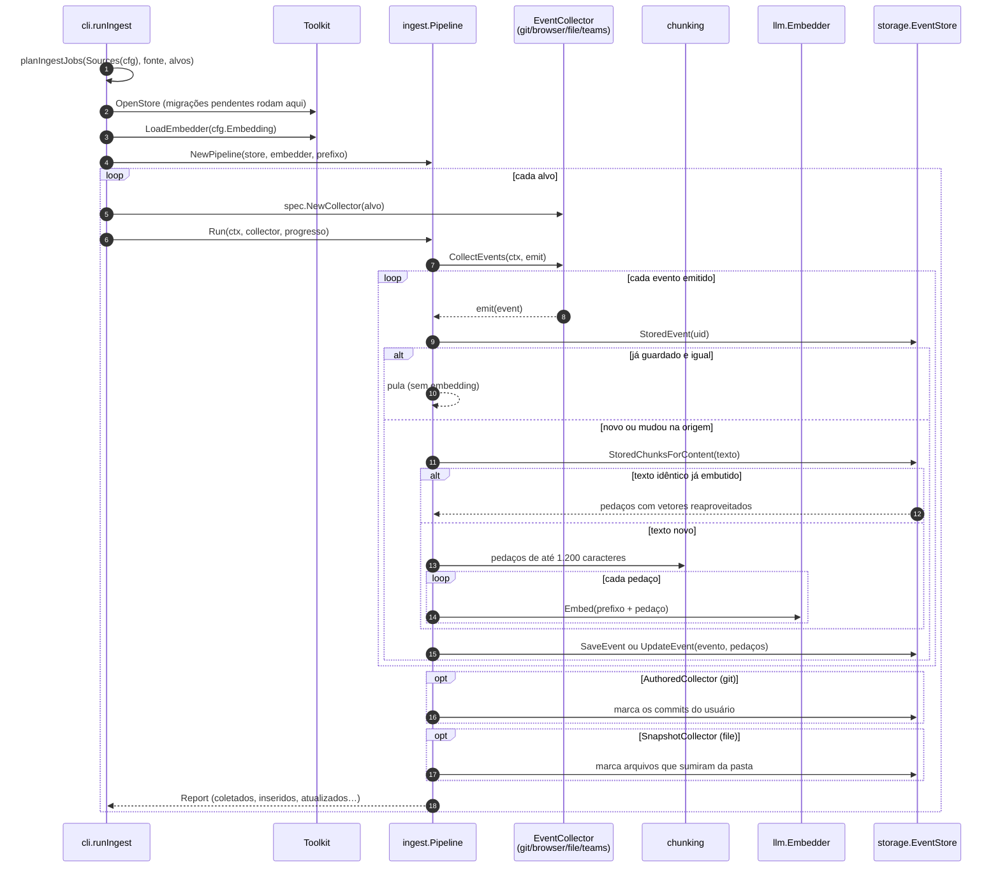
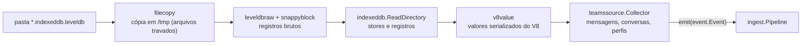
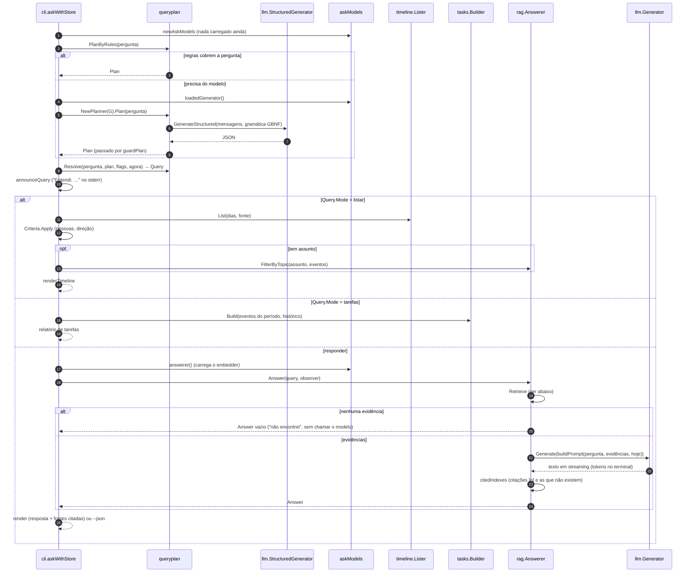
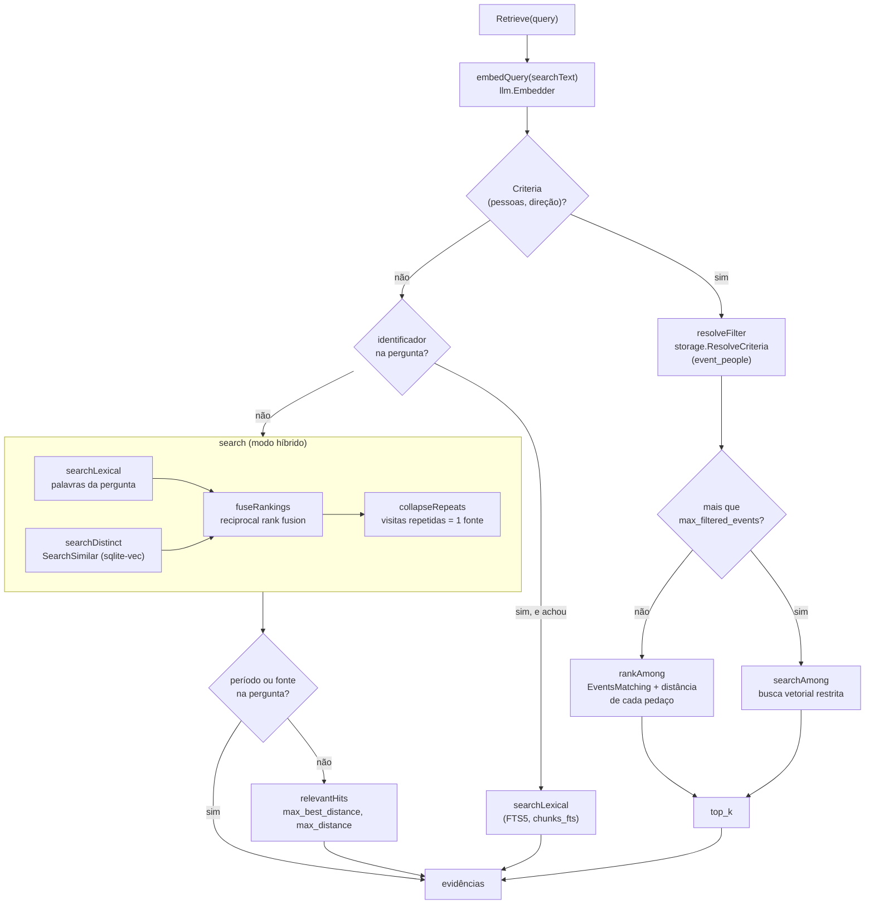
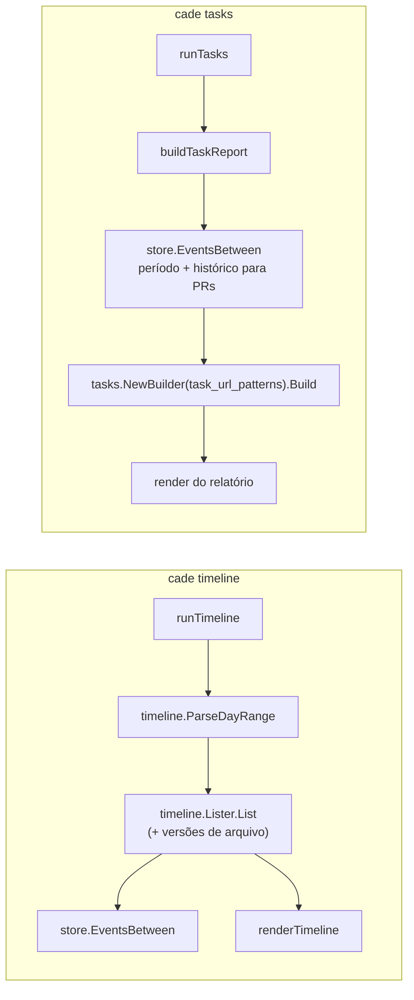
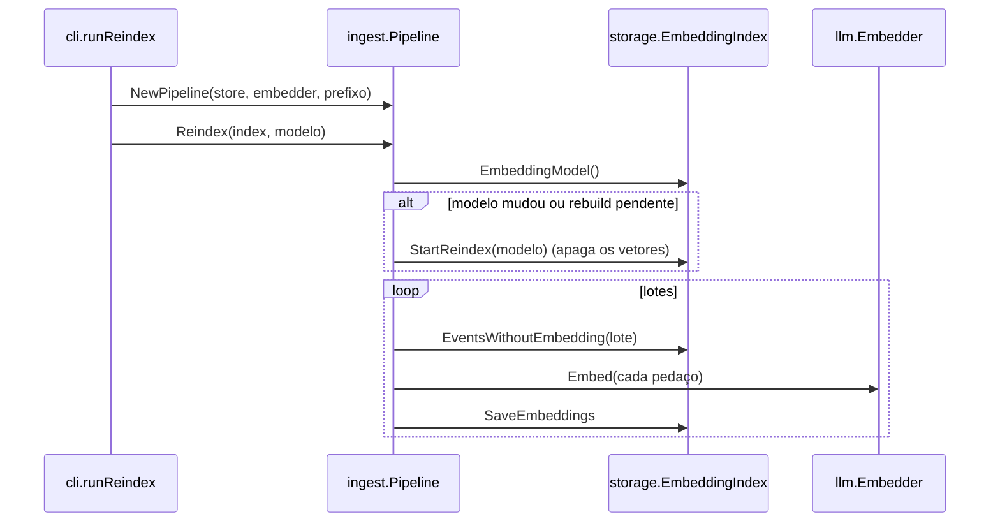
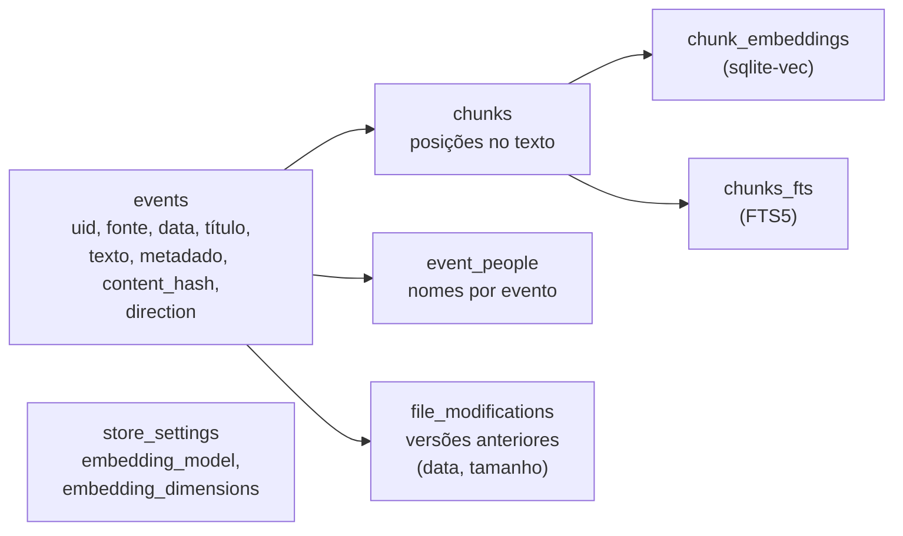

# cade — arquitetura

Como o código está organizado e qual componente chama qual, no estado da v0.0.0. Os diagramas são em Mermaid e seguem os nomes reais de pacotes, tipos e funções, para servirem de mapa ao ler o código. O que muda na v0.1.0 está no [ROADMAP](ROADMAP.md).

## Índice

- [Pacotes](#pacotes)
- [Montagem: quem cria as implementações](#montagem-quem-cria-as-implementações)
- [`cade ingest`](#cade-ingest)
- [`cade ask`](#cade-ask)
- [Busca de evidências (`rag.Answerer.Retrieve`)](#busca-de-evidências-raganswererretrieve)
- [`cade timeline` e `cade tasks`](#cade-timeline-e-cade-tasks)
- [`cade reindex`](#cade-reindex)
- [Banco](#banco)

---

## Pacotes

As setas são imports (`A --> B`: A usa B). O núcleo só conhece interfaces (`llm.Embedder`, `llm.Generator`, `storage.EventStore`); as implementações concretas (`llamacpp`, `sqlitestore`) só são importadas pelo `cmd/cade`.

Pacotes que não aparecem: `textnorm` (normalização de texto, usada por quase todos), `rootfs` (sistema de arquivos para o `init` e o `doctor`), `idbschema` (`cade teams-schema`), `buildinfo` (`cade version`) e os de teste (`testfakes`, `testcheck`, `benchmarks`, `retrievalsuite`).

---

## Montagem: quem cria as implementações

`main` monta um `cli.Toolkit` com funções que abrem o banco e carregam os modelos. O `cli` recebe só essas funções, então os testes trocam tudo por fakes (`internal/testfakes`) sem llama.cpp nem SQLite.

---

## `cade ingest`

Um `ingest` abre o banco, carrega só o modelo de embedding e passa cada coletor pelo mesmo `ingest.Pipeline`. Os coletores não sabem de banco nem de vetores: só emitem `event.Event`.

O coletor do Teams tem um caminho próprio até o evento:

---

## `cade ask`

`askWithStore` interpreta a pergunta e escolhe um de três caminhos. Os modelos são carregados sob demanda por `askModels`: uma listagem lida por regras não carrega nenhum.

---

## Busca de evidências (`rag.Answerer.Retrieve`)

O caminho depende de a pergunta ter critérios exatos (pessoas, direção), um identificador (`PROJ-481`, hash) ou nenhum dos dois.

Depois disso, `generate` monta o prompt (`rag/prompt.go`): eventos que dão ordens ao assistente são marcados como não confiáveis e vão sem o texto (`rag/injection.go`), e mensagens sem conteúdo ("ok", "valeu") já ficaram de fora (`rag/chatter.go`).

---

## `cade timeline` e `cade tasks`

Nenhum dos dois carrega modelo.

---

## `cade reindex`

Reaproveita o `ingest.Pipeline` sem coletor: só refaz os vetores.

---

## Banco

Um arquivo SQLite (`~/.local/share/cade/cade.db`), com as extensões sqlite-vec e FTS5. As migrações ficam em `internal/storage/sqlitestore/migrations.go` e estão listadas no [CHANGELOG](../CHANGELOG.pt-BR.md#migrações).

