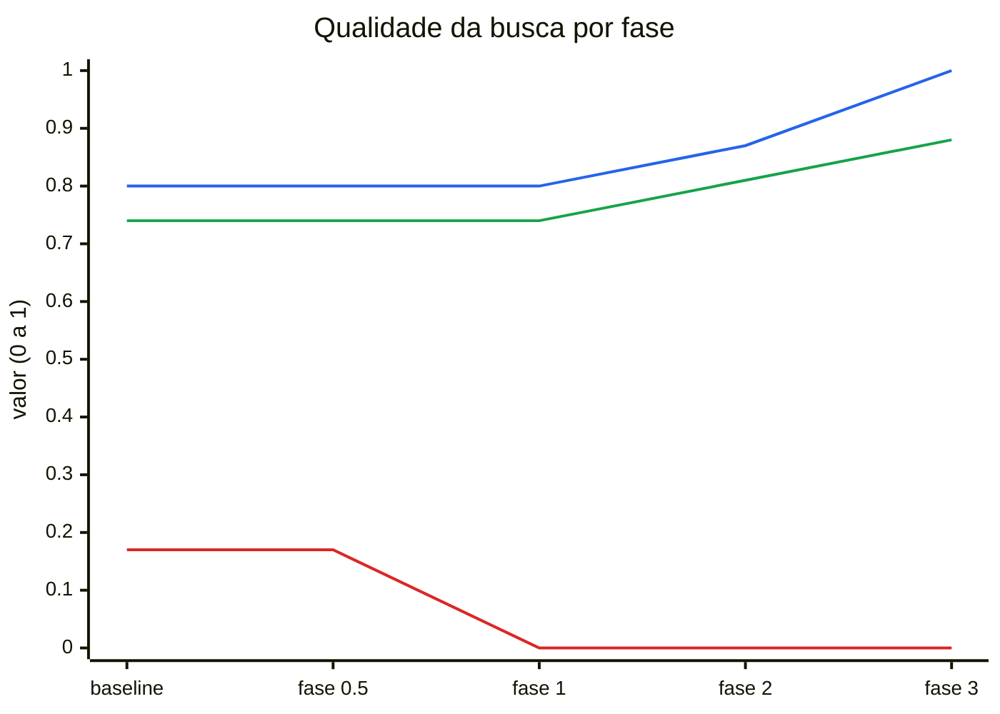
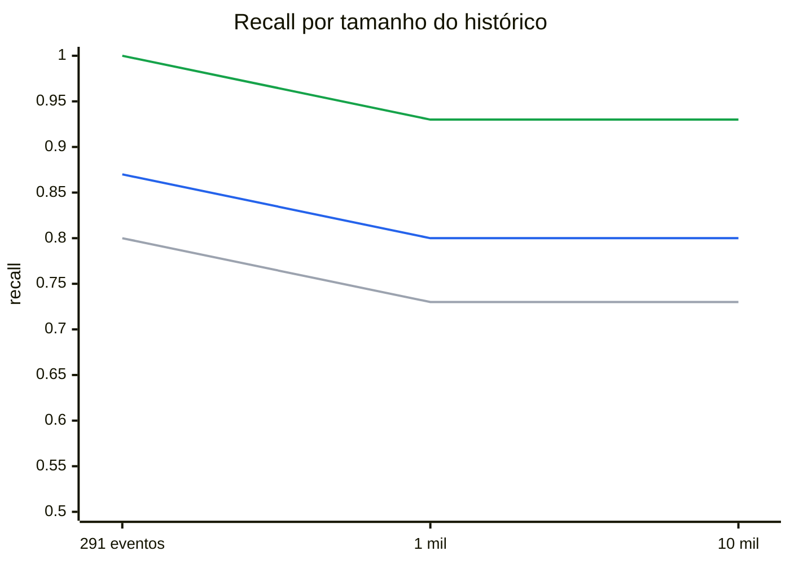
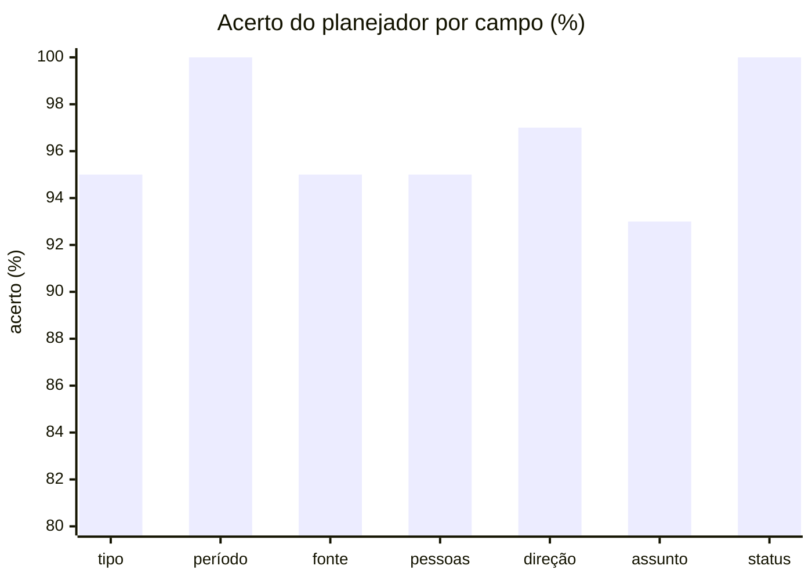
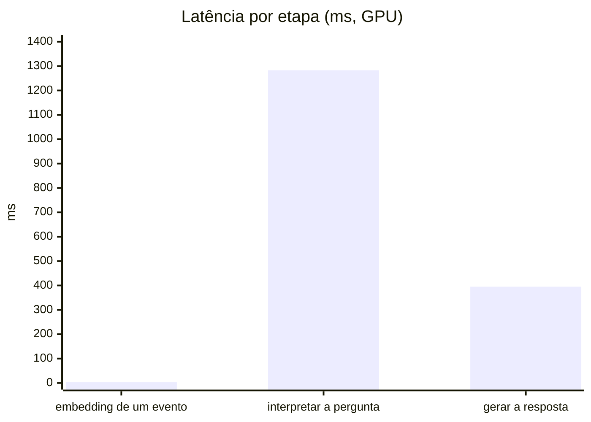
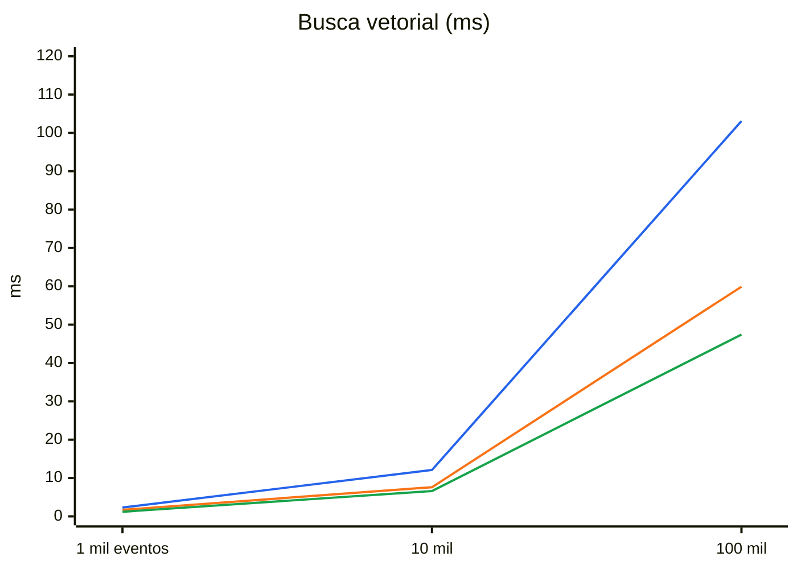
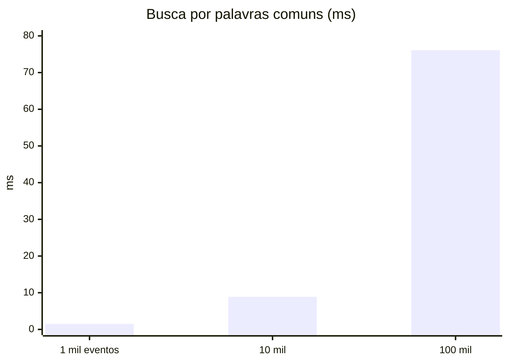
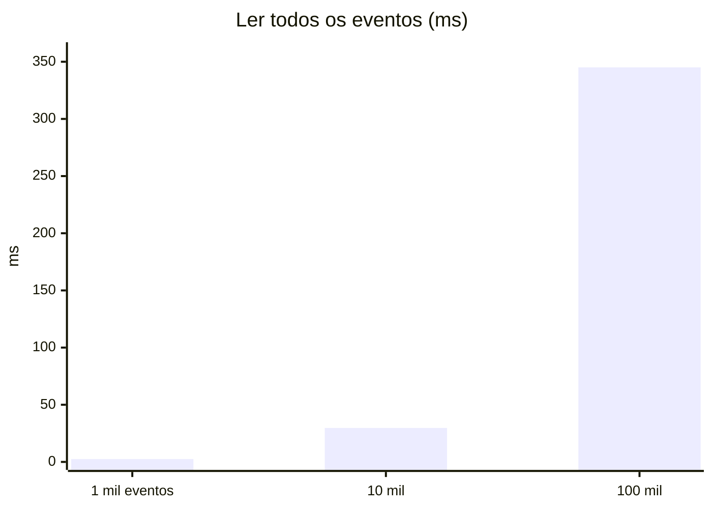

# Benchmarks

Medições do cade numa máquina de referência: Ryzen 5 5500, RTX 3060 12 GB, build CUDA. Os números vêm de:
- `bench/baseline.txt` (`make bench`);
- `bench/retrieval-baseline.txt`, `bench/retrieval-scale.txt` e `bench/plan-baseline.txt` (`make eval`, `make eval-scale`);
- das situações registradas em `docs/USECASES2.md`.

Os gráficos são Mermaid e precisam ser atualizados à mão depois de uma nova medição. O Mermaid não desenha legenda, então ela vem escrita abaixo de cada gráfico.

## Qualidade da busca por fase

Conjunto de teste da suíte de recuperação (24 perguntas, nunca usado para ajustar limites).

Azul: recall. Verde: MRR. Vermelho: redundância (resultados que repetem a mesma página ou arquivo; menor é melhor). A rejeição ficou em 1,00 em todas as fases.

## Busca à medida que o histórico cresce

Recall no conjunto de teste com o corpus aumentado por distratores (`make eval-scale`).

Cinza: baseline. Azul: depois da fase 2 (pedaços). Verde: depois da fase 3 (busca híbrida). Os distratores são gerados de modelos fixos e são menos variados que um histórico real, então a queda com o tamanho tende a ser maior na prática.

## Interpretação das perguntas

Acerto por campo na suíte de 153 perguntas (`make eval-plan`). Os pisos da suíte são comparados com o limite inferior do intervalo de Wilson de 95%, que fica 3 a 6 pontos abaixo destes valores.

## Latência do `ask` por etapa

Cada modelo aquece antes da medição; a interpretação da pergunta roda com o cache de prompt frio, como num `cade ask` real.

Interpretar a pergunta custa mais que gerar a resposta: a saída é restrita por gramática, e o sampler com gramática do llama.cpp é lento por token. É o alvo da fase 5.

## Busca vetorial no banco

Busca dos vizinhos mais próximos em históricos sintéticos (`make bench`), antes da fase 2. Com pedaços, a busca em 100 mil eventos passou de 103 para 112 ms.

Azul: sem filtro. Laranja: só Teams. Verde: um dia. O tempo cresce de forma linear com o histórico, porque o sqlite-vec compara com todos os vetores; filtros reduzem o trabalho.

## Busca por palavra no banco

A metade por palavras da busca híbrida (FTS5), com eventos sintéticos. Um hash de commit é resolvido em 0,1 ms em qualquer tamanho.

O corpus sintético repete as mesmas poucas palavras em quase todos os eventos, então este é o pior caso; num histórico real as palavras são mais variadas.

## Carregar o histórico inteiro

É o que acontece numa pergunta com pessoa e sem período. Ler um dia leva menos de 1 ms em qualquer tamanho.

Alvo da fase 6: filtrar pessoas no SQL em vez de carregar tudo.

## Memória

```mermaid
---
config:
  themeVariables:
    xyChart:
      plotColorPalette: "#2563eb, #f97316"
---
xychart-beta
  title "Memória com os modelos carregados (MB)"
  x-axis ["só embedding", "embedding + geração"]
  y-axis "MB" 0 --> 2800
  bar [979, 1174]
  bar [390, 2554]
```

Azul: RAM do processo. Laranja: memória da GPU. Numa build só de CPU, os pesos ficam na RAM.

## Números

| Medida | 1 mil | 10 mil | 100 mil |
|---|---|---|---|
| busca vetorial, sem filtro (ms) | 2,3 | 12,1 | 103,1 |
| busca vetorial, só Teams (ms) | 1,7 | 7,6 | 59,9 |
| busca vetorial, um dia (ms) | 1,2 | 6,6 | 47,4 |
| ler um dia (ms) | 0,05 | 0,16 | 0,75 |
| ler tudo (ms) | 2,5 | 29,7 | 345,1 |
| vetores de 1.000 eventos (ms) | 170 | 152 | 165 |
| bytes por evento | 3.633 | 3.563 | 3.498 |

| Modelo | Latência | RAM | GPU |
|---|---|---|---|
| embedding de um evento | 3,5 ms | 979 MB | 390 MB |
| interpretar a pergunta | 1.283 ms | 1.121 MB | 2.554 MB |
| gerar a resposta (~45 tokens) | 395 ms | 1.174 MB | 2.554 MB |
