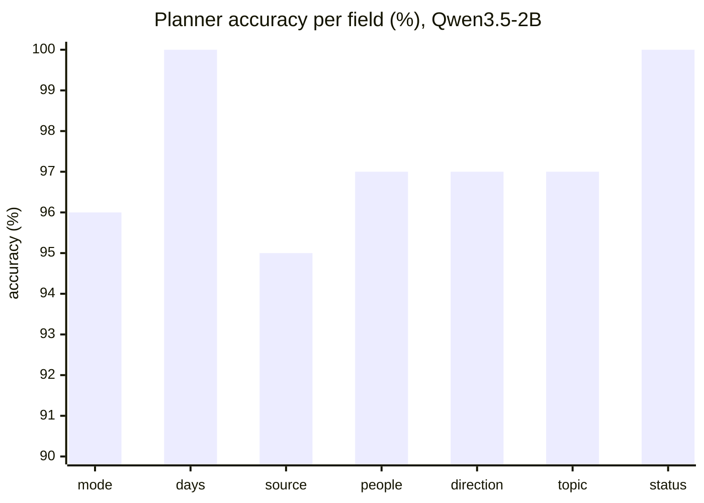
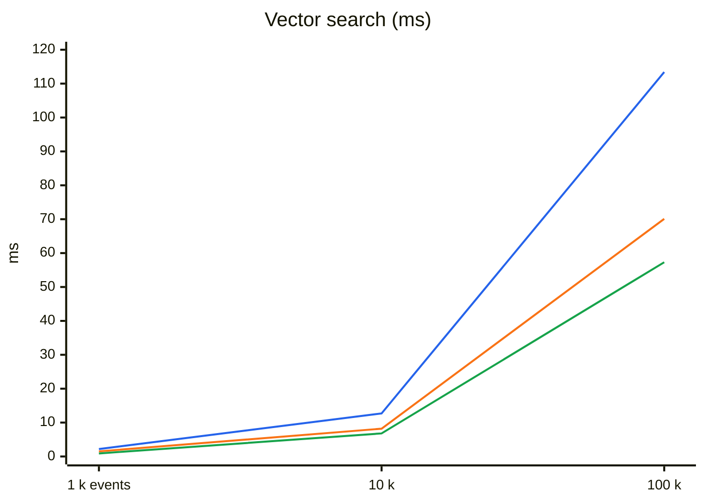
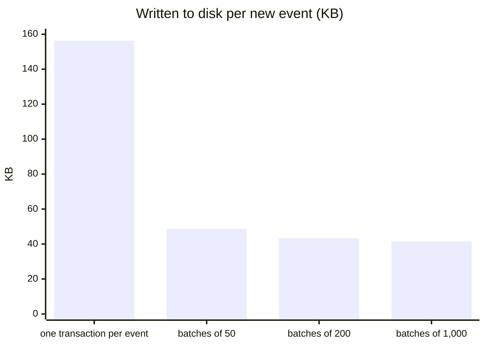
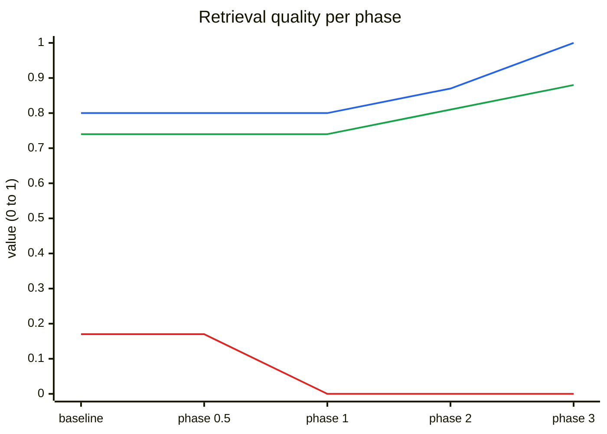
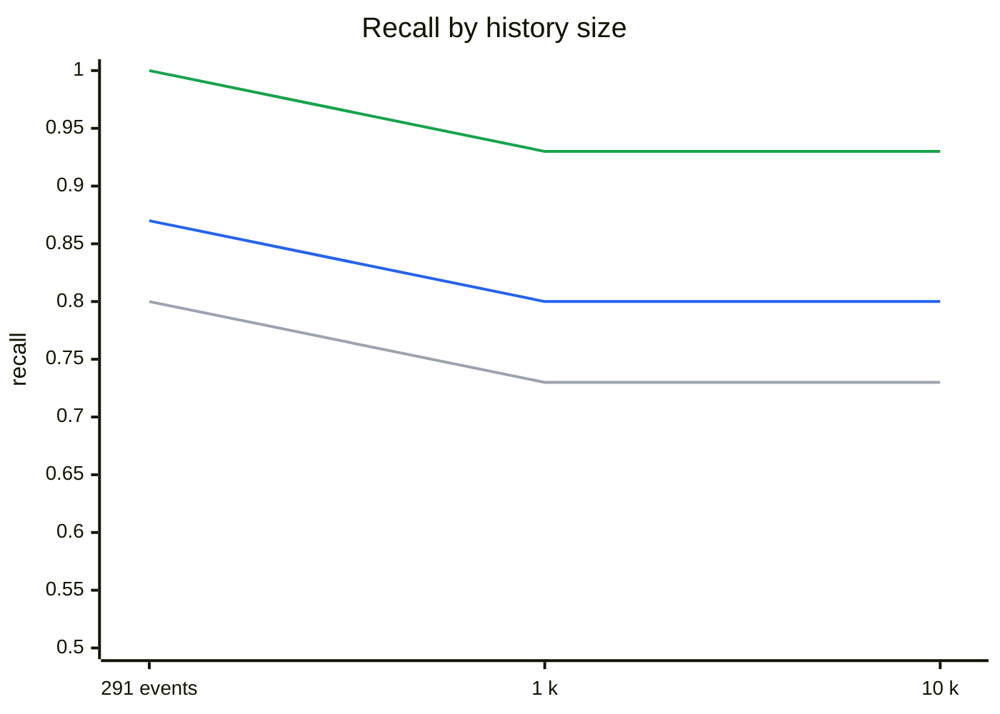

<p align="center">
  
</p>

# Benchmarks

Measurements of cade on a reference machine. Each section gives the command that reproduces it, the date, the commit and the build. Sections that no command today reproduces are under [History](#history).

## Machine and builds

| | |
|---|---|
| CPU | AMD Ryzen 5 5500, 6 cores / 12 threads |
| GPU | NVIDIA RTX 3060 12 GB, **power-limited to 120 W** (default 170 W) to keep it cool; at 170 W it reached 93 °C |
| Disk | Kingston A400 (SATA), ext4 |
| CUDA build | `go tool mage bench` / `go tool mage eval` (default, `cuda` tag) |
| CPU build | `GO_TAGS= go tool mage bench` (the same machine, without the GPU) |
| Models | `nomic-embed-text-v2-moe` Q4_K_M (embeddings), Qwen3.5-2B Q4_K_M + `mmproj` (generation and images) |

Today's numbers were measured on **2026-09-30, commit `f4e5379`**. The raw outputs are in `bench/`:

| File | Command |
|---|---|
| `bench/baseline.txt` | `go tool mage bench` (CUDA) |
| `bench/baseline-cpu.txt` | `GO_TAGS= go tool mage bench` |
| `bench/plan-baseline.txt` | `go tool mage evalPlan` (part of `go tool mage eval`) |
| `bench/retrieval-scale.txt` | `go tool mage evalScale` |
| `bench/retrieval-scale-top8.txt` | `SCALE_TOP_K=8 SCALE_REPORT=bench/retrieval-scale-top8.txt go tool mage evalScale` |

The baselines up to 2026-09-27 were measured with the GPU at 170 W. At 120 W only image description got slower (0.1–0.2 s); the rest of the GPU numbers stayed the same or got faster. For a single question the GPU waits on memory, not on power.

The charts are Mermaid and are updated by hand after a new measurement. Mermaid draws no legend, so it is written below each chart.

## Reading the metrics

### In plain language

Think of cade as an assistant that keeps everything you did in a filing cabinet. When you ask something, it first works out what you mean, then looks for the right papers in the cabinet, puts a few on the desk, reads them and answers.

| Term | In practice |
|---|---|
| CPU / GPU | Running on the processor alone (most laptops) or with a graphics card. On the reference machine, the graphics card does the AI work 7.5 to 23 times faster: a full `ask` takes 22.7 s on the CPU and 3.04 s on the GPU. If your computer has no dedicated graphics card, look at the CPU numbers. |
| recall | **Did it find it?** Out of 100 questions that have an answer in your history, how many times the right paper reached the desk. With 10 k events recall is 0.96: 4 times out of 100 it did not, and the answer comes out incomplete or "I don't know". |
| MRR | **Did it find it right away?** Like a web search: 1.00 = the right paper is always on top of the pile; 0.50 = on average it is second. Today it is 0.87: first, for most questions. |
| rejection | **Can it say "I don't know"?** When the answer is not in the history, how often it admits it instead of making something up. Today it is 1.00: on the 9 unanswerable calibration questions it never made anything up. |
| redundancy | **Did it bring duplicates?** How much of the desk was taken by the same paper twice instead of a new one. |
| calibration / test set | Like studying with one set of exercises and taking the exam with another. The grade that counts is the exam (the test set). |
| `top_k` | How many papers the assistant puts on the desk before answering. More papers, better chance the answer is there, but more time reading: on the CPU, 6 papers take 9.71 s and 8 papers 11.92 s. |
| per-field accuracy | To understand the question, cade fills in a form: list or answer? From when? From where (git, browser, Teams)? From whom? This is how often each line of the form comes out right. |
| Wilson interval | The margin of error, as in an opinion poll: 149 right out of 155 questions (96.1%) means "probably between 92% and 98%". |
| read by rules | Simple questions ("what did I do yesterday?") that cade understands without AI. In the suite, 69 of 155, with 0 mistakes. |
| `ask` to first token | How long you wait, after pressing Enter, until the answer starts to appear: from 1.56 s (GPU, simple question) to 27.2 s (CPU, question that goes to the AI, right after turning the computer on). |
| warm / cold cache | Like opening a program for the second time in a day (fast, it is already in memory) or right after turning the computer on (slow, it has to be read from disk). The difference is 4.3 to 4.7 s. |
| saved state | A "bookmark" on disk (98 MB) for the fixed part of the AI's instructions, so it does not reread them on every question. On the CPU it cuts `ask` from 22.7 s to 14.4 s. |
| `rss_MB` / `gpu_MB` | How much memory cade takes while running: the computer's RAM and the graphics card's memory. With both models loaded, 1,412 MB of RAM and 1,948 MB of graphics memory; on the CPU alone, 2,363 MB of RAM. |
| bytes per event | How much disk space each item of the history takes (a commit, a visited page, a message). In the synthetic test, 3,805 bytes: 100 k items = 380.5 MB. In the reference machine's real history, 5,282 bytes: 238,720 items = 1.26 GB. |
| KB written per event | How much of the SSD cade uses up to store each item. SSD lifetime is measured by how much has been written to it; less is better. Today, 43.4 KB per item (it was 156.3 KB): 2,287 items write 99.2 MB. |
| tokens | Pieces of words the AI reads and writes. The AI's time grows with the number of tokens: the instructions for understanding the question are ~2 k tokens, and a test answer 20 to 34. |

**Retrieval quality** (suites in `internal/retrievalsuite`). Each question has the events that should come back, or none when the answer is not in the history.

| Metric | What it measures | Best |
|---|---|---|
| recall | Of the questions that have an answer, the share where at least one expected event is among the `top_k` returned. 0.94 = for 6% of the questions the answer never reaches the model. | 1.00 |
| MRR | *Mean reciprocal rank*: the mean of 1/position of the first expected event (1st place = 1, 2nd = 0.5, 3rd = 0.33, missing = 0). Tells how close to the top the answer shows up. | 1.00 |
| rejection | Of the questions with **no** answer in the history, the share where search returns nothing, so cade says it does not know instead of making something up. | 1.00 |
| redundancy | Share of the results that repeat the page or file of another result, taking the place of new evidence. | 0.00 |
| calibration / test set | Calibration tunes the thresholds; the test set is never used to tune anything and is the number that counts. | |

**Question interpretation** (`internal/queryplan`). The planner turns the question into a plan with seven fields: `mode` (answer or list), `days` (period), `source` (git, browser, file, Teams), `people`, `direction` (sent/received), `topic` and `status` (of tasks).

| Metric | What it measures |
|---|---|
| per-field accuracy | Share of the questions where that field came out as expected. |
| Wilson 95% interval | The range where the true accuracy probably lies, given the size of the suite. The suite fails when the **lower** bound falls below the field's floor, so luck on a small set does not pass. |
| fully correct | Questions with all seven fields right. |
| read by rules | Questions the rules understand without a model; "0 wrong" = none of them came out different from the expected plan. |

**Time and resources** (`go test -bench`).

| Metric | What it measures |
|---|---|
| ns/op (shown in ms or s) | Mean time of one operation over 5 runs (`-benchtime 5x`). Model benchmarks warm up first, so loading is not counted, except in the full `ask` ones. |
| `ask` to first token | From process start to the first token of the answer: loading the models, interpreting, searching and reading the evidence. It is the wait the person feels. |
| warm / cold page cache | Warm: the model files are already in the system's memory (read recently). Cold: evicted before each run, as after a reboot; adds reading ~1.6 GB from disk. |
| `rss_MB` | The process's resident RAM (`VmRSS`) at the end of the benchmark. |
| `gpu_MB` | GPU memory used by the process, according to `nvidia-smi`. |
| `bytes/event` | Database file size divided by the number of events, with vectors, indexes and text. Used to project growth. |
| `reply_tokens/op` | Tokens generated per answer. Generation time depends on it, and it differs between CPU and GPU because the generated text changes. |
| KB written per event | Bytes the process sent to disk (`write_bytes` from `/proc/PID/io`) divided by the new events. Measures SSD wear, not database size. |

## Retrieval quality

> `go tool mage eval` (`TestRetrievalSuiteWithModel`) · 2026-09-30 · `f4e5379` · CUDA. CPU gives the same quality.

Test set of 32 questions (25 text and 7 image) over ~300 events, `top_k` 6:

| recall | MRR | rejection | redundancy |
|---:|---:|---:|---:|
| 1.00 | 0.87 | 1.00 | 0.00 |

32 of 32 correct. On 2026-09-27 the MRR was 0.89.

The injection suite (`TestInjectionWithModel`, 5 questions with instructions hidden in events and in an image) passed with no instruction followed.

## `top_k` and thresholds

> Quality: `go tool mage eval` (`TestRetrievalSweepWithModel`) · Time: `go tool mage bench` and `GO_TAGS= go tool mage bench` (`BenchmarkColdAskTopK`, warm page cache) · 2026-09-30 · `f4e5379`

`top_k` is how many events search hands to the model. More events raise the chance that the answer is there, but the model has to read all of them before answering.

| `top_k` | recall | MRR | rejection | `ask` CPU | `ask` GPU |
| ---: | ---: | ---: | ---: | ---: | ---: |
| 4 | 0.93 | 0.86 | 1.00 | 7.65 s | 1.44 s |
| **6 (default)** | **1.00** | **0.87** | **1.00** | **9.71 s** | **1.56 s** |
| 8 (v0.0.0) | 1.00 | 0.88 | 1.00 | 11.92 s | 1.62 s |
| 12 | 1.00 | 0.88 | 1.00 | 16.47 s | 1.76 s |

- **`top_k` = 6:** the smallest value that loses no recall. With 8 the MRR rises by 0.01 and `ask` on CPU gets 2.2 s slower.
- **Thresholds:** `max_distance` changes nothing between 0.68 and 0.76. With `max_best_distance` 0.63, rejection on the calibration set drops to 0.89 (one unanswerable question gets through). Calibration puts the cut between the worst event of an answerable question (0.596) and the best event of an unanswerable one (0.624). The current 0.61 is inside that range. On CPU the range was 0.606–0.621 on 2026-09-27; the vectors differ in the third decimal.

## Retrieval as the history grows

> `go tool mage evalScale` (`bench/retrieval-scale.txt`) and the same with `SCALE_TOP_K=8` (`bench/retrieval-scale-top8.txt`) · 2026-09-30 · `f4e5379` · CUDA

The test set with the corpus padded with distractor events up to 1 k and 10 k events:

| events | `top_k` 6: recall / MRR / rejection | `top_k` 8: recall / MRR / rejection |
|---:|---|---|
| 1 k | 0.96 / 0.84 / 1.00 | 0.96 / 0.86 / 1.00 |
| 10 k | 0.96 / 0.83 / 1.00 | 0.96 / 0.82 / 1.00 |

The distractors are generated from fixed templates and are less varied than a real history, so the drop with size tends to be larger in practice.

## Reranking (phase 17, rejected)

> `go tool mage evalRerank` · 2026-09-27 · `ce1454b` · CUDA (GPU at 170 W) and CPU · not re-run: the reranker is not in use.

The top 30 of the hybrid search, after the distance cuts, were reordered by `bge-reranker-v2-m3` Q4_K_M (418 MB) and cut to 6:

| events | without reranker (recall / MRR) | with reranker (recall / MRR) | cost per question |
| ---: | ---: | ---: | ---: |
| 291 | 1.00 / 0.89 | 0.94 / 0.91 | 72 ms GPU, 567 ms CPU |
| 1 k | 0.94 / 0.83 | 0.94 / 0.91 | 61 ms GPU |
| 10 k | 0.94 / 0.83 | 0.94 / 0.91 | 58 ms GPU |

MRR went up, but recall on the test set fell from 1.00 to 0.94, and the criterion requires equal or better recall. On CPU, 0.57 s per question plus loading another 418 MB would eat a third of what `top_k` 6 saves.

## Question interpretation

> `go tool mage evalPlan` (`bench/plan-baseline.txt`) · 2026-09-30 · `f4e5379` · CUDA · Qwen3.5-2B

Suite of 155 questions: 131 fully correct, 69 read by the rules alone, none of them wrong.



| Field | Correct | Wilson 95% |
|---|---:|---|
| `mode` | 149/155 | 92%–98% |
| `days` | 155/155 | 98%–100% |
| `source` | 147/155 | 90%–97% |
| `people` | 150/155 | 93%–99% |
| `direction` | 150/155 | 93%–99% |
| `topic` | 151/155 | 94%–99% |
| `status` | 155/155 | 98%–100% |

On 2026-09-27, with 153 questions, 135 were fully correct. The most frequent errors are message listings read as a question to answer (`mode`) and person names missing from `people`. The comparison with other models is under [History](#history).

## `ask` latency per stage

> `go tool mage bench` and `GO_TAGS= go tool mage bench` (`BenchmarkEmbedEvent`, `BenchmarkPlanQuestion`, `BenchmarkAnswer`) · 2026-09-30 · `f4e5379`

Each model warms up before the measurement. "Interpret the question" uses the model with a cold prompt cache and no saved state: it is the cost of a question the rules do not read. "Generate the answer" includes reading the evidence.

| Stage | GPU | CPU |
|---|---:|---:|
| embed one event | 3.1 ms | 32 ms |
| interpret the question | 1.49 s | 12.6 s |
| read the evidence and generate the answer | 0.47 s (20 tokens) | 10.9 s (34 tokens) |

The planner prompt has ~2 k tokens of instructions and examples, and llama.cpp's grammar sampler is slow per token.

## A full `ask`

> `go tool mage bench` and `GO_TAGS= go tool mage bench` (`BenchmarkColdAsk`) · 2026-09-30 · `f4e5379`

From start to the first token of the answer, loading both models. The question is read by the model decoding the whole prompt, by the model with the saved prompt state, or by the rules, with no model.

```mermaid
---
config:
  themeVariables:
    xyChart:
      plotColorPalette: "#9ca3af, #2563eb, #16a34a"
---
xychart-beta
  title "ask to first token, GPU (s)"
  x-axis ["warm cache", "cold cache"]
  y-axis "s" 0 --> 10
  bar [3.04, 7.65]
  bar [2.77, 7.28]
  bar [1.56, 5.86]
```




Grey: model, whole prompt decoded. Blue: model with saved state. Green: rules.

- **CPU:** the saved state cuts 36% of `ask` with a warm cache (22.7 → 14.4 s), and the rules 57% (→ 9.8 s). What is left is almost all the model reading the evidence before answering. On 2026-09-27 it was 24.8 / 16.5 / 12.0 s.
- **GPU:** the gain is smaller in seconds (3.04 → 2.77 → 1.56 s), and the cold cache dominates: reading the models from disk adds ~4.5 s.
- **Saved state:** a 98 MB file in `~/.cache/cade/prompt-state/`, written on the first question that goes to the model.
- **Rules:** they read 69 of the 155 questions of the plan suite. A task listing or report read by them does not even load a model.

## Database

> `go tool mage bench` (`internal/storage/sqlitestore`) · 2026-09-30 · `f4e5379` · database on tmpfs, synthetic events. These numbers do not depend on CPU or GPU build.

| Measure | 1 k | 10 k | 100 k |
|---|---:|---:|---:|
| vector search, no filter (ms) | 2.2 | 12.7 | 113.4 |
| vector search, Teams only (ms) | 1.5 | 8.2 | 70.1 |
| vector search, one day (ms) | 0.9 | 6.8 | 57.3 |
| search for common words, FTS5 (ms) | 1.5 | 9.0 | 78.0 |
| search for a hash prefix (ms) | 0.10 | 0.10 | 0.11 |
| read one day (ms) | 0.04 | 0.15 | 0.68 |
| read everything (ms) | 2.0 | 27.6 | 346.0 |
| person with no period, read everything and filter in Go (ms) | 3.8 | 44.5 | 469.5 |
| person with no period, filter in SQL (ms) | 0.35 | 0.89 | 8.5 |
| direction with no period, count + vector search (ms) | 2.7 | 16.1 | 122.8 |
| chunk vectors of 1,000 events (ms) | 202 | 177 | 201 |
| bytes per event | 4,010 | 3,867 | 3,805 |



Blue: no filter. Orange: Teams only. Green: one day.

- **Vector search:** grows linearly with the history, because sqlite-vec compares against every vector; filters reduce the work.
- **Word search:** the synthetic corpus repeats the same few words in almost every event, so this is the worst case.
- **Person with no period:** the question used to load the whole history and filter in Go (469 ms and 187 MB allocated at 100 k events). With the filter in SQL it takes 8.5 ms and 0.7 MB.
- **Saving an event:** 0.69 ms in its own transaction (`BenchmarkSaveEvent`) and 0.50 ms in a batch of 200 (`BenchmarkSaveEventInBatch`). On tmpfs `fsync` costs nothing; the effect of batches on disk is under [Disk writes during ingestion](#disk-writes-during-ingestion-51).

## Size per table (#40)

### Synthetic history

> `go tool mage bench` (`BenchmarkTableSize`, `internal/storage/sqlitestore`, compiled with `sqlite_dbstat`) · 2026-09-30 · `e616f06` · same synthetic events as [Database](#database).

Bytes per event of each table, with its internal tables and its indexes; the sum is the `bytes per event` of [Database](#database).

| Table | What it holds | 1 k | 10 k | 100 k | % at 100 k |
|---|---|---:|---:|---:|---:|
| `chunk_embeddings` | chunk vectors (sqlite-vec) | 3,240 | 3,203 | 3,135 | 82.4 |
| `events` | event text and metadata | 549 | 526 | 531 | 14.0 |
| `chunks_fts` | word index (FTS5) | 107 | 83 | 83 | 2.2 |
| `chunks` | text chunks of each event | 53 | 41 | 44 | 1.2 |
| `event_people` | people of each event | 20 | 13 | 12 | 0.3 |
| `file_modifications` | date and size of each file version | 8 | 0.8 | 0.1 | 0.0 |
| other | settings, forgotten events | 20 | 2 | 0.2 | 0.0 |

- **Vectors:** ~3.1 KB of the ~3.8 KB per event at every size; 768 `float32` dimensions take 3,072 bytes on their own.
- **Fixed cost:** `file_modifications` and other are one or two empty pages, so they shrink per event as the history grows. The synthetic history has no files; in the real history below they are 0.3 MB together.

### Real history

> `sqlite3 -readonly ~/.local/share/cade/cade.db` with the query below · 2026-09-30 · the reference machine's real history: 238,720 events, 246,488 chunks, 1.26 GB.

```sql
SELECT CASE
    WHEN name LIKE 'chunk_embeddings%' THEN 'chunk_embeddings'
    WHEN name LIKE 'chunks_fts%' THEN 'chunks_fts'
    WHEN name LIKE 'events%' OR name = 'sqlite_autoindex_events_1' THEN 'events'
    WHEN name LIKE 'chunks%' OR name = 'sqlite_autoindex_chunks_1' THEN 'chunks'
    WHEN name LIKE 'event_people%' THEN 'event_people'
    ELSE 'other' END AS table_name,
  round(sum(pgsize) / 1048576.0, 1) AS mb,
  round(100.0 * sum(pgsize) / (SELECT sum(pgsize) FROM dbstat), 1) AS pct
FROM dbstat GROUP BY table_name ORDER BY mb DESC;
```

Each table includes its internal tables and its indexes.

| Table | What it holds | MB | % |
|---|---|---:|---:|
| `chunk_embeddings` | chunk vectors (sqlite-vec) | 960.1 | 79.8 |
| `events` | event text and metadata | 203.4 | 16.9 |
| `chunks_fts` | word index (FTS5) | 22.8 | 1.9 |
| `chunks` | text chunks of each event | 9.8 | 0.8 |
| `event_people` | people of each event | 6.0 | 0.5 |
| other | settings, modified files, forgotten events | 0.3 | 0.0 |

Vectors are 4/5 of the database: ~4.0 KB per chunk, for 768 `float32` dimensions that take 3 KB on their own.

## Space levers (#40)

Each way of keeping more history in less space, measured on the reference machine's real history (1,242.4 MB of pages, 238,834 events, 246,602 chunks) and on the synthetic one. 2026-09-30.

### Vector formats

> `go tool mage bench` (`BenchmarkVectorFormat`: 100 k synthetic vectors, unfiltered search, in memory) · `CADE_SPACE_DB=~/.local/share/cade/cade.db go test -tags sqlite_fts5 -run TestQuantizationOverlap -v ./internal/storage/sqlitestore` (61,706 real vectors, 250 real chunks as queries) · `internal/storage/sqlitestore`.

| Format | Bytes per vector | Search, 100 k (ms) | Exact top-10 kept |
|---|---:|---:|---:|
| `float32` (today) | 3,109 | 78 | 1.000 |
| `int8`, sqlite-vec scale (`unit`) | 794 | 72 | 0.955 |
| `int8`, scaled per vector | 794 | 73 | 0.994 |
| `bit` | 119 | 4.5 | 0.758 |
| `bit`, top-100 rescored in `float32` | 119 + 3,109 | — | 0.972 |

- **Scaled `int8`:** each vector is multiplied by 127 over its largest component before rounding; cosine ignores the scale. sqlite-vec's `unit` scale maps [-1, 1], but normalized 768-dim vectors rarely pass ±0.2, so most of the 256 levels go unused.
- **`bit`:** 16× faster, but loses a quarter of the top-10; rescoring recovers it only by keeping the `float32` too, which saves no space.
- **Queries:** real chunks, not question embeddings. The retrieval suite (`go tool mage evalRetrieval`) is the acceptance of [#66](https://github.com/Chipskein/cade/issues/66).

### Empty slots, repeated text and text size

> `sqlite3 -readonly ~/.local/share/cade/cade.db` with the queries below · zlib level 6 per row in Python, `zstd -19` over the whole dump.

```sql
-- vec0 slots and live vectors
SELECT count(*), sum(size) FROM chunk_embeddings_chunks;
SELECT count(*) FROM chunk_embeddings_rowids;
-- chunks of events whose text another event already has
SELECT count(*) FROM chunks c JOIN events e ON e.id = c.event_id
WHERE e.id NOT IN (SELECT min(id) FROM events GROUP BY content_hash);
-- text per source
SELECT source, count(*), count(DISTINCT content_hash), sum(length(content)), sum(length(metadata))
FROM events GROUP BY source;
```

| | Measured |
|---|---|
| vec0 slots / live vectors | 335,872 / 246,602: 89,270 empty (27%), left by `reindex`, `forget` and the secrets migration; vec0 never reuses them and `VACUUM` does not reach inside its blobs |
| events / distinct texts | 238,834 / 124,273; browser alone 161,366 / 52,236 |
| chunks of repeated text | 114,846 of 246,602 (47%): the vector is reused at ingestion, but stored again |
| `content` + `metadata` | 39.8 + 69.5 MB; zlib per row 26.4 + 48.2 MB (−31%); `zstd -19` over everything 7.0 MB |
| `file` + `git` text | 16.5 MB of `content` (1.3% of the database) |
| older than 12 months | 53,962 events (23%) |

### Verdict

Gains are on the real history (1,242.4 MB); each row assumes the ones above it are done.

| Lever | Space | Search | Ingestion | Decision |
|---|---:|---|---|---|
| Compact the vector table (drop empty slots) | −262 MB (−21%) | same results; fewer blocks to scan | none | done: [#65](https://github.com/Chipskein/cade/issues/65), [measured](#vector-compaction-65) |
| One set of chunks and vectors per text | −337 MB of vectors, ~−11 MB of FTS5 (−28%) | copies stop taking top-k slots; the source and period filters need a new design | fewer writes | [#67](https://github.com/Chipskein/cade/issues/67) |
| Scaled `int8` vectors | −288 MB (−59% if done alone: −734 MB) | 0.994 of the top-10, same latency | one pass over 768 values per vector | [#66](https://github.com/Chipskein/cade/issues/66) |
| Compress text per row | −33 MB (−3%) | FTS5 unaffected (contentless); every read decompresses, and the SQL filters on `metadata` (people, image hash) stop working | compress per event | no: reassess once vectors shrink |
| Keep only a reference for `file` and `git` | −16 MB (−1%) | a citation breaks if the repository moves or the file changes | none | no |
| `bit` vectors for events older than 12 months | ~−19 MB after `int8` | loses a quarter of the top-10 in old history | none | no |

With the three chosen, vectors go from 985 MB to ~99 MB and the database from ~1.24 GB to ~0.35 GB, ~1.5 KB per event. Text (`events`, 157 MB) then becomes the largest table, so compression is measured again after them.

## Vector compaction (#65)

> `cade compact` on a copy of the reference machine's real history (`sqlite3 .backup`, NVMe) · 2026-10-01 · commit `372d390` · CPU build, no model loaded · blocks and file read with the queries of [Space levers](#space-levers-40), plus `PRAGMA freelist_count` · search: 54 stored vectors as queries, top-6, no filter, 3 rounds, median.

Since the reindex of that morning, ingestion had already left 15% of the positions empty, and the reindex itself had left its dropped table as free pages, because it did not `VACUUM` then.

| | Before | After `cade compact` |
|---|---:|---:|
| vec0 blocks / positions | 480 / 491,520 | 407 / 416,768 |
| live vectors | 415,963 | 415,963 |
| empty positions | 75,557 (15%, 221.4 MB) | 805 (0.2%), the last block's tail |
| free pages | 256,645 (1,002.5 MB) | 0 |
| file | 2,949.5 MB | 1,715.7 MB (−42%) |
| unfiltered search, median | 507–516 ms | 466 ms (−9%) |
| time | — | 91 s |

- **Blocks:** 407 = ceil(415,963 / 1,024), the acceptance of #65. `PRAGMA integrity_check` is `ok`.
- **Same search:** the 54 queries return the same distances in the same order. Where a UID changed, it sits at a tied distance, almost always 0: a copy of a repeated text, whose order among the ties follows its position in the blocks.
- **Where the space came from:** most of it, 1,002.5 MB, was the free pages; the reindex now ends with a `VACUUM`, so only the 221.4 MB inside the blocks are left for `cade compact`.
- **Time:** 91 s. Reading the `embedding` column through vec0 opens the whole 3 MB block once per row and took 174 s of the first version's 258 s; the compaction now reads each block once from vec0's shadow tables. What is left: reinserting into vec0 (~54 s) and `VACUUM` (~28 s). A reindex of the same vectors takes hours of GPU.
- **Disk:** the rewrite holds a copy of the vectors (~1.3 GB here) until the `VACUUM`.

## Disk writes during ingestion (#51)

> Manual measurement, no mage target · 2026-09-30 · commits `d963b97`–`11020d0` · CUDA · Kingston A400 with ext4 (not tmpfs)

To reproduce: write a `config.json` with `database_path` in an empty directory, point `XDG_CONFIG_HOME` at it, run `cade ingest git` on the cade repository and `cade ingest file ~/Downloads` with images off, and read `write_bytes` from `/proc/PID/io` before the process exits. Mean of two interleaved runs, 2,287 new events.



| Writes | Written (MB) | KB per event | Database (MB) | Time (s) |
|---|---|---|---|---|
| one transaction per event (before) | 357.4 | 156.3 | 26.6 | 59.3 |
| batches of 50 | 111.3 | 48.7 | 26.4 | 58.4 |
| **batches of 200** (chosen) | 99.2 | 43.4 | 26.6 | 55.7 |
| batches of 1,000 | 94.7 | 41.4 | 26.6 | 54.9 |
| batches of 200 with `synchronous=NORMAL` | 101.4 | 44.3 | 26.6 | 56.7 |

- Batching cuts writes by ~3.6× without making it slower; the variation between runs (±4 s) is larger than the difference between batch sizes.
- From 200 to 1,000 writes drop only 5%, and an interruption would lose up to 5× more events to redo; hence 200 (`eventsPerCommit`).
- A batch is also committed after being open for 2 s (`batchMaxAge`), below the 5 s another command waits for the database.
- `synchronous=NORMAL` changed nothing because it was already the mode in use: `go-sqlite3` is compiled with `SQLITE_DEFAULT_WAL_SYNCHRONOUS=1`.
- A second ingestion with nothing new writes ~0.1 MB, before and after.

## Image description

> `go tool mage bench` and `GO_TAGS= go tool mage bench` (`BenchmarkDescribeImage`) · quality: `go tool mage eval` (`TestCaptionSuiteWithModel`) · 2026-09-30 · `f4e5379`

A 1920 × 1080 terminal screenshot with 10 lines (~680 bytes of reply), scaled down to the given longest side and described by Qwen3.5-2B with the `mmproj`. Includes decoding, scaling, encoding the image and generating the description.

| Longest side | GPU | CPU |
|---|---:|---:|
| 512 px | 1.44 s | 15.0 s |
| 768 px | 1.68 s | 18.5 s |
| **1024 px (default)** | **1.80 s** | **20.8 s** |
| 1536 px | 2.28 s | 35.7 s |

- **Why 1024 px:** at 512 px the transcription loses a line and swaps file names; from 768 px on it comes out complete. 1024 px leaves room for real screenshots with smaller fonts. Without scaling, a full-HD screenshot becomes ~2,000 tokens and does not fit `vision.context_tokens` (2048).
- **Folder with 1,000 screenshots:** ~30 min on the GPU and ~6 h on the CPU; with the default of 50 per `ingest`, that is 20 runs.
- **Memory:** generator + `mmproj` take 2.6 GB of VRAM in the CUDA build and 2.7 GB of RAM in the CPU build. The embedder is not loaded at the same time.
- **Quality:** 8 images from `testdata/images`, coverage 1.00 of the required words (minimum 0.90), no secret left after masking.

## Memory

> `go test -tags sqlite_fts5,cuda -run '^$' -bench 'EmbedEvent|PlanQuestion|Answer' -benchtime 5x ./internal/benchmarks` and the same without `,cuda`, with `CADE_TEST_EMBEDDING_MODEL`, `CADE_TEST_GENERATION_MODEL` and `CADE_TEST_VISION_PROJECTOR` pointing at the models · 2026-09-30 · `f4e5379`

These three benchmarks run on their own because in `go tool mage bench` image description runs first, in the same process, and the RAM it leaves behind shows up in the `rss_MB` of the ones after it.

```mermaid
---
config:
  themeVariables:
    xyChart:
      plotColorPalette: "#2563eb, #f97316, #9ca3af"
---
xychart-beta
  title "Memory with the models loaded (MB)"
  x-axis ["embeddings only", "embeddings + generation"]
  y-axis "MB" 0 --> 2500
  bar [922, 1412]
  bar [328, 1948]
  bar [634, 2363]
```



Blue: process RAM, CUDA build. Orange: GPU memory, CUDA build. Grey: process RAM, CPU build, where the weights live in RAM.

## History

Numbers from earlier phases that no command today reproduces: the code of those phases no longer exists. They are a record of the path, not the current state.

### Retrieval quality per phase

> Retrieval suite of 2026-09-26 (24 test questions), measured at each phase; `bench/retrieval-baseline.txt` is the output from before phase 0.5.



Blue: recall. Green: MRR. Red: redundancy. Rejection stayed at 1.00 in every phase.

### Recall by history size, per phase



Grey: baseline. Blue: after phase 2 (chunks). Green: after phase 3 (hybrid search).

### Planner with other models

> `go tool mage evalPlan` with `GENERATION_MODEL` pointing at another model · 2026-09-27 · `ce1454b` · 153 questions · `bench/plan-qwen2.5-3b.txt`, `plan-qwen3.5-4b.txt` (and `plan-qwen2.5-1.5b.txt`, 117 fully correct)

| Model | mode | days | source | people | direction | topic | status | fully correct |
|---|---:|---:|---:|---:|---:|---:|---:|---:|
| Qwen2.5-3B (default up to v0.0.0) | 95% | 100% | 96% | 95% | 98% | 94% | 100% | 133 |
| Qwen3.5-2B (default) | 96% | 100% | 96% | 98% | 98% | 97% | 100% | 135 |
| Qwen3.5-4B (over the VRAM budget) | 98% | 100% | 99% | 99% | 99% | 99% | 100% | 146 |

With Qwen2.5-3B, an `ask` on CPU with a warm cache took 41.5 / 26.0 / 21.5 s (model / saved state / rules) and the saved state was ~55 MB.
