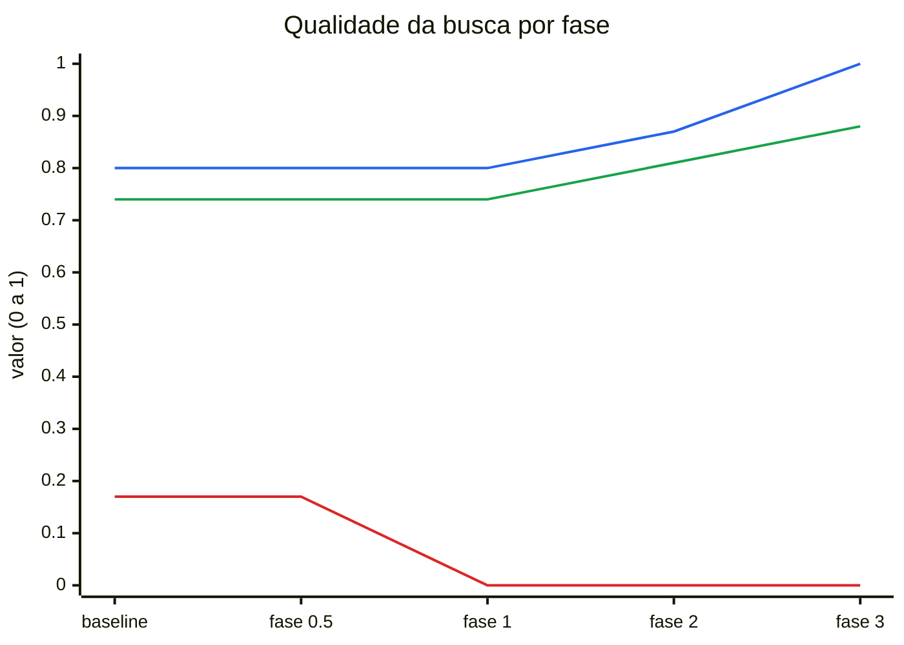
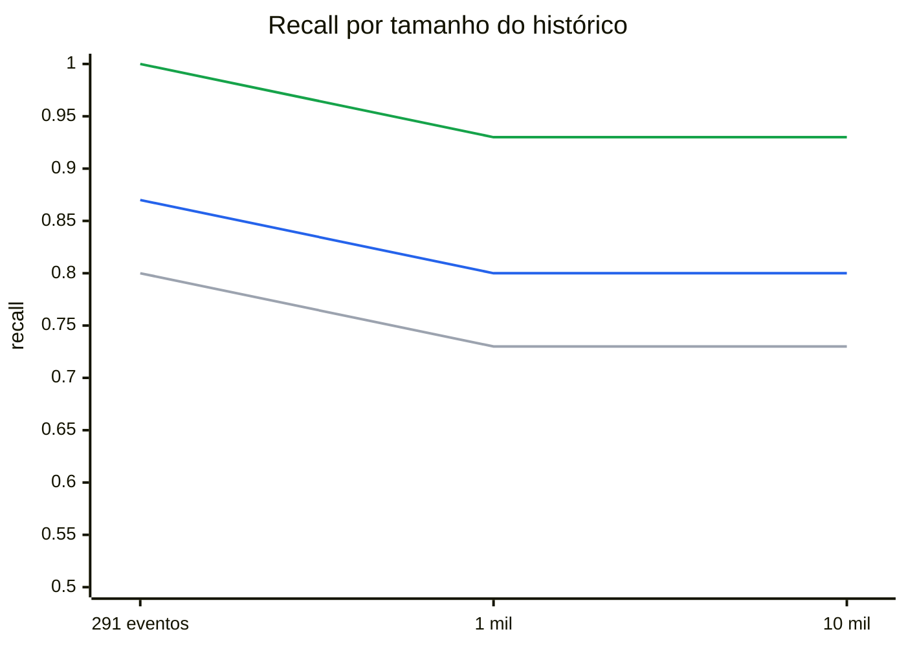
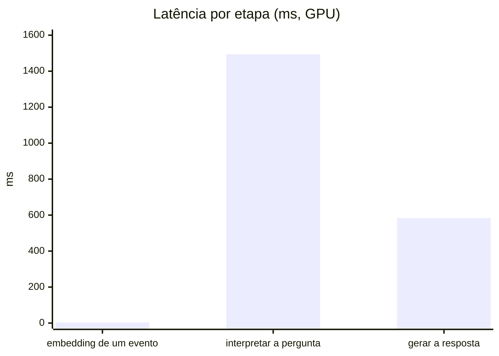
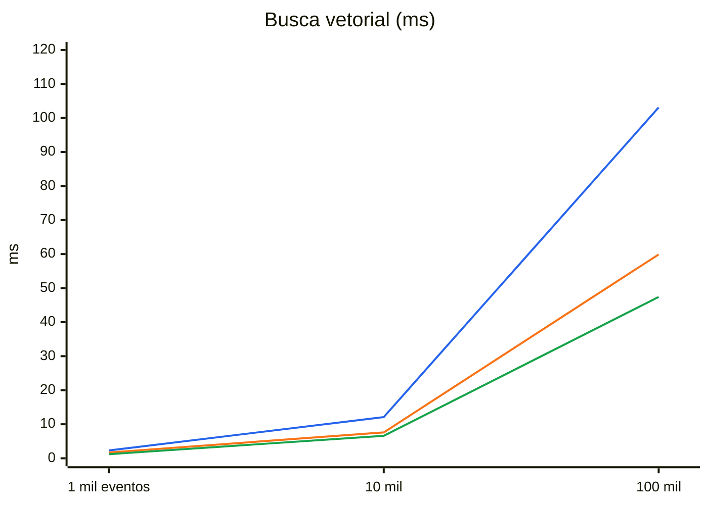
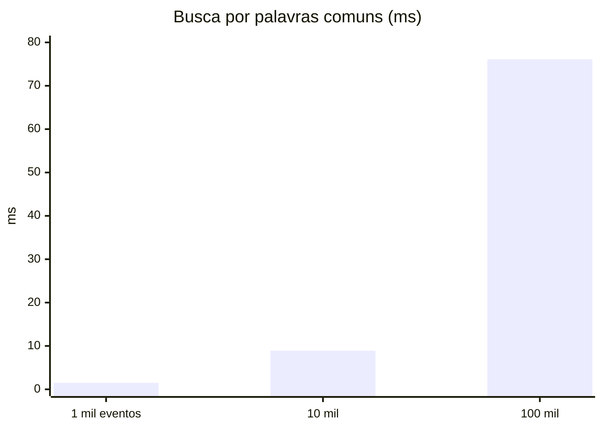
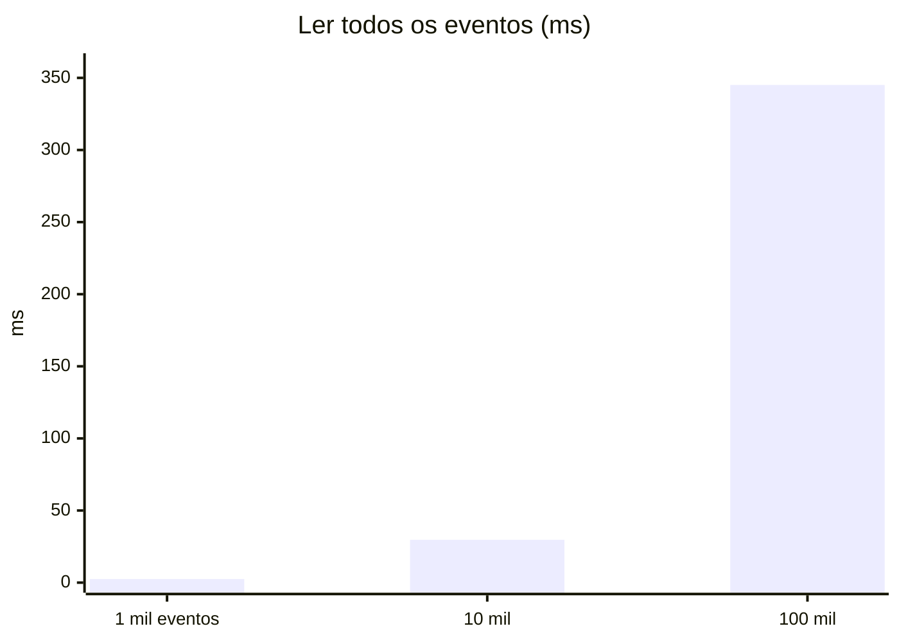

# Benchmarks

Medições do cade numa máquina de referência: Ryzen 5 5500, RTX 3060 12 GB, build CUDA. Os números vêm de:
- `bench/baseline.txt` (`make bench`) e `bench/baseline-cpu.txt` (`make bench GO_TAGS=`, a mesma máquina sem a GPU);
- `bench/retrieval-baseline.txt`, `bench/retrieval-scale.txt` e `bench/plan-baseline.txt` (`make eval`, `make eval-scale`);
- das medições por fase registradas no `CHANGELOG.pt-BR.md`.

Os gráficos são Mermaid e precisam ser atualizados à mão depois de uma nova medição. O Mermaid não desenha legenda, então ela vem escrita abaixo de cada gráfico.

## Qualidade da busca por fase

Conjunto de teste da suíte de recuperação (24 perguntas, nunca usado para ajustar limites).

Azul: recall. Verde: MRR. Vermelho: redundância (resultados que repetem a mesma página ou arquivo; menor é melhor). A rejeição ficou em 1,00 em todas as fases.

## `top_k`, limiares e reranking (fase 17)

`make eval-retrieval` cruza `top_k` (4, 6, 8, 12) com `max_distance` (0,68, 0,72, 0,76) e `max_best_distance` (0,60, 0,61, 0,63) nos conjuntos de calibração e de teste (25 perguntas), com o `nomic-embed-text-v2-moe` Q4_K_M, e mede o `ask` até o primeiro token para cada `top_k` (`BenchmarkColdAskTopK`, cache de páginas quente, uma execução por valor). CPU e GPU dão a mesma qualidade.

| `top_k` | recall | MRR | rejeição | `ask` CPU | `ask` GPU |
| ---: | ---: | ---: | ---: | ---: | ---: |
| 4 | 0,91 | 0,86 | 1,00 | 9,53 s | 1,52 s |
| **6** | **1,00** | **0,89** | **1,00** | **10,61 s** | **1,62 s** |
| 8 (v0.0.0) | 1,00 | 0,88 | 1,00 | 12,40 s | 1,77 s |
| 12 | 1,00 | 0,88 | 1,00 | 19,20 s | 1,90 s |

- **`top_k` = 6:** o menor valor que não perde recall. O MRR sobe um pouco porque um evento fraco sai do fim da lista. O `ask` em CPU fica 1,8 s mais rápido.
- **Limiares:** `max_distance` não muda nada entre 0,68 e 0,76. Com `max_best_distance` 0,63, a rejeição na calibração cai para 0,89 (uma pergunta sem resposta passa). A calibração põe o corte entre o pior evento de pergunta com resposta e o melhor de pergunta sem resposta: 0,596–0,624 em GPU e 0,606–0,621 em CPU (os vetores diferem na terceira casa). Os 0,61 atuais ficam dentro dos dois intervalos e continuam valendo.
- **Curva de escala** (`make eval-scale`, `bench/retrieval-scale.txt`): com 1 mil e com 10 mil eventos, `top_k` 6 dá recall 0,94, MRR 0,83 e rejeição 1,00. A v0.0.0 (`top_k` 8) dava 0,93, 0,82 e 1,00, e a mesma medição hoje com 8 dá 0,94, 0,82 e 1,00 (`bench/retrieval-scale-top8.txt`).

**Reranking, reprovado no portão** (`make eval-rerank`). Os 30 primeiros da busca híbrida, depois dos cortes de distância, são reordenados pelo `bge-reranker-v2-m3` Q4_K_M (418 MB, Apache-2.0) pelo llama.cpp, que lê o mesmo texto que o modelo de resposta, e são cortados em 6:

| eventos | sem reranker (recall / MRR) | com reranker (recall / MRR) | custo por pergunta |
| ---: | ---: | ---: | ---: |
| 291 | 1,00 / 0,89 | 0,94 / 0,91 | 72 ms GPU, 567 ms CPU |
| 1 mil | 0,94 / 0,83 | 0,94 / 0,91 | 61 ms GPU |
| 10 mil | 0,94 / 0,83 | 0,94 / 0,91 | 58 ms GPU |

O MRR sobe em todos os tamanhos, mas o recall no conjunto de teste cai de 1,00 para 0,94, e o critério pede recall igual ou melhor. O custo também é alto: em CPU, 0,57 s por pergunta, mais carregar outros 418 MB, comeria um terço do que o `top_k` 6 economiza. A ideia volta para "A definir" no ROADMAP.

## Busca à medida que o histórico cresce

Recall no conjunto de teste com o corpus aumentado por distratores (`make eval-scale`).

Cinza: baseline. Azul: depois da fase 2 (pedaços). Verde: depois da fase 3 (busca híbrida). Os distratores são gerados de modelos fixos e são menos variados que um histórico real, então a queda com o tamanho tende a ser maior na prática.

## Interpretação das perguntas

Acerto por campo na suíte de 153 perguntas (`make eval-plan`), com o prompt da fase 18 para os três modelos (`bench/plan-baseline.txt`, `plan-qwen2.5-3b.txt`, `plan-qwen3.5-4b.txt`). Os pisos da suíte são comparados com o limite inferior do intervalo de Wilson de 95%, que fica 3 a 6 pontos abaixo destes valores.

```mermaid
---
config:
  themeVariables:
    xyChart:
      plotColorPalette: "#9ca3af, #2563eb, #16a34a"
---
xychart-beta
  title "Acerto do planejador por campo (%)"
  x-axis ["tipo", "período", "fonte", "pessoas", "direção", "assunto", "status"]
  y-axis "acerto (%)" 90 --> 100
  bar [95, 100, 96, 95, 98, 94, 100]
  bar [96, 100, 96, 98, 98, 97, 100]
  bar [98, 100, 99, 99, 99, 99, 100]
```

Cinza: Qwen2.5-3B (padrão até a v0.0.0). Azul: Qwen3.5-2B (padrão). Verde: Qwen3.5-4B, fora do orçamento de VRAM. Totalmente certas: 133, 135 e 146.

## Latência do `ask` por etapa

Cada modelo aquece antes da medição. A interpretação roda pelo modelo, com o cache de prompt frio e sem o estado salvo: é o custo de uma pergunta que as regras não leem.

Em CPU (Ryzen 5 5500, 6 threads) as mesmas etapas levam 33 ms, 12,7 s e 12,3 s. O prompt do planejador tem ~2 mil tokens de instruções e exemplos, e o sampler com gramática do llama.cpp é lento por token. Desde a fase 18, "gerar a resposta" inclui ler as 8 evidências: com o Qwen2.5-3B (399 ms na GPU, 2,9 s na CPU) o benchmark reaproveitava da rodada anterior o prompt em memória, e o estado recorrente do Qwen3.5 não volta atrás. Num `cade ask`, que é sempre um processo novo, as evidências são lidas nos dois casos.

## Um `ask` inteiro (fases 5 e 18)

Do início até o primeiro token da resposta, com o carregamento dos dois modelos (`BenchmarkColdAsk`). A pergunta é lida pelo modelo decodificando o prompt inteiro (como antes da fase 5), pelo modelo com o estado do prompt salvo, ou pelas regras, sem modelo. Cache de página quente: os modelos foram lidos há pouco. Frio: foram tirados da memória antes de cada rodada, como depois de reiniciar.

```mermaid
---
config:
  themeVariables:
    xyChart:
      plotColorPalette: "#9ca3af, #2563eb, #16a34a"
---
xychart-beta
  title "ask até o primeiro token, CPU (s)"
  x-axis ["cache quente", "cache frio"]
  y-axis "s" 0 --> 35
  bar [24.8, 29.6]
  bar [16.5, 21.1]
  bar [12.0, 16.2]
```

```mermaid
---
config:
  themeVariables:
    xyChart:
      plotColorPalette: "#9ca3af, #2563eb, #16a34a"
---
xychart-beta
  title "ask até o primeiro token, GPU (s)"
  x-axis ["cache quente", "cache frio"]
  y-axis "s" 0 --> 10
  bar [3.16, 7.40]
  bar [2.88, 6.89]
  bar [1.60, 5.68]
```

Cinza: modelo, prompt decodificado inteiro. Azul: modelo com o estado salvo. Verde: regras.

- **Modelo (fase 18):** com o Qwen3.5-2B, a CPU foi de 41,5 / 26,0 / 21,5 s para 24,8 / 16,5 / 12,0 s com o cache quente. Na GPU, o cache quente ficou 0,2–0,4 s mais lento (2,93 / 2,48 / 1,59 s com o Qwen2.5-3B), e o frio, ~1,5 s mais rápido, porque o modelo é menor.
- **CPU:** o estado salvo corta 34% do `ask` com o cache quente (24,8 → 16,5 s), e as regras, 52%. O que sobra é quase todo a leitura das 8 evidências pelo modelo antes da resposta.
- **GPU:** o ganho é menor em segundos (3,16 → 2,88 → 1,60 s), e o cache frio domina: ler ~1,6 GB de modelos do disco leva ~4 s.
- **Estado salvo:** um arquivo de ~40 MB em `~/.cache/cade/prompt-state/` (~55 MB com o Qwen2.5-3B), gravado na primeira pergunta que vai ao modelo.
- **Regras:** leem 67 das 153 perguntas da suíte de plano, sem nenhum erro. Uma listagem ou relatório de tarefas lido por elas nem carrega modelo.

## Busca vetorial no banco

Busca dos vizinhos mais próximos em históricos sintéticos (`make bench`), antes da fase 2. Com pedaços, a busca em 100 mil eventos passou de 103 para 112 ms.

Azul: sem filtro. Laranja: só Teams. Verde: um dia. O tempo cresce de forma linear com o histórico, porque o sqlite-vec compara com todos os vetores; filtros reduzem o trabalho.

## Busca por palavra no banco

A metade por palavras da busca híbrida (FTS5), com eventos sintéticos. Um hash de commit é resolvido em 0,1 ms em qualquer tamanho.

O corpus sintético repete as mesmas poucas palavras em quase todos os eventos, então este é o pior caso; num histórico real as palavras são mais variadas.

## Carregar o histórico inteiro

É o que acontece numa pergunta com pessoa e sem período. Ler um dia leva menos de 1 ms em qualquer tamanho.

Alvo da fase 6: filtrar pessoas no SQL em vez de carregar tudo.

## Memória

```mermaid
---
config:
  themeVariables:
    xyChart:
      plotColorPalette: "#2563eb, #f97316"
---
xychart-beta
  title "Memória com os modelos carregados (MB)"
  x-axis ["só embedding", "embedding + geração"]
  y-axis "MB" 0 --> 2800
  bar [979, 1473]
  bar [390, 1948]
```

Azul: RAM do processo. Laranja: memória da GPU. Numa build só de CPU, os pesos ficam na RAM.

## Números

| Medida | 1 mil | 10 mil | 100 mil |
|---|---|---|---|
| busca vetorial, sem filtro (ms) | 2,3 | 12,1 | 103,1 |
| busca vetorial, só Teams (ms) | 1,7 | 7,6 | 59,9 |
| busca vetorial, um dia (ms) | 1,2 | 6,6 | 47,4 |
| ler um dia (ms) | 0,05 | 0,16 | 0,75 |
| ler tudo (ms) | 2,5 | 29,7 | 345,1 |
| vetores de 1.000 eventos (ms) | 170 | 152 | 165 |
| bytes por evento | 3.633 | 3.563 | 3.498 |

| Modelo | Latência GPU | Latência CPU | RAM | GPU |
|---|---|---|---|---|
| embedding de um evento | 3,5 ms | 33 ms | 966 MB | 328 MB |
| interpretar a pergunta (modelo, sem estado salvo) | 1.494 ms | 12,7 s | 1.473 MB | 1.948 MB |
| ler as evidências e gerar a resposta (~30 tokens) | 584 ms | 12,3 s | 1.473 MB | 1.948 MB |
| `ask` até o primeiro token, cache quente (modelo / estado salvo / regras) | 3,16 / 2,88 / 1,60 s | 24,8 / 16,5 / 12,0 s | | |

RAM e GPU são do build CUDA. No build só de CPU os pesos ficam na RAM, e o processo com os dois modelos chega a ~2,4 GB (~3,9 GB com o Qwen2.5-3B).
