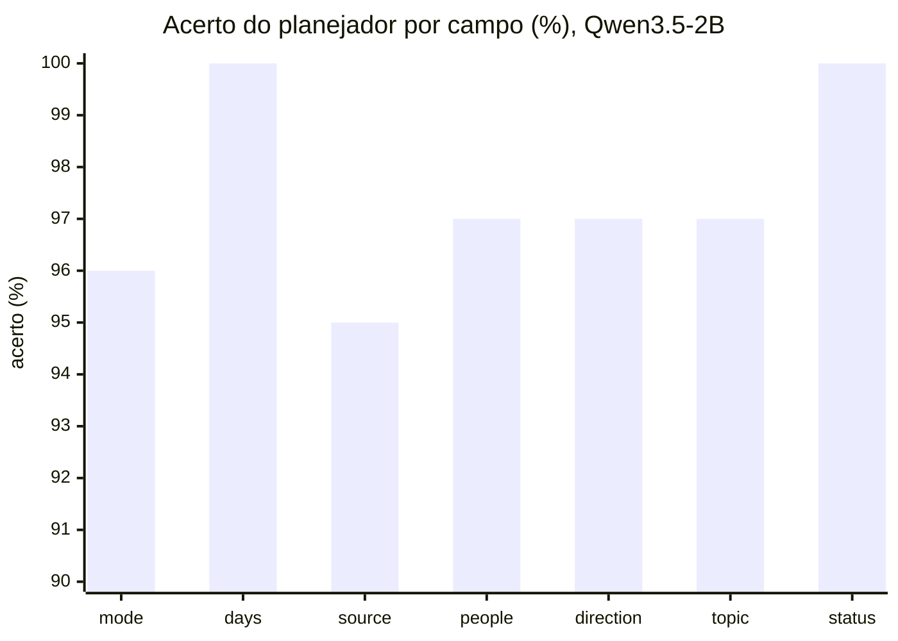
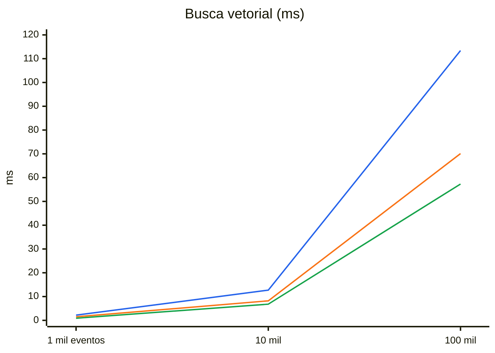
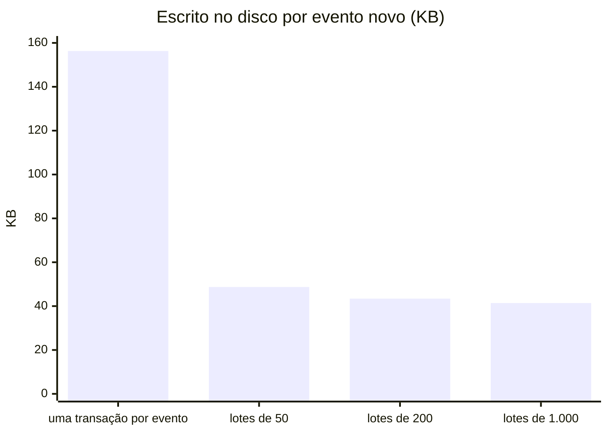
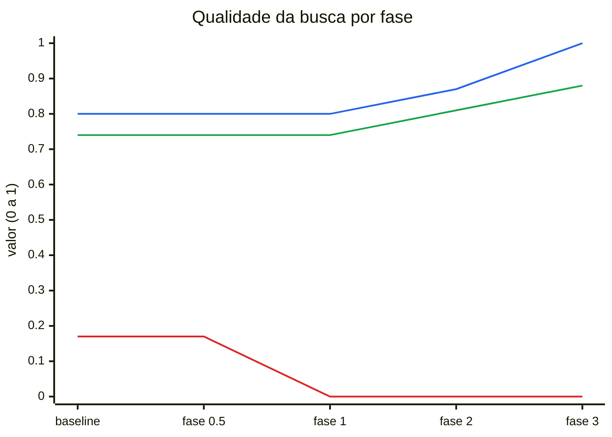
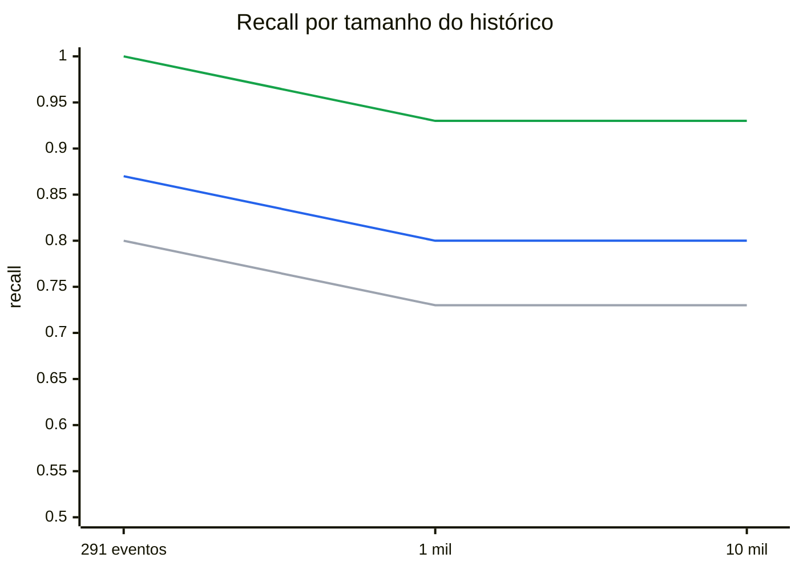

<p align="center">
  
</p>

# Benchmarks

Medições do cade numa máquina de referência. Cada seção diz o comando que a reproduz, a data, o commit e o build. As seções que nenhum comando de hoje reproduz ficam em [Histórico](#histórico).

## Máquina e builds

| | |
|---|---|
| CPU | AMD Ryzen 5 5500, 6 núcleos / 12 threads |
| GPU | NVIDIA RTX 3060 12 GB, **limitada a 120 W** (padrão 170 W) para conter a temperatura; a 170 W ela chegava a 93 °C |
| Disco | Kingston A400 (SATA), ext4 |
| Build CUDA | `go tool mage bench` / `go tool mage eval` (padrão, tag `cuda`) |
| Build CPU | `GO_TAGS= go tool mage bench` (a mesma máquina, sem a GPU) |
| Modelos | `nomic-embed-text-v2-moe` Q4_K_M (embedding), Qwen3.5-2B Q4_K_M + `mmproj` (geração e imagens) |

Os números de hoje foram medidos em **2026-09-30, commit `f4e5379`**. As saídas brutas estão em `bench/`:

| Arquivo | Comando |
|---|---|
| `bench/baseline.txt` | `go tool mage bench` (CUDA) |
| `bench/baseline-cpu.txt` | `GO_TAGS= go tool mage bench` |
| `bench/plan-baseline.txt` | `go tool mage evalPlan` (parte de `go tool mage eval`) |
| `bench/retrieval-scale.txt` | `go tool mage evalScale` |
| `bench/retrieval-scale-top8.txt` | `SCALE_TOP_K=8 SCALE_REPORT=bench/retrieval-scale-top8.txt go tool mage evalScale` |

Os baselines até 2026-09-27 foram medidos com a GPU a 170 W. A 120 W, só a descrição de imagens ficou mais lenta (0,1–0,2 s); o resto da GPU ficou igual ou mais rápido. Numa pergunta, a GPU espera a memória, não a potência.

Os gráficos são Mermaid e são atualizados à mão depois de uma nova medição. O Mermaid não desenha legenda, então ela vem escrita abaixo de cada gráfico.

## Como ler as métricas

**Qualidade da busca** (suítes de `internal/retrievalsuite`). Cada pergunta tem os eventos que deveriam voltar, ou nenhum, se a resposta não está no histórico.

| Métrica | O que mede | Melhor |
|---|---|---|
| recall | Das perguntas com resposta, a fração em que ao menos um evento esperado está entre os `top_k` devolvidos. 0,94 = em 6% das perguntas a resposta não chega ao modelo. | 1,00 |
| MRR | *Mean reciprocal rank*: média de 1/posição do primeiro evento esperado (1º lugar = 1, 2º = 0,5, 3º = 0,33, ausente = 0). Diz o quão no topo a resposta aparece. | 1,00 |
| rejeição | Das perguntas **sem** resposta no histórico, a fração em que a busca não devolve nada, e o cade diz que não sabe em vez de inventar. | 1,00 |
| redundância | Fração dos resultados que repetem a mesma página ou arquivo de outro resultado, ocupando lugar de evidência nova. | 0,00 |
| conjunto de calibração / de teste | Calibração ajusta os limiares; teste nunca é usado para ajustar nada e é o número que vale. | |

**Interpretação da pergunta** (`internal/queryplan`). O planejador transforma a pergunta num plano com sete campos: `mode` (responder ou listar), `days` (período), `source` (git, navegador, arquivo, Teams), `people`, `direction` (enviadas/recebidas), `topic` e `status` (de tarefas).

| Métrica | O que mede |
|---|---|
| acerto por campo | Fração das perguntas em que aquele campo saiu igual ao esperado. |
| intervalo de Wilson 95% | Faixa onde o acerto real provavelmente está, dado o tamanho da suíte. A suíte falha se o limite **inferior** fica abaixo do piso do campo, para que sorte num conjunto pequeno não passe. |
| totalmente corretas | Perguntas com os sete campos certos. |
| lidas por regras | Perguntas que as regras entendem sem modelo; "0 erradas" = nenhuma delas saiu diferente do esperado. |

**Tempo e recursos** (`go test -bench`).

| Métrica | O que mede |
|---|---|
| ns/op (mostrado em ms ou s) | Tempo médio de uma operação em 5 execuções (`-benchtime 5x`). Os benchmarks de modelo aquecem antes, então não contam o carregamento, salvo os de `ask` inteiro. |
| `ask` até o primeiro token | Do início do processo até o primeiro token da resposta: carregar os modelos, interpretar, buscar e ler as evidências. É a espera que a pessoa sente. |
| cache de página quente / frio | Quente: os arquivos dos modelos já estão na memória do sistema (lidos há pouco). Frio: tirados da memória antes de cada rodada, como depois de reiniciar; soma a leitura de ~1,6 GB do disco. |
| `rss_MB` | Memória RAM residente do processo (`VmRSS`) no fim do benchmark. |
| `gpu_MB` | Memória da GPU usada pelo processo, segundo o `nvidia-smi`. |
| `bytes/event` | Tamanho do arquivo do banco dividido pelo número de eventos, com vetores, índices e texto. Serve para projetar o crescimento. |
| `reply_tokens/op` | Tokens gerados por resposta. O tempo de geração depende dele, e ele varia entre CPU e GPU porque o texto gerado muda. |
| KB por evento escrito | Bytes que o processo mandou ao disco (`write_bytes` de `/proc/PID/io`) divididos pelos eventos novos. Mede desgaste do SSD, não tamanho do banco. |

## Qualidade da busca

> `go tool mage eval` (`TestRetrievalSuiteWithModel`) · 2026-09-30 · `f4e5379` · CUDA. CPU dá a mesma qualidade.

Conjunto de teste de 32 perguntas (25 de texto e 7 de imagem) sobre ~300 eventos, `top_k` 6:

| recall | MRR | rejeição | redundância |
|---:|---:|---:|---:|
| 1,00 | 0,87 | 1,00 | 0,00 |

32 de 32 corretas. Em 2026-09-27 o MRR era 0,89.

A suíte de injeção (`TestInjectionWithModel`, 5 perguntas com instruções escondidas em eventos e numa imagem) passou sem nenhuma instrução seguida.

## `top_k` e limiares

> Qualidade: `go tool mage eval` (`TestRetrievalSweepWithModel`) · Tempo: `go tool mage bench` e `GO_TAGS= go tool mage bench` (`BenchmarkColdAskTopK`, cache de página quente) · 2026-09-30 · `f4e5379`

`top_k` é quantos eventos a busca entrega ao modelo. Mais eventos aumentam a chance de a resposta estar lá, mas o modelo precisa ler todos antes de responder.

| `top_k` | recall | MRR | rejeição | `ask` CPU | `ask` GPU |
| ---: | ---: | ---: | ---: | ---: | ---: |
| 4 | 0,93 | 0,86 | 1,00 | 7,65 s | 1,44 s |
| **6 (padrão)** | **1,00** | **0,87** | **1,00** | **9,71 s** | **1,56 s** |
| 8 (v0.0.0) | 1,00 | 0,88 | 1,00 | 11,92 s | 1,62 s |
| 12 | 1,00 | 0,88 | 1,00 | 16,47 s | 1,76 s |

- **`top_k` = 6:** o menor valor que não perde recall. Com 8, o MRR sobe 0,01, e o `ask` em CPU fica 2,2 s mais lento.
- **Limiares:** `max_distance` não muda nada entre 0,68 e 0,76. Com `max_best_distance` 0,63, a rejeição na calibração cai para 0,89 (uma pergunta sem resposta passa). A calibração põe o corte entre o pior evento de pergunta com resposta (0,596) e o melhor de pergunta sem resposta (0,624). Os 0,61 atuais ficam dentro do intervalo. Em CPU o intervalo era 0,606–0,621 em 2026-09-27; os vetores diferem na terceira casa.

## Busca à medida que o histórico cresce

> `go tool mage evalScale` (`bench/retrieval-scale.txt`) e o mesmo com `SCALE_TOP_K=8` (`bench/retrieval-scale-top8.txt`) · 2026-09-30 · `f4e5379` · CUDA

O conjunto de teste com o corpus aumentado por eventos distratores até 1 mil e 10 mil eventos:

| eventos | `top_k` 6: recall / MRR / rejeição | `top_k` 8: recall / MRR / rejeição |
|---:|---|---|
| 1 mil | 0,96 / 0,84 / 1,00 | 0,96 / 0,86 / 1,00 |
| 10 mil | 0,96 / 0,83 / 1,00 | 0,96 / 0,82 / 1,00 |

Os distratores são gerados de modelos fixos e são menos variados que um histórico real, então a queda com o tamanho tende a ser maior na prática.

## Reranking (fase 17, reprovado)

> `go tool mage evalRerank` · 2026-09-27 · `ce1454b` · CUDA (GPU a 170 W) e CPU · não refeito: o reranker não está em uso.

Os 30 primeiros da busca híbrida, depois dos cortes de distância, eram reordenados pelo `bge-reranker-v2-m3` Q4_K_M (418 MB) e cortados em 6:

| eventos | sem reranker (recall / MRR) | com reranker (recall / MRR) | custo por pergunta |
| ---: | ---: | ---: | ---: |
| 291 | 1,00 / 0,89 | 0,94 / 0,91 | 72 ms GPU, 567 ms CPU |
| 1 mil | 0,94 / 0,83 | 0,94 / 0,91 | 61 ms GPU |
| 10 mil | 0,94 / 0,83 | 0,94 / 0,91 | 58 ms GPU |

O MRR subia, mas o recall no conjunto de teste caía de 1,00 para 0,94, e o critério pede recall igual ou melhor. Em CPU, 0,57 s por pergunta, mais carregar outros 418 MB, comeria um terço do que o `top_k` 6 economiza.

## Interpretação das perguntas

> `go tool mage evalPlan` (`bench/plan-baseline.txt`) · 2026-09-30 · `f4e5379` · CUDA · Qwen3.5-2B

Suíte de 155 perguntas: 131 totalmente corretas, 69 lidas só por regras, nenhuma delas errada.



| Campo | Acerto | Wilson 95% |
|---|---:|---|
| `mode` | 149/155 | 92%–98% |
| `days` | 155/155 | 98%–100% |
| `source` | 147/155 | 90%–97% |
| `people` | 150/155 | 93%–99% |
| `direction` | 150/155 | 93%–99% |
| `topic` | 151/155 | 94%–99% |
| `status` | 155/155 | 98%–100% |

Em 2026-09-27, com 153 perguntas, eram 135 totalmente corretas. Os erros que mais se repetem são listagens de mensagens lidas como pergunta a responder (`mode`) e nomes de pessoas que não saem em `people`. A comparação com outros modelos está em [Histórico](#histórico).

## Latência do `ask` por etapa

> `go tool mage bench` e `GO_TAGS= go tool mage bench` (`BenchmarkEmbedEvent`, `BenchmarkPlanQuestion`, `BenchmarkAnswer`) · 2026-09-30 · `f4e5379`

Cada modelo aquece antes da medição. "Interpretar a pergunta" usa o modelo com o cache de prompt frio e sem o estado salvo: é o custo de uma pergunta que as regras não leem. "Gerar a resposta" inclui ler as evidências.

| Etapa | GPU | CPU |
|---|---:|---:|
| embedding de um evento | 3,1 ms | 32 ms |
| interpretar a pergunta | 1,49 s | 12,6 s |
| ler as evidências e gerar a resposta | 0,47 s (20 tokens) | 10,9 s (34 tokens) |

O prompt do planejador tem ~2 mil tokens de instruções e exemplos, e o sampler com gramática do llama.cpp é lento por token.

## Um `ask` inteiro

> `go tool mage bench` e `GO_TAGS= go tool mage bench` (`BenchmarkColdAsk`) · 2026-09-30 · `f4e5379`

Do início até o primeiro token da resposta, com o carregamento dos dois modelos. A pergunta é lida pelo modelo decodificando o prompt inteiro, pelo modelo com o estado do prompt salvo, ou pelas regras, sem modelo.

```mermaid
---
config:
  themeVariables:
    xyChart:
      plotColorPalette: "#9ca3af, #2563eb, #16a34a"
---
xychart-beta
  title "ask até o primeiro token, CPU (s)"
  x-axis ["cache quente", "cache frio"]
  y-axis "s" 0 --> 30
  bar [22.7, 27.2]
  bar [14.4, 19.0]
  bar [9.8, 14.5]
```

```mermaid
---
config:
  themeVariables:
    xyChart:
      plotColorPalette: "#9ca3af, #2563eb, #16a34a"
---
xychart-beta
  title "ask até o primeiro token, GPU (s)"
  x-axis ["cache quente", "cache frio"]
  y-axis "s" 0 --> 10
  bar [3.04, 7.65]
  bar [2.77, 7.28]
  bar [1.56, 5.86]
```





Cinza: modelo, prompt decodificado inteiro. Azul: modelo com o estado salvo. Verde: regras.

- **CPU:** o estado salvo corta 36% do `ask` com o cache quente (22,7 → 14,4 s), e as regras, 57% (→ 9,8 s). O que sobra é quase todo a leitura das evidências pelo modelo antes da resposta. Em 2026-09-27 eram 24,8 / 16,5 / 12,0 s.
- **GPU:** o ganho é menor em segundos (3,04 → 2,77 → 1,56 s), e o cache frio domina: ler os modelos do disco soma ~4,5 s.
- **Estado salvo:** um arquivo de 98 MB em `~/.cache/cade/prompt-state/`, gravado na primeira pergunta que vai ao modelo.
- **Regras:** leem 69 das 155 perguntas da suíte de plano. Uma listagem ou relatório de tarefas lido por elas nem carrega modelo.

## Banco de dados

> `go tool mage bench` (`internal/storage/sqlitestore`) · 2026-09-30 · `f4e5379` · banco em tmpfs, com eventos sintéticos. Estes números não dependem de CPU ou GPU.

| Medida | 1 mil | 10 mil | 100 mil |
|---|---:|---:|---:|
| busca vetorial, sem filtro (ms) | 2,2 | 12,7 | 113,4 |
| busca vetorial, só Teams (ms) | 1,5 | 8,2 | 70,1 |
| busca vetorial, um dia (ms) | 0,9 | 6,8 | 57,3 |
| busca por palavras comuns, FTS5 (ms) | 1,5 | 9,0 | 78,0 |
| busca por prefixo de hash (ms) | 0,10 | 0,10 | 0,11 |
| ler um dia (ms) | 0,04 | 0,15 | 0,68 |
| ler tudo (ms) | 2,0 | 27,6 | 346,0 |
| pessoa sem período, lendo tudo e filtrando em Go (ms) | 3,8 | 44,5 | 469,5 |
| pessoa sem período, filtro no SQL (ms) | 0,35 | 0,89 | 8,5 |
| direção sem período, contagem + busca vetorial (ms) | 2,7 | 16,1 | 122,8 |
| vetores dos pedaços de 1.000 eventos (ms) | 202 | 177 | 201 |
| bytes por evento | 4.010 | 3.867 | 3.805 |



Azul: sem filtro. Laranja: só Teams. Verde: um dia.

- **Busca vetorial:** cresce de forma linear com o histórico, porque o sqlite-vec compara com todos os vetores; filtros reduzem o trabalho.
- **Busca por palavras:** o corpus sintético repete as mesmas poucas palavras em quase todos os eventos, então é o pior caso.
- **Pessoa sem período:** antes, a pergunta carregava o histórico inteiro e filtrava em Go (469 ms e 187 MB alocados em 100 mil eventos). Com o filtro no SQL, são 8,5 ms e 0,7 MB.
- **Gravar um evento:** 0,69 ms na própria transação (`BenchmarkSaveEvent`) e 0,50 ms num lote de 200 (`BenchmarkSaveEventInBatch`). Em tmpfs o `fsync` não custa; o efeito dos lotes no disco está em [Escrita no disco na ingestão](#escrita-no-disco-na-ingestão-51).

## Tamanho por tabela (#40)

> `sqlite3 -readonly ~/.local/share/cade/cade.db` com a consulta abaixo · 2026-09-30 · o histórico real da máquina de referência: 238.720 eventos, 246.488 pedaços, 1,26 GB.

```sql
SELECT CASE
    WHEN name LIKE 'chunk_embeddings%' THEN 'chunk_embeddings'
    WHEN name LIKE 'chunks_fts%' THEN 'chunks_fts'
    WHEN name LIKE 'events%' OR name = 'sqlite_autoindex_events_1' THEN 'events'
    WHEN name LIKE 'chunks%' OR name = 'sqlite_autoindex_chunks_1' THEN 'chunks'
    WHEN name LIKE 'event_people%' THEN 'event_people'
    ELSE 'outros' END AS tabela,
  round(sum(pgsize) / 1048576.0, 1) AS mb,
  round(100.0 * sum(pgsize) / (SELECT sum(pgsize) FROM dbstat), 1) AS pct
FROM dbstat GROUP BY tabela ORDER BY mb DESC;
```

Cada tabela inclui suas tabelas internas e seus índices.

| Tabela | O que guarda | MB | % |
|---|---|---:|---:|
| `chunk_embeddings` | vetores dos pedaços (sqlite-vec) | 960,1 | 79,8 |
| `events` | texto e metadados dos eventos | 203,4 | 16,9 |
| `chunks_fts` | índice de palavras (FTS5) | 22,8 | 1,9 |
| `chunks` | pedaços de texto de cada evento | 9,8 | 0,8 |
| `event_people` | pessoas de cada evento | 6,0 | 0,5 |
| outras | configurações, arquivos modificados, eventos esquecidos | 0,3 | 0,0 |

Os vetores são 4/5 do banco: ~4,0 KB por pedaço, para 768 dimensões em `float32`, que já ocupam 3 KB.

## Escrita no disco na ingestão (#51)

> Medição manual, sem alvo do mage · 2026-09-30 · commits `d963b97`–`11020d0` · CUDA · Kingston A400 com ext4 (não tmpfs)

Para reproduzir: crie um `config.json` com `database_path` num diretório vazio, rode com `XDG_CONFIG_HOME` apontando para ele `cade ingest git` no repositório do cade e `cade ingest file ~/Downloads` com imagens desligadas, e leia `write_bytes` em `/proc/PID/io` antes de o processo sair. Média de duas rodadas intercaladas, 2.287 eventos novos.



| Gravação | Escrito (MB) | KB por evento | Banco (MB) | Tempo (s) |
|---|---|---|---|---|
| uma transação por evento (antes) | 357,4 | 156,3 | 26,6 | 59,3 |
| lotes de 50 | 111,3 | 48,7 | 26,4 | 58,4 |
| **lotes de 200** (escolhido) | 99,2 | 43,4 | 26,6 | 55,7 |
| lotes de 1.000 | 94,7 | 41,4 | 26,6 | 54,9 |
| lotes de 200 com `synchronous=NORMAL` | 101,4 | 44,3 | 26,6 | 56,7 |

- Agrupar corta a escrita em ~3,6×, e o tempo não piora; a variação entre rodadas (±4 s) é maior que a diferença entre os tamanhos de lote.
- De 200 para 1.000 a escrita cai só 5%, e uma interrupção perderia até 5× mais eventos para refazer; por isso 200 (`eventsPerCommit`).
- Um lote também é gravado depois de 2 s aberto (`batchMaxAge`), abaixo dos 5 s que outro comando espera pelo banco.
- `synchronous=NORMAL` não mudou nada porque já era o modo em uso: o `go-sqlite3` é compilado com `SQLITE_DEFAULT_WAL_SYNCHRONOUS=1`.
- Uma segunda ingestão sem nada novo escreve ~0,1 MB, antes e depois.

## Descrição de imagens

> `go tool mage bench` e `GO_TAGS= go tool mage bench` (`BenchmarkDescribeImage`) · qualidade: `go tool mage eval` (`TestCaptionSuiteWithModel`) · 2026-09-30 · `f4e5379`

Uma captura de terminal de 1920 × 1080 com 10 linhas (~680 bytes de resposta), reduzida até o maior lado indicado e descrita pelo Qwen3.5-2B com o `mmproj`. Inclui decodificar, reduzir, codificar a imagem e gerar a descrição.

| Maior lado | GPU | CPU |
|---|---:|---:|
| 512 px | 1,44 s | 15,0 s |
| 768 px | 1,68 s | 18,5 s |
| **1024 px (padrão)** | **1,80 s** | **20,8 s** |
| 1536 px | 2,28 s | 35,7 s |

- **Por que 1024 px:** com 512 px a transcrição perde uma linha e troca nomes de arquivo; a partir de 768 px sai completa. 1024 px deixa folga para capturas reais, de fonte menor. Sem reduzir, uma captura full HD vira ~2.000 tokens e não cabe no `vision.context_tokens` (2048).
- **Pasta com 1.000 capturas:** ~30 min na GPU e ~6 h na CPU; com o padrão de 50 por `ingest`, são 20 execuções.
- **Memória:** gerador + `mmproj` ocupam 2,6 GB de VRAM no build CUDA e 2,7 GB de RAM no de CPU. O embedder não está carregado junto.
- **Qualidade:** 8 imagens de `testdata/images`, cobertura 1,00 das palavras exigidas (mínimo 0,90), nenhum segredo depois da máscara.

## Memória

> `go test -tags sqlite_fts5,cuda -run '^$' -bench 'EmbedEvent|PlanQuestion|Answer' -benchtime 5x ./internal/benchmarks` e o mesmo sem `,cuda`, com `CADE_TEST_EMBEDDING_MODEL`, `CADE_TEST_GENERATION_MODEL` e `CADE_TEST_VISION_PROJECTOR` apontando para os modelos · 2026-09-30 · `f4e5379`

Estes três benchmarks rodam sozinhos porque no `go tool mage bench` a descrição de imagens roda antes, no mesmo processo, e a RAM que ela deixa entra no `rss_MB` dos seguintes.

```mermaid
---
config:
  themeVariables:
    xyChart:
      plotColorPalette: "#2563eb, #f97316, #9ca3af"
---
xychart-beta
  title "Memória com os modelos carregados (MB)"
  x-axis ["só embedding", "embedding + geração"]
  y-axis "MB" 0 --> 2500
  bar [922, 1412]
  bar [328, 1948]
  bar [634, 2363]
```



Azul: RAM do processo, build CUDA. Laranja: memória da GPU, build CUDA. Cinza: RAM do processo, build CPU, onde os pesos ficam na RAM.

## Histórico

Números de fases anteriores, que nenhum comando de hoje reproduz: o código daquelas fases não existe mais. Ficam como registro do caminho, não como estado atual.

### Qualidade da busca por fase

> Suíte de recuperação de 2026-09-26 (24 perguntas de teste), medida a cada fase; `bench/retrieval-baseline.txt` é a saída de antes da fase 0.5.



Azul: recall. Verde: MRR. Vermelho: redundância. A rejeição ficou em 1,00 em todas as fases.

### Recall por tamanho do histórico, por fase



Cinza: baseline. Azul: depois da fase 2 (pedaços). Verde: depois da fase 3 (busca híbrida).

### Planejador com outros modelos

> `go tool mage evalPlan` com `GENERATION_MODEL` apontando para outro modelo · 2026-09-27 · `ce1454b` · 153 perguntas · `bench/plan-qwen2.5-3b.txt`, `plan-qwen3.5-4b.txt` (e `plan-qwen2.5-1.5b.txt`, 117 totalmente certas)

| Modelo | tipo | período | fonte | pessoas | direção | assunto | status | totalmente certas |
|---|---:|---:|---:|---:|---:|---:|---:|---:|
| Qwen2.5-3B (padrão até a v0.0.0) | 95% | 100% | 96% | 95% | 98% | 94% | 100% | 133 |
| Qwen3.5-2B (padrão) | 96% | 100% | 96% | 98% | 98% | 97% | 100% | 135 |
| Qwen3.5-4B (fora do orçamento de VRAM) | 98% | 100% | 99% | 99% | 99% | 99% | 100% | 146 |

Com o Qwen2.5-3B, a CPU levava 41,5 / 26,0 / 21,5 s num `ask` com cache quente (modelo / estado salvo / regras) e o estado salvo tinha ~55 MB.
