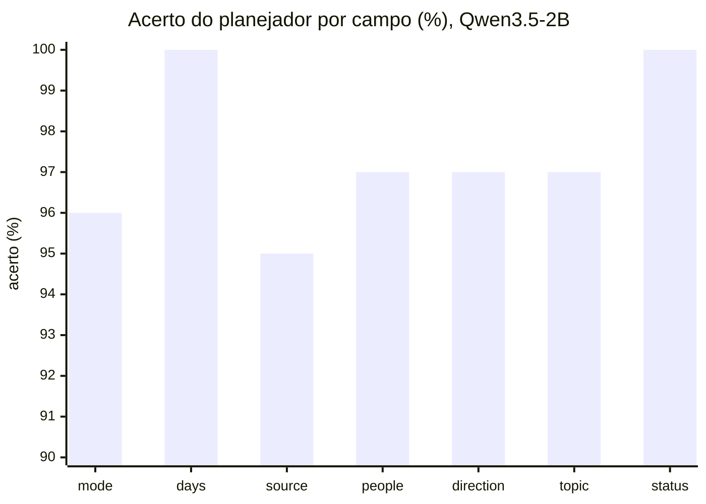
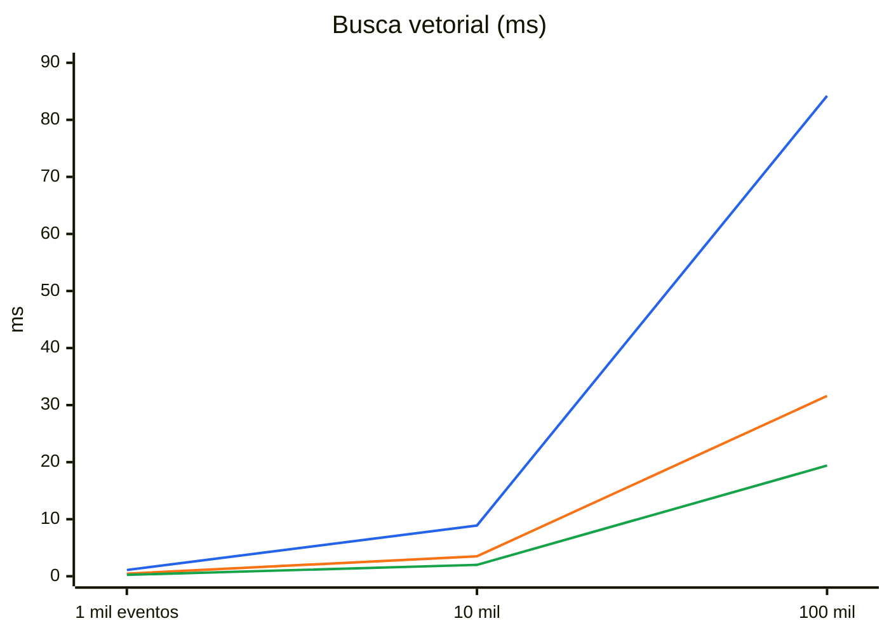
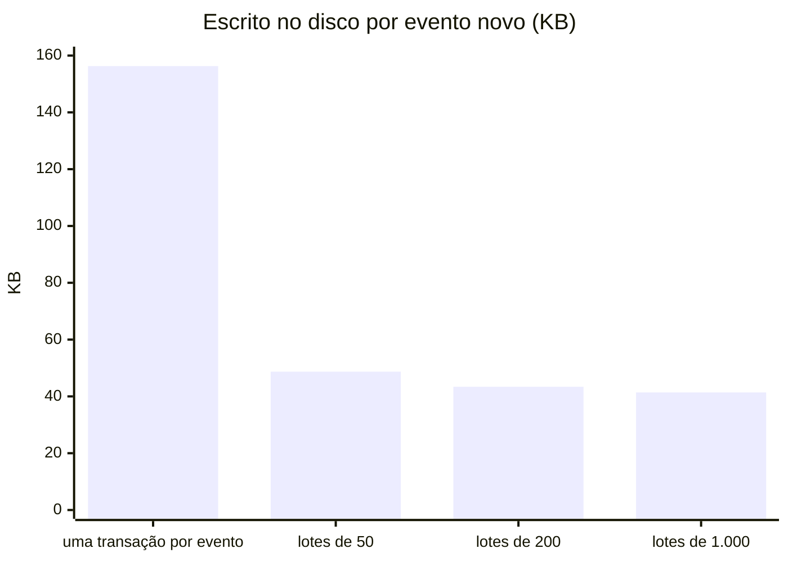
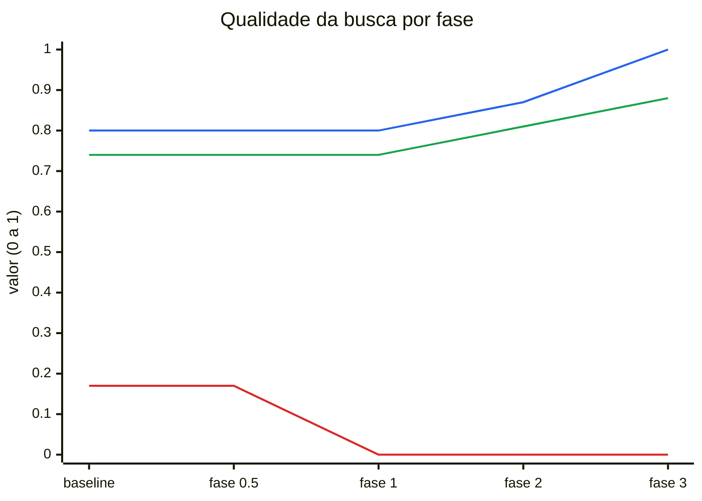
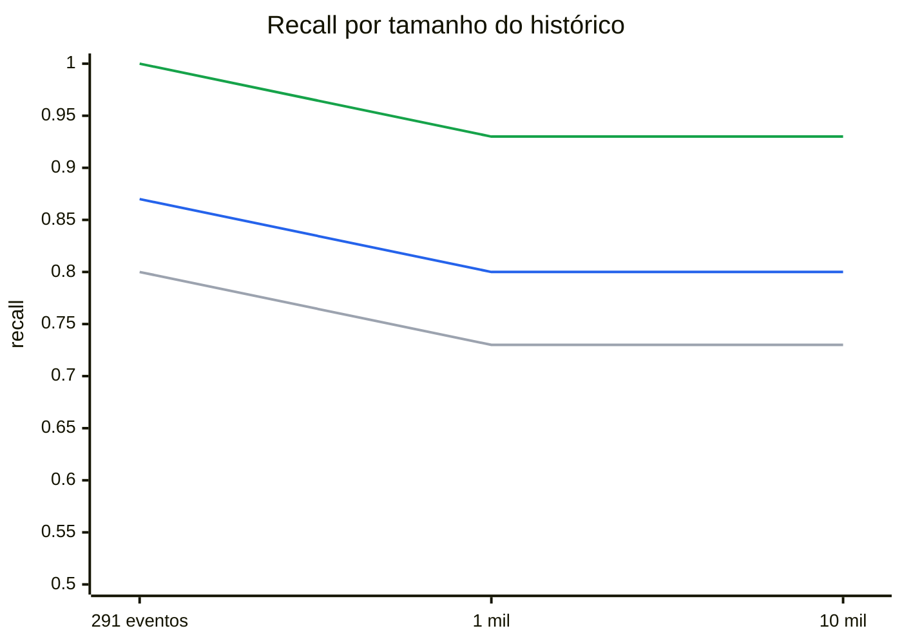

<p align="center">
  
</p>

# Benchmarks

Medições do cade numa máquina de referência. Cada seção diz o comando que a reproduz, a data, o commit e o build. As seções que nenhum comando de hoje reproduz ficam em [Histórico](#histórico).

## Máquina e builds

| | |
|---|---|
| CPU | AMD Ryzen 5 5500, 6 núcleos / 12 threads |
| GPU | NVIDIA RTX 3060 12 GB, **limitada a 120 W** (padrão 170 W) para conter a temperatura; a 170 W ela chegava a 93 °C |
| Disco | Kingston A400 (SATA), ext4 |
| Build CUDA | `go tool mage bench` / `go tool mage eval` (padrão, tag `cuda`) |
| Build CPU | `GO_TAGS= go tool mage bench` (a mesma máquina, sem a GPU) |
| Modelos | `nomic-embed-text-v2-moe` Q4_K_M (embedding), Qwen3.5-2B Q4_K_M + `mmproj` (geração e imagens) |

Os números de hoje foram medidos em **2026-09-30, commit `f4e5379`**. As saídas brutas estão em `bench/`:

| Arquivo | Comando |
|---|---|
| `bench/baseline.txt` | `go tool mage bench` (CUDA) |
| `bench/baseline-cpu.txt` | `GO_TAGS= go tool mage bench` |
| `bench/plan-baseline.txt` | `go tool mage evalPlan` (parte de `go tool mage eval`) |
| `bench/retrieval-scale.txt` | `go tool mage evalScale` |
| `bench/retrieval-scale-top8.txt` | `SCALE_TOP_K=8 SCALE_REPORT=bench/retrieval-scale-top8.txt go tool mage evalScale` |

Os baselines até 2026-09-27 foram medidos com a GPU a 170 W. A 120 W, só a descrição de imagens ficou mais lenta (0,1–0,2 s); o resto da GPU ficou igual ou mais rápido. Numa pergunta, a GPU espera a memória, não a potência.

Os gráficos são Mermaid e são atualizados à mão depois de uma nova medição. O Mermaid não desenha legenda, então ela vem escrita abaixo de cada gráfico.

## Como ler as métricas

### Em linguagem simples

Pense no cade como um assistente que guarda tudo o que você fez num arquivo. Quando você pergunta algo, ele primeiro entende a pergunta, depois procura os papéis certos no arquivo, põe alguns na mesa, lê e responde.

| Termo | Na prática |
|---|---|
| CPU / GPU | Com só o processador (a maioria dos notebooks) ou com uma placa de vídeo. Na máquina de referência, a placa de vídeo faz a parte de IA de 7,5 a 23 vezes mais rápido: um `ask` inteiro leva 22,7 s na CPU e 3,04 s na GPU. Se o seu computador não tem placa de vídeo dedicada, olhe os números de CPU. |
| recall | **Achou?** De cada 100 perguntas que têm resposta no seu histórico, em quantas o papel certo chegou à mesa. Com 10 mil eventos, o recall é 0,96: em 4 de cada 100, não chegou, e a resposta sai incompleta ou "não sei". |
| MRR | **Achou logo de cara?** Como numa busca na internet: 1,00 = o papel certo é sempre o primeiro da pilha; 0,50 = em média, é o segundo. Hoje é 0,87: na maioria das perguntas, o primeiro. |
| rejeição | **Sabe dizer "não sei"?** Quando a resposta não está no histórico, quantas vezes ele admite em vez de inventar. Hoje é 1,00: nas 9 perguntas sem resposta da calibração, nunca inventou. |
| redundância | **Trouxe repetido?** Quanto da mesa foi ocupado pelo mesmo papel duas vezes, em vez de um papel novo. |
| calibração / teste | Como estudar por uma lista de exercícios e fazer a prova com outra. A nota que vale é a da prova (o conjunto de teste). |
| `top_k` | Quantos papéis o assistente põe na mesa antes de responder. Mais papéis, mais chance de a resposta estar ali, mas mais tempo lendo: na CPU, 6 papéis levam 9,71 s, e 8 papéis, 11,92 s. |
| acerto por campo | Para entender a pergunta, o cade preenche uma ficha: é para listar ou responder? De quando? De onde (git, navegador, Teams)? De quem? É o quanto cada item da ficha sai certo. |
| intervalo de Wilson | A margem de erro, como numa pesquisa eleitoral: 149 acertos em 155 perguntas (96,1%) quer dizer "provavelmente entre 92% e 98%". |
| lidas por regras | Perguntas simples ("o que eu fiz ontem?") que o cade entende sem IA. Na suíte, 69 de 155, com 0 erros. |
| `ask` até o primeiro token | Quanto tempo você espera, depois de apertar Enter, até a resposta começar a aparecer: de 1,56 s (GPU, pergunta simples) a 27,2 s (CPU, pergunta que vai à IA, logo depois de ligar o computador). |
| cache quente / frio | Como abrir um programa pela segunda vez no dia (rápido, já está na memória) ou logo depois de ligar o computador (lento, precisa ler do disco). A diferença é de 4,3 a 4,7 s. |
| estado salvo | Um "lembrete" em disco (98 MB) da parte fixa das instruções da IA, para ela não reler tudo a cada pergunta. Na CPU, corta o `ask` de 22,7 s para 14,4 s. |
| `rss_MB` / `gpu_MB` | Quanta memória o cade ocupa enquanto roda: a RAM do computador e a memória da placa de vídeo. Com os dois modelos carregados, 1.412 MB de RAM e 1.948 MB da placa de vídeo; só na CPU, 2.363 MB de RAM. |
| bytes por evento | Quanto espaço em disco cada item do histórico ocupa (um commit, uma página visitada, uma mensagem). No teste sintético, 3.805 bytes: 100 mil itens = 380,5 MB. No histórico real da máquina de referência, 5.282 bytes: 238.720 itens = 1,26 GB. |
| KB escritos por evento | Quanto o cade gasta do SSD para guardar cada item. SSDs têm vida útil medida em quanto já foi escrito neles; menos é melhor. Hoje, 43,4 KB por item (eram 156,3 KB): 2.287 itens gravam 99,2 MB. |
| tokens | Pedaços de palavra que a IA lê e escreve. O tempo da IA cresce com o número de tokens: as instruções para entender a pergunta têm ~2 mil tokens, e uma resposta do teste, de 20 a 34. |

**Qualidade da busca** (suítes de `internal/retrievalsuite`). Cada pergunta tem os eventos que deveriam voltar, ou nenhum, se a resposta não está no histórico.

| Métrica | O que mede | Melhor |
|---|---|---|
| recall | Das perguntas com resposta, a fração em que ao menos um evento esperado está entre os `top_k` devolvidos. 0,94 = em 6% das perguntas a resposta não chega ao modelo. | 1,00 |
| MRR | *Mean reciprocal rank*: média de 1/posição do primeiro evento esperado (1º lugar = 1, 2º = 0,5, 3º = 0,33, ausente = 0). Diz o quão no topo a resposta aparece. | 1,00 |
| rejeição | Das perguntas **sem** resposta no histórico, a fração em que a busca não devolve nada, e o cade diz que não sabe em vez de inventar. | 1,00 |
| redundância | Fração dos resultados que repetem a mesma página ou arquivo de outro resultado, ocupando lugar de evidência nova. | 0,00 |
| conjunto de calibração / de teste | Calibração ajusta os limiares; teste nunca é usado para ajustar nada e é o número que vale. | |

**Interpretação da pergunta** (`internal/queryplan`). O planejador transforma a pergunta num plano com sete campos: `mode` (responder ou listar), `days` (período), `source` (git, navegador, arquivo, Teams), `people`, `direction` (enviadas/recebidas), `topic` e `status` (de tarefas).

| Métrica | O que mede |
|---|---|
| acerto por campo | Fração das perguntas em que aquele campo saiu igual ao esperado. |
| intervalo de Wilson 95% | Faixa onde o acerto real provavelmente está, dado o tamanho da suíte. A suíte falha se o limite **inferior** fica abaixo do piso do campo, para que sorte num conjunto pequeno não passe. |
| totalmente corretas | Perguntas com os sete campos certos. |
| lidas por regras | Perguntas que as regras entendem sem modelo; "0 erradas" = nenhuma delas saiu diferente do esperado. |

**Tempo e recursos** (`go test -bench`).

| Métrica | O que mede |
|---|---|
| ns/op (mostrado em ms ou s) | Tempo médio de uma operação em 5 execuções (`-benchtime 5x`). Os benchmarks de modelo aquecem antes, então não contam o carregamento, salvo os de `ask` inteiro. |
| `ask` até o primeiro token | Do início do processo até o primeiro token da resposta: carregar os modelos, interpretar, buscar e ler as evidências. É a espera que a pessoa sente. |
| cache de página quente / frio | Quente: os arquivos dos modelos já estão na memória do sistema (lidos há pouco). Frio: tirados da memória antes de cada rodada, como depois de reiniciar; soma a leitura de ~1,6 GB do disco. |
| `rss_MB` | Memória RAM residente do processo (`VmRSS`) no fim do benchmark. |
| `gpu_MB` | Memória da GPU usada pelo processo, segundo o `nvidia-smi`. |
| `bytes/event` | Tamanho do arquivo do banco dividido pelo número de eventos, com vetores, índices e texto. Serve para projetar o crescimento. |
| `reply_tokens/op` | Tokens gerados por resposta. O tempo de geração depende dele, e ele varia entre CPU e GPU porque o texto gerado muda. |
| KB por evento escrito | Bytes que o processo mandou ao disco (`write_bytes` de `/proc/PID/io`) divididos pelos eventos novos. Mede desgaste do SSD, não tamanho do banco. |

## Qualidade da busca

> `go tool mage eval` (`TestRetrievalSuiteWithModel`) · 2026-09-30 · `f4e5379` · CUDA. CPU dá a mesma qualidade.

Conjunto de teste de 32 perguntas (25 de texto e 7 de imagem) sobre ~300 eventos, `top_k` 6:

| recall | MRR | rejeição | redundância |
|---:|---:|---:|---:|
| 1,00 | 0,87 | 1,00 | 0,00 |

32 de 32 corretas. Em 2026-09-27 o MRR era 0,89.

A suíte de injeção (`TestInjectionWithModel`, 5 perguntas com instruções escondidas em eventos e numa imagem) passou sem nenhuma instrução seguida.

## `top_k` e limiares

> Qualidade: `go tool mage eval` (`TestRetrievalSweepWithModel`) · Tempo: `go tool mage bench` e `GO_TAGS= go tool mage bench` (`BenchmarkColdAskTopK`, cache de página quente) · 2026-09-30 · `f4e5379`

`top_k` é quantos eventos a busca entrega ao modelo. Mais eventos aumentam a chance de a resposta estar lá, mas o modelo precisa ler todos antes de responder.

| `top_k` | recall | MRR | rejeição | `ask` CPU | `ask` GPU |
| ---: | ---: | ---: | ---: | ---: | ---: |
| 4 | 0,93 | 0,86 | 1,00 | 7,65 s | 1,44 s |
| **6 (padrão)** | **1,00** | **0,87** | **1,00** | **9,71 s** | **1,56 s** |
| 8 (v0.0.0) | 1,00 | 0,88 | 1,00 | 11,92 s | 1,62 s |
| 12 | 1,00 | 0,88 | 1,00 | 16,47 s | 1,76 s |

- **`top_k` = 6:** o menor valor que não perde recall. Com 8, o MRR sobe 0,01, e o `ask` em CPU fica 2,2 s mais lento.
- **Limiares:** `max_distance` não muda nada entre 0,68 e 0,76. Com `max_best_distance` 0,63, a rejeição na calibração cai para 0,89 (uma pergunta sem resposta passa). A calibração põe o corte entre o pior evento de pergunta com resposta (0,596) e o melhor de pergunta sem resposta (0,624). Os 0,61 atuais ficam dentro do intervalo. Em CPU o intervalo era 0,606–0,621 em 2026-09-27; os vetores diferem na terceira casa.

## Busca à medida que o histórico cresce

> `go tool mage evalScale` (`bench/retrieval-scale.txt`) e o mesmo com `SCALE_TOP_K=8` (`bench/retrieval-scale-top8.txt`) · 2026-09-30 · `f4e5379` · CUDA

O conjunto de teste com o corpus aumentado por eventos distratores até 1 mil e 10 mil eventos:

| eventos | `top_k` 6: recall / MRR / rejeição | `top_k` 8: recall / MRR / rejeição |
|---:|---|---|
| 1 mil | 0,96 / 0,84 / 1,00 | 0,96 / 0,86 / 1,00 |
| 10 mil | 0,96 / 0,83 / 1,00 | 0,96 / 0,82 / 1,00 |

Os distratores são gerados de modelos fixos e são menos variados que um histórico real, então a queda com o tamanho tende a ser maior na prática.

## Reranking (fase 17, reprovado)

> `go tool mage evalRerank` · 2026-09-27 · `ce1454b` · CUDA (GPU a 170 W) e CPU · não refeito: o reranker não está em uso.

Os 30 primeiros da busca híbrida, depois dos cortes de distância, eram reordenados pelo `bge-reranker-v2-m3` Q4_K_M (418 MB) e cortados em 6:

| eventos | sem reranker (recall / MRR) | com reranker (recall / MRR) | custo por pergunta |
| ---: | ---: | ---: | ---: |
| 291 | 1,00 / 0,89 | 0,94 / 0,91 | 72 ms GPU, 567 ms CPU |
| 1 mil | 0,94 / 0,83 | 0,94 / 0,91 | 61 ms GPU |
| 10 mil | 0,94 / 0,83 | 0,94 / 0,91 | 58 ms GPU |

O MRR subia, mas o recall no conjunto de teste caía de 1,00 para 0,94, e o critério pede recall igual ou melhor. Em CPU, 0,57 s por pergunta, mais carregar outros 418 MB, comeria um terço do que o `top_k` 6 economiza.

## Interpretação das perguntas

> `go tool mage evalPlan` (`bench/plan-baseline.txt`) · 2026-09-30 · `f4e5379` · CUDA · Qwen3.5-2B

Suíte de 155 perguntas: 131 totalmente corretas, 69 lidas só por regras, nenhuma delas errada.



| Campo | Acerto | Wilson 95% |
|---|---:|---|
| `mode` | 149/155 | 92%–98% |
| `days` | 155/155 | 98%–100% |
| `source` | 147/155 | 90%–97% |
| `people` | 150/155 | 93%–99% |
| `direction` | 150/155 | 93%–99% |
| `topic` | 151/155 | 94%–99% |
| `status` | 155/155 | 98%–100% |

Em 2026-09-27, com 153 perguntas, eram 135 totalmente corretas. Os erros que mais se repetem são listagens de mensagens lidas como pergunta a responder (`mode`) e nomes de pessoas que não saem em `people`. A comparação com outros modelos está em [Histórico](#histórico).

## Latência do `ask` por etapa

> `go tool mage bench` e `GO_TAGS= go tool mage bench` (`BenchmarkEmbedEvent`, `BenchmarkPlanQuestion`, `BenchmarkAnswer`) · 2026-09-30 · `f4e5379`

Cada modelo aquece antes da medição. "Interpretar a pergunta" usa o modelo com o cache de prompt frio e sem o estado salvo: é o custo de uma pergunta que as regras não leem. "Gerar a resposta" inclui ler as evidências.

| Etapa | GPU | CPU |
|---|---:|---:|
| embedding de um evento | 3,1 ms | 32 ms |
| interpretar a pergunta | 1,49 s | 12,6 s |
| ler as evidências e gerar a resposta | 0,47 s (20 tokens) | 10,9 s (34 tokens) |

O prompt do planejador tem ~2 mil tokens de instruções e exemplos, e o sampler com gramática do llama.cpp é lento por token.

## Um `ask` inteiro

> `go tool mage bench` e `GO_TAGS= go tool mage bench` (`BenchmarkColdAsk`) · 2026-09-30 · `f4e5379`

Do início até o primeiro token da resposta, com o carregamento dos dois modelos. A pergunta é lida pelo modelo decodificando o prompt inteiro, pelo modelo com o estado do prompt salvo, ou pelas regras, sem modelo.

```mermaid
---
config:
  themeVariables:
    xyChart:
      plotColorPalette: "#9ca3af, #2563eb, #16a34a"
---
xychart-beta
  title "ask até o primeiro token, CPU (s)"
  x-axis ["cache quente", "cache frio"]
  y-axis "s" 0 --> 30
  bar [22.7, 27.2]
  bar [14.4, 19.0]
  bar [9.8, 14.5]
```

```mermaid
---
config:
  themeVariables:
    xyChart:
      plotColorPalette: "#9ca3af, #2563eb, #16a34a"
---
xychart-beta
  title "ask até o primeiro token, GPU (s)"
  x-axis ["cache quente", "cache frio"]
  y-axis "s" 0 --> 10
  bar [3.04, 7.65]
  bar [2.77, 7.28]
  bar [1.56, 5.86]
```





Cinza: modelo, prompt decodificado inteiro. Azul: modelo com o estado salvo. Verde: regras.

- **CPU:** o estado salvo corta 36% do `ask` com o cache quente (22,7 → 14,4 s), e as regras, 57% (→ 9,8 s). O que sobra é quase todo a leitura das evidências pelo modelo antes da resposta. Em 2026-09-27 eram 24,8 / 16,5 / 12,0 s.
- **GPU:** o ganho é menor em segundos (3,04 → 2,77 → 1,56 s), e o cache frio domina: ler os modelos do disco soma ~4,5 s.
- **Estado salvo:** um arquivo de 98 MB em `~/.cache/cade/prompt-state/`, gravado na primeira pergunta que vai ao modelo.
- **Regras:** leem 69 das 155 perguntas da suíte de plano. Uma listagem ou relatório de tarefas lido por elas nem carrega modelo.

## Banco de dados

> `go tool mage bench` (`internal/storage/sqlitestore`) · 2026-10-01 · `1cce1cd` · banco em tmpfs, com eventos sintéticos, vetores `int8` (#66). Estes números não dependem de CPU ou GPU.

| Medida | 1 mil | 10 mil | 100 mil |
|---|---:|---:|---:|
| busca vetorial, sem filtro (ms) | 1,1 | 8,9 | 84,2 |
| busca vetorial, só Teams (ms) | 0,45 | 3,5 | 31,6 |
| busca vetorial, um dia (ms) | 0,25 | 2,0 | 19,4 |
| busca por palavras comuns, FTS5 (ms) | 1,5 | 9,0 | 76,4 |
| busca por prefixo de hash (ms) | 0,10 | 0,08 | 0,11 |
| ler um dia (ms) | 0,05 | 0,16 | 0,71 |
| ler tudo (ms) | 2,5 | 32,5 | 378,3 |
| pessoa sem período, lendo tudo e filtrando em Go (ms) | 3,6 | 39,1 | 452,8 |
| pessoa sem período, filtro no SQL (ms) | 0,28 | 0,91 | 8,6 |
| direção sem período, contagem + busca vetorial (ms) | 2,0 | 12,5 | 91,5 |
| vetores dos pedaços de 1.000 eventos (ms) | 33 | 40 | 56 |
| bytes por evento | 1.651 | 1.507 | 1.490 |



Azul: sem filtro. Laranja: só Teams. Verde: um dia.

- **Busca vetorial:** cresce de forma linear com o histórico, porque o sqlite-vec compara com todos os vetores; filtros reduzem o trabalho. No mesmo dia, em `float32`, antes da #66, eram 114, 70 e 58 ms em 100 mil eventos ([Vetores em `int8`](#vetores-em-int8-66)).
- **Busca por palavras:** o corpus sintético repete as mesmas poucas palavras em quase todos os eventos, então é o pior caso.
- **Pessoa sem período:** antes, a pergunta carregava o histórico inteiro e filtrava em Go (453 ms e 187 MB alocados em 100 mil eventos). Com o filtro no SQL, são 8,6 ms e 0,7 MB.
- **Gravar um evento:** 0,28 ms na própria transação (`BenchmarkSaveEvent`) e 0,14 ms num lote de 200 (`BenchmarkSaveEventInBatch`). Em tmpfs o `fsync` não custa; o efeito dos lotes no disco está em [Escrita no disco na ingestão](#escrita-no-disco-na-ingestão-51).

## Tamanho por tabela (#40)

### Histórico sintético

> `go tool mage bench` (`BenchmarkTableSize`, `internal/storage/sqlitestore`, compilado com `sqlite_dbstat`) · 2026-10-01 · `1cce1cd` · os mesmos eventos sintéticos de [Banco](#banco-de-dados).

Bytes por evento de cada tabela, com suas tabelas internas e seus índices; a soma é o `bytes por evento` de [Banco](#banco-de-dados).

| Tabela | O que guarda | 1 mil | 10 mil | 100 mil | % em 100 mil |
|---|---|---:|---:|---:|---:|
| `chunk_embeddings` | vetores dos pedaços (sqlite-vec) | 881 | 840 | 820 | 55,0 |
| `events` | texto e metadados dos eventos | 549 | 526 | 531 | 35,7 |
| `chunks_fts` | índice de palavras (FTS5) | 107 | 83 | 83 | 5,6 |
| `chunks` | pedaços de texto de cada evento | 53 | 41 | 44 | 2,9 |
| `event_people` | pessoas de cada evento | 20 | 13 | 12 | 0,8 |
| `file_modifications` | data e tamanho de cada versão de arquivo | 8 | 0,8 | 0,1 | 0,0 |
| outras | configurações, eventos esquecidos | 20 | 2 | 0,2 | 0,0 |

- **Vetores:** ~0,8 KB dos ~1,5 KB por evento em todos os tamanhos; 768 dimensões em `int8` já ocupam 768 bytes. Em `float32`, antes da #66, eram ~3,1 KB dos ~3,8 KB (82%).
- **Custo fixo:** `file_modifications` e outras são uma ou duas páginas vazias, então diminuem por evento conforme o histórico cresce. O histórico sintético não tem arquivos; no histórico real abaixo, as duas somam 0,3 MB.

### Histórico real

> `sqlite3 -readonly ~/.local/share/cade/cade.db` com a consulta abaixo · 2026-09-30 · o histórico real da máquina de referência: 238.720 eventos, 246.488 pedaços, 1,26 GB.

```sql
SELECT CASE
    WHEN name LIKE 'chunk_embeddings%' THEN 'chunk_embeddings'
    WHEN name LIKE 'chunks_fts%' THEN 'chunks_fts'
    WHEN name LIKE 'events%' OR name = 'sqlite_autoindex_events_1' THEN 'events'
    WHEN name LIKE 'chunks%' OR name = 'sqlite_autoindex_chunks_1' THEN 'chunks'
    WHEN name LIKE 'event_people%' THEN 'event_people'
    ELSE 'outros' END AS tabela,
  round(sum(pgsize) / 1048576.0, 1) AS mb,
  round(100.0 * sum(pgsize) / (SELECT sum(pgsize) FROM dbstat), 1) AS pct
FROM dbstat GROUP BY tabela ORDER BY mb DESC;
```

Cada tabela inclui suas tabelas internas e seus índices.

| Tabela | O que guarda | MB | % |
|---|---|---:|---:|
| `chunk_embeddings` | vetores dos pedaços (sqlite-vec) | 960,1 | 79,8 |
| `events` | texto e metadados dos eventos | 203,4 | 16,9 |
| `chunks_fts` | índice de palavras (FTS5) | 22,8 | 1,9 |
| `chunks` | pedaços de texto de cada evento | 9,8 | 0,8 |
| `event_people` | pessoas de cada evento | 6,0 | 0,5 |
| outras | configurações, arquivos modificados, eventos esquecidos | 0,3 | 0,0 |

Os vetores são 4/5 do banco: ~4,0 KB por pedaço, para 768 dimensões em `float32`, que já ocupam 3 KB.

## Alavancas de espaço (#40)

Cada jeito de guardar mais histórico em menos espaço, medido no histórico real da máquina de referência (1.242,4 MB de páginas, 238.834 eventos, 246.602 pedaços) e no sintético. 2026-09-30.

### Formatos de vetor

> `go tool mage bench` (`BenchmarkVectorFormat`: 100 mil vetores sintéticos, busca sem filtro, em memória) · `CADE_SPACE_DB=~/.local/share/cade/cade.db go test -tags sqlite_fts5 -run TestQuantizationOverlap -v ./internal/storage/sqlitestore` (61.706 vetores reais, 250 pedaços reais como consulta) · `internal/storage/sqlitestore`.

| Formato | Bytes por vetor | Busca, 100 mil (ms) | Top-10 exato mantido |
|---|---:|---:|---:|
| `float32` (até a #66) | 3.109 | 78 | 1,000 |
| `int8`, escala do sqlite-vec (`unit`) | 794 | 72 | 0,955 |
| `int8`, escala por vetor (desde a #66) | 794 | 73 | 0,994 |
| `bit` | 119 | 4,5 | 0,758 |
| `bit`, top-100 reordenado em `float32` | 119 + 3.109 | — | 0,972 |

- **`int8` escalado:** cada vetor é multiplicado por 127 dividido pelo seu maior componente antes de arredondar, e o cosseno não muda com a escala. A escala `unit` do sqlite-vec cobre [-1, 1], mas vetores normalizados de 768 dimensões quase nunca passam de ±0,2, então a maioria dos 256 níveis fica sem uso.
- **`bit`:** 16× mais rápido, mas perde um quarto do top-10. Reordenar em `float32` recupera isso só se o `float32` continuar guardado, e aí não economiza espaço.
- **Consultas:** pedaços reais, não embeddings de pergunta. A suíte de recuperação (`go tool mage evalRetrieval`) é o aceite da [#66](https://github.com/Chipskein/cade/issues/66).

### Posições vazias, texto repetido e tamanho do texto

> `sqlite3 -readonly ~/.local/share/cade/cade.db` com as consultas abaixo · zlib nível 6 por linha em Python, `zstd -19` sobre o dump inteiro.

```sql
-- posições do vec0 e vetores vivos
SELECT count(*), sum(size) FROM chunk_embeddings_chunks;
SELECT count(*) FROM chunk_embeddings_rowids;
-- pedaços de eventos cujo texto outro evento já tem
SELECT count(*) FROM chunks c JOIN events e ON e.id = c.event_id
WHERE e.id NOT IN (SELECT min(id) FROM events GROUP BY content_hash);
-- texto por fonte
SELECT source, count(*), count(DISTINCT content_hash), sum(length(content)), sum(length(metadata))
FROM events GROUP BY source;
```

| | Medido |
|---|---|
| posições do vec0 / vetores vivos | 335.872 / 246.602: 89.270 vazias (27%), deixadas por `reindex`, `forget` e pela migração de segredos. O vec0 nunca as reaproveita, e o `VACUUM` não chega dentro dos blobs dele |
| eventos / textos distintos | 238.834 / 124.273; só o browser, 161.366 / 52.236 |
| pedaços de texto repetido | 114.846 de 246.602 (47%): o vetor é reaproveitado na ingestão, mas gravado de novo |
| `content` + `metadata` | 39,8 + 69,5 MB; zlib por linha, 26,4 + 48,2 MB (−31%); `zstd -19` sobre tudo, 7,0 MB |
| texto de `file` + `git` | 16,5 MB de `content` (1,3% do banco) |
| mais de 12 meses | 53.962 eventos (23%) |

### Decisão

Ganhos sobre o histórico real (1.242,4 MB). Cada linha supõe as de cima já feitas.

| Alavanca | Espaço | Busca | Ingestão | Decisão |
|---|---:|---|---|---|
| Compactar a tabela de vetores (tirar as posições vazias) | −262 MB (−21%) | mesmos resultados; menos blocos para ler | nenhum | feito: [#65](https://github.com/Chipskein/cade/issues/65), [medido](#compactação-dos-vetores-65) |
| Um conjunto de pedaços e vetores por texto | −337 MB de vetores, ~−11 MB de FTS5 (−28%) | as cópias deixam de ocupar vagas do top-k; os filtros de fonte e período precisam de outro desenho | menos escrita | [#67](https://github.com/Chipskein/cade/issues/67) |
| Vetores em `int8` escalado | −288 MB (−59% se feito sozinho: −734 MB) | 0,994 do top-10, mesma latência | uma passada em 768 valores por vetor | feito: [#66](https://github.com/Chipskein/cade/issues/66), [medido](#vetores-em-int8-66) |
| Comprimir o texto por linha | −33 MB (−3%) | FTS5 não muda (sem conteúdo); toda leitura descomprime, e os filtros SQL em `metadata` (pessoas, hash de imagem) param de funcionar | comprimir cada evento | não: medir de novo depois que os vetores diminuírem |
| Guardar só uma referência para `file` e `git` | −16 MB (−1%) | a citação quebra se o repositório mudar de lugar ou o arquivo mudar | nenhum | não |
| Vetores `bit` para eventos com mais de 12 meses | ~−19 MB depois do `int8` | perde um quarto do top-10 no histórico antigo | nenhum | não |

Com as três escolhidas, os vetores vão de 985 MB para ~99 MB, e o banco de ~1,24 GB para ~0,35 GB, ~1,5 KB por evento. O texto (`events`, 157 MB) passa a ser a maior tabela, então a compressão é medida de novo depois delas.

## Compactação dos vetores (#65)

> `cade compact` numa cópia do histórico real da máquina de referência (`sqlite3 .backup`, NVMe) · 2026-10-01 · commit `372d390` · build de CPU, sem modelo carregado · blocos e arquivo lidos com as consultas de [Alavancas de espaço](#alavancas-de-espaço-40), mais `PRAGMA freelist_count` · busca: 54 vetores guardados como consultas, top-6, sem filtro, 3 rodadas, mediana.

Desde o reindex daquela manhã, a ingestão já tinha deixado 15% das posições vazias, e o próprio reindex tinha deixado a tabela apagada como páginas livres, porque na época não rodava `VACUUM`.

| | Antes | Depois do `cade compact` |
|---|---:|---:|
| blocos / posições do vec0 | 480 / 491.520 | 407 / 416.768 |
| vetores vivos | 415.963 | 415.963 |
| posições vazias | 75.557 (15%, 221,4 MB) | 805 (0,2%), o fim do último bloco |
| páginas livres | 256.645 (1.002,5 MB) | 0 |
| arquivo | 2.949,5 MB | 1.715,7 MB (−42%) |
| busca sem filtro, mediana | 507–516 ms | 466 ms (−9%) |
| tempo | — | 91 s |

- **Blocos:** 407 = ceil(415.963 / 1.024), o aceite da #65. O `PRAGMA integrity_check` dá `ok`.
- **Mesma busca:** as 54 consultas devolvem as mesmas distâncias, na mesma ordem. Onde um UID mudou, ele está numa distância empatada, quase sempre 0: uma cópia de um texto repetido, cuja ordem entre os empatados segue a posição nos blocos.
- **De onde veio o espaço:** a maior parte, 1.002,5 MB, eram as páginas livres; o reindex agora termina com `VACUUM`, então só os 221,4 MB dentro dos blocos ficam para o `cade compact`.
- **Tempo:** 91 s. Ler a coluna `embedding` pelo vec0 abre o bloco inteiro de 3 MB a cada linha, e isso levava 174 s dos 258 s da primeira versão; a compactação agora lê cada bloco uma vez das tabelas-sombra do vec0. O que sobra: reinserir no vec0 (~54 s) e o `VACUUM` (~28 s). Um reindex dos mesmos vetores leva horas de GPU.
- **Disco:** a reescrita guarda uma cópia dos vetores (~1,3 GB aqui) até o `VACUUM`.

## Vetores em `int8` (#66)

> Sintético: `go tool mage bench` (`internal/storage/sqlitestore`), `float32` em `f84b170` e `int8` em `1cce1cd`, no mesmo dia · qualidade: `go tool mage evalRetrieval` · histórico real: migração 11 numa cópia do histórico compactado da máquina de referência (o arquivo medido em [Compactação dos vetores](#compactação-dos-vetores-65)), NVMe, blocos e arquivo lidos com as consultas de [Alavancas de espaço](#alavancas-de-espaço-40) · busca: 51 vetores guardados como consultas (cada `chunk_id` múltiplo de 7.717), top-6, sem filtro, 3 rodadas, mediana · 2026-10-01.

Cada vetor é guardado como 768 valores `int8`, escalado pelo seu maior componente para que ±127 cubra o intervalo que ele usa; a pergunta é quantizada do mesmo jeito.

| Sintético, 100 mil eventos | `float32` | `int8` |
|---|---:|---:|
| bytes por evento | 3.805 | 1.490 (−2.315) |
| busca vetorial, sem filtro (ms) | 113,8 | 84,2 |
| busca vetorial, só Teams (ms) | 70,4 | 31,6 |
| busca vetorial, um dia (ms) | 58,3 | 19,4 |
| vetores dos pedaços de 1.000 eventos (ms) | 202 | 56 |

| Histórico real | Antes (`float32`) | Depois da migração 11 |
|---|---:|---:|
| arquivo | 1.799,0 MB | 837,5 MB (−53%) |
| blocos do vec0 / vetores vivos | 407 / 415.963 | 407 / 415.963 |
| busca sem filtro, mediana | 433 ms | 324 ms (−25%) |
| top-6 mantido | — | 305 de 306 (0,997) |
| tempo | — | 28 s, 4 s deles na cópia de segurança |

- **Suíte de recuperação:** recall 1,00, MRR 0,87, rejeição 1,00, 32 de 32 corretas, igual ao `float32`; a varredura de `top_k` dá a mesma tabela de [`top_k` e limiares](#top_k-e-limiares), e a calibração os mesmos 0,596 / 0,624, então o `max_best_distance` 0,61 fica.
- **Mesma busca no histórico real:** 49 das 51 consultas devolvem os mesmos pedaços na mesma ordem; cada distância muda no máximo 0,0005 (0,0001 em média). O `PRAGMA integrity_check` dá `ok`.
- **Mais rápida:** provavelmente porque os blocos têm 1/4 do tamanho, então a varredura lê 1/4 da memória; em memória, sem E/S, o `BenchmarkVectorFormat` ganha menos (78 → 73 ms).
- **Migrado = ingerido de novo:** a migração codifica cada vetor `float32` guardado do mesmo jeito que a ingestão codifica um novo, então um banco da v0.1.0 migrado tem os mesmos vetores que um ingerido do zero, e a suíte acima vale para ele.
- **Disco durante a migração:** a cópia de segurança (do tamanho do banco, 1,8 GB aqui) mais os vetores `int8` em espera até o `VACUUM`.

## Um conjunto de pedaços por texto (#67)

> Filtros: `go tool mage bench` (`BenchmarkSharedChunkFilters`, sintético, em memória, 768 dimensões, k = 24, `f5e3915`) · qualidade: `go tool mage evalRetrieval` (`ba2c39d`, CUDA) · histórico real: migrações 12–14 numa cópia do arquivo medido em [Vetores em `int8`](#vetores-em-int8-66) (versão 11, 837,5 MB), NVMe, tabelas medidas com `dbstat` · busca: 38 vetores guardados como consultas (cada `chunk_id` múltiplo de 7.717 que continua lá depois da migração), as mesmas nos dois arquivos, top-6, 3 rodadas, mediana · 2026-10-01.

Os pedaços, vetores e entradas de palavras de um texto são guardados uma vez, com a fonte e o `content_hash` como chave; os eventos chegam a eles pelo `events.content_hash`. O hash de um commit e o caminho de um arquivo, que são do evento e não do texto, têm um índice de palavras próprio.

### Onde fica o filtro de período

Os eventos de um texto podem estar anos distantes (0,4 dia na mediana, 133 no p90 e 613 no p99 no histórico real), então o vetor dele não tem uma data só. Nenhum texto do histórico real está em duas fontes, então a fonte continua uma coluna do vec0. Histórico sintético com essa forma, 50 mil textos:

| Filtro | Depois do KNN | Primeira e última data no vec0 | `text_id IN (…)` | Por evento (antes) |
|---|---:|---:|---:|---:|
| nenhum | 37,6 ms | 38,1 ms | 66,2 ms | 62,3 ms |
| só Teams | 12,6 ms | 11,6 ms | 39,2 ms | 18,1 ms |
| um dia | 346,8 ms, 1,1 de 21 textos | 4,4 ms | 5,4 ms | 6,3 ms |
| um mês | 236,0 ms | 8,6 ms | 9,8 ms | 14,8 ms |
| um ano | 76,8 ms | 23,3 ms | 36,5 ms | 37,7 ms |

- **Escolhido: primeira e última data no vec0.** O KNN fica com os textos cujo intervalo cruza o período, os eventos decidem, e o k aumenta (×4, até o 4.096 do sqlite-vec) até k textos terem um evento dentro dele. Exato (CA9.1) e o mais rápido em todos os filtros.
- **Depois do KNN** perde textos: num período de um dia, o k chega a 4.096 antes de aparecerem 21 textos com evento naquele dia.
- O `TestSharedChunkDesignsMatchTheScan` confere que os três desenhos devolvem o top-k exato de uma varredura completa.

### Histórico real

| | Antes (versão 11) | Depois das migrações 12–14 |
|---|---:|---:|
| eventos / textos distintos | 269.999 / 152.504 | 269.999 / 152.504 |
| pedaços / vetores | 415.963 / 415.963 | 295.350 / 295.350 |
| blocos do vec0 | 407 | 289 |
| arquivo | 837,5 MB | 767,4 MB (−8%) |
| blocos de vetores | 305,6 MB | 217,0 MB |
| índice de palavras (`chunks_fts`) | 63,7 MB | 54,3 MB |
| `chunks` e os índices dela | 17,0 MB | 47,5 MB |
| índice de hash e caminho (`event_identifiers_fts`) | — | 5,2 MB |
| busca, sem filtro | 334 ms | 238 ms (−29%) |
| busca, um dia | 74 ms | 60 ms (−19%) |
| busca, um mês | 159 ms | 124 ms (−22%) |
| tempo | — | 53 s, com a cópia de segurança |

- **Um conjunto por texto:** os 152.504 textos têm 152.504 conjuntos de pedaços, nenhum evento com texto fica sem eles, e o `PRAGMA integrity_check` dá `ok`.
- **Suíte de recuperação:** recall 1,00, MRR 0,87, rejeição 1,00, redundância 0,00, 32 de 32 corretas, igual a antes; a varredura de `top_k` dá a mesma tabela.
- **Menos que a estimativa:** a #40 estimou −337 MB no banco em `float32`; com `int8` (#66), os vetores removidos pesam 1/4 disso, 88,6 MB. E `chunks` agora guarda a chave de cada texto (a fonte e o `content_hash` de 64 caracteres) e um índice único nela: +30,5 MB, mais 5,2 MB do índice de hash e caminho. Uma tabela de textos com id inteiro recuperaria parte disso; não medido.
- **Resultados:** o k conta textos, e um texto encontrado vira um resultado por evento com ele na fonte e no período (7,3 resultados por consulta sem filtro). Com os três textos que têm mais eventos como consultas, uma consulta devolve ~4.900 resultados: 266 ms sem filtro (antes: 336 ms) e 87 ms para um dia (antes: 74 ms).

## Escrita no disco na ingestão (#51)

> Medição manual, sem alvo do mage · 2026-09-30 · commits `d963b97`–`11020d0` · CUDA · Kingston A400 com ext4 (não tmpfs)

Para reproduzir: crie um `config.json` com `database_path` num diretório vazio, rode com `XDG_CONFIG_HOME` apontando para ele `cade ingest git` no repositório do cade e `cade ingest file ~/Downloads` com imagens desligadas, e leia `write_bytes` em `/proc/PID/io` antes de o processo sair. Média de duas rodadas intercaladas, 2.287 eventos novos.



| Gravação | Escrito (MB) | KB por evento | Banco (MB) | Tempo (s) |
|---|---|---|---|---|
| uma transação por evento (antes) | 357,4 | 156,3 | 26,6 | 59,3 |
| lotes de 50 | 111,3 | 48,7 | 26,4 | 58,4 |
| **lotes de 200** (escolhido) | 99,2 | 43,4 | 26,6 | 55,7 |
| lotes de 1.000 | 94,7 | 41,4 | 26,6 | 54,9 |
| lotes de 200 com `synchronous=NORMAL` | 101,4 | 44,3 | 26,6 | 56,7 |

- Agrupar corta a escrita em ~3,6×, e o tempo não piora; a variação entre rodadas (±4 s) é maior que a diferença entre os tamanhos de lote.
- De 200 para 1.000 a escrita cai só 5%, e uma interrupção perderia até 5× mais eventos para refazer; por isso 200 (`eventsPerCommit`).
- Um lote também é gravado depois de 2 s aberto (`batchMaxAge`), abaixo dos 5 s que outro comando espera pelo banco.
- `synchronous=NORMAL` não mudou nada porque já era o modo em uso: o `go-sqlite3` é compilado com `SQLITE_DEFAULT_WAL_SYNCHRONOUS=1`.
- Uma segunda ingestão sem nada novo escreve ~0,1 MB, antes e depois.

## Descrição de imagens

> `go tool mage bench` e `GO_TAGS= go tool mage bench` (`BenchmarkDescribeImage`) · qualidade: `go tool mage eval` (`TestCaptionSuiteWithModel`) · 2026-09-30 · `f4e5379`

Uma captura de terminal de 1920 × 1080 com 10 linhas (~680 bytes de resposta), reduzida até o maior lado indicado e descrita pelo Qwen3.5-2B com o `mmproj`. Inclui decodificar, reduzir, codificar a imagem e gerar a descrição.

| Maior lado | GPU | CPU |
|---|---:|---:|
| 512 px | 1,44 s | 15,0 s |
| 768 px | 1,68 s | 18,5 s |
| **1024 px (padrão)** | **1,80 s** | **20,8 s** |
| 1536 px | 2,28 s | 35,7 s |

- **Por que 1024 px:** com 512 px a transcrição perde uma linha e troca nomes de arquivo; a partir de 768 px sai completa. 1024 px deixa folga para capturas reais, de fonte menor. Sem reduzir, uma captura full HD vira ~2.000 tokens e não cabe no `vision.context_tokens` (2048).
- **Pasta com 1.000 capturas:** ~30 min na GPU e ~6 h na CPU; com o padrão de 50 por `ingest`, são 20 execuções.
- **Memória:** gerador + `mmproj` ocupam 2,6 GB de VRAM no build CUDA e 2,7 GB de RAM no de CPU. O embedder não está carregado junto.
- **Qualidade:** 8 imagens de `testdata/images`, cobertura 1,00 das palavras exigidas (mínimo 0,90), nenhum segredo depois da máscara.

## Memória

> `go test -tags sqlite_fts5,cuda -run '^$' -bench 'EmbedEvent|PlanQuestion|Answer' -benchtime 5x ./internal/benchmarks` e o mesmo sem `,cuda`, com `CADE_TEST_EMBEDDING_MODEL`, `CADE_TEST_GENERATION_MODEL` e `CADE_TEST_VISION_PROJECTOR` apontando para os modelos · 2026-09-30 · `f4e5379`

Estes três benchmarks rodam sozinhos porque no `go tool mage bench` a descrição de imagens roda antes, no mesmo processo, e a RAM que ela deixa entra no `rss_MB` dos seguintes.

```mermaid
---
config:
  themeVariables:
    xyChart:
      plotColorPalette: "#2563eb, #f97316, #9ca3af"
---
xychart-beta
  title "Memória com os modelos carregados (MB)"
  x-axis ["só embedding", "embedding + geração"]
  y-axis "MB" 0 --> 2500
  bar [922, 1412]
  bar [328, 1948]
  bar [634, 2363]
```



Azul: RAM do processo, build CUDA. Laranja: memória da GPU, build CUDA. Cinza: RAM do processo, build CPU, onde os pesos ficam na RAM.

## Histórico

Números de fases anteriores, que nenhum comando de hoje reproduz: o código daquelas fases não existe mais. Ficam como registro do caminho, não como estado atual.

### Qualidade da busca por fase

> Suíte de recuperação de 2026-09-26 (24 perguntas de teste), medida a cada fase; `bench/retrieval-baseline.txt` é a saída de antes da fase 0.5.



Azul: recall. Verde: MRR. Vermelho: redundância. A rejeição ficou em 1,00 em todas as fases.

### Recall por tamanho do histórico, por fase



Cinza: baseline. Azul: depois da fase 2 (pedaços). Verde: depois da fase 3 (busca híbrida).

### Planejador com outros modelos

> `go tool mage evalPlan` com `GENERATION_MODEL` apontando para outro modelo · 2026-09-27 · `ce1454b` · 153 perguntas · `bench/plan-qwen2.5-3b.txt`, `plan-qwen3.5-4b.txt` (e `plan-qwen2.5-1.5b.txt`, 117 totalmente certas)

| Modelo | tipo | período | fonte | pessoas | direção | assunto | status | totalmente certas |
|---|---:|---:|---:|---:|---:|---:|---:|---:|
| Qwen2.5-3B (padrão até a v0.0.0) | 95% | 100% | 96% | 95% | 98% | 94% | 100% | 133 |
| Qwen3.5-2B (padrão) | 96% | 100% | 96% | 98% | 98% | 97% | 100% | 135 |
| Qwen3.5-4B (fora do orçamento de VRAM) | 98% | 100% | 99% | 99% | 99% | 99% | 100% | 146 |

Com o Qwen2.5-3B, a CPU levava 41,5 / 26,0 / 21,5 s num `ask` com cache quente (modelo / estado salvo / regras) e o estado salvo tinha ~55 MB.
