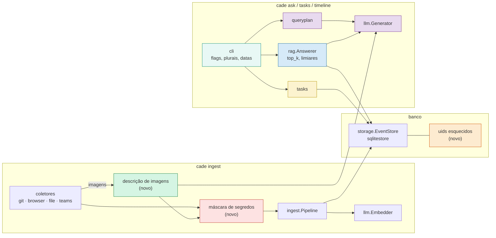
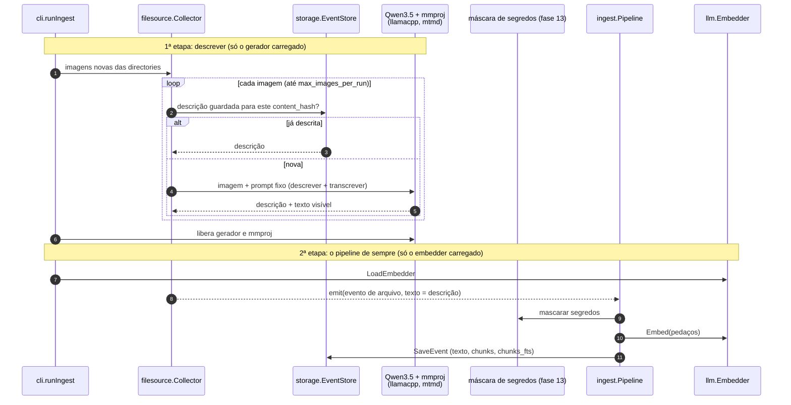

# cade — roadmap

O que falta para a v0.1.0, e em que ordem. A [v0.0.0](https://github.com/Chipskein/cade/releases/tag/v0.0.0) saiu em 2026-09-27; o que ela entregou, fase a fase e com as medições, está no [CHANGELOG](../CHANGELOG.pt-BR.md), e os gráficos em [BENCHMARKS.md](BENCHMARKS.md). Qual componente chama qual está em [ARCHITECTURE.md](ARCHITECTURE.md). Os requisitos citados no código (`RF`, `RNF`, `CA`) estão em [USECASES.md](USECASES.md).

## Como cada entrega é feita

- Uma fase (ou parte dela) por vez, cada uma num commit próprio.
- Cada entrega vem com testes (`go tool mage test`), a suíte (`go tool mage eval`) quando afeta busca ou plano, `go tool mage bench` quando afeta desempenho, e docs (README EN/PT, `docs/USECASES.md`, PRIVACY quando toca dados, CHANGELOG, e os diagramas de `docs/ARCHITECTURE.md` quando muda quem chama quem).
- Mudança de esquema é migração (`PRAGMA user_version`, com cópia quando reescreve dados), nunca `forget` + `ingest`: reimportar perde dados, porque o cache do Teams expira e o histórico do Chrome guarda só ~90 dias.
- Tudo continua local, sem rede em tempo de execução. Propostas que dependem de rede (por exemplo, consultar a API do GitHub para saber se um PR foi mergeado) ficam fora.

## Foco da v0.1.0

A v0.0.0 fechou a base: avaliação, busca híbrida, CI, instalação e release. A v0.1.0 cuida do que as revisões apontaram como mais arriscado no uso real, nesta ordem:

1. **Privacidade:** segredos não devem chegar ao banco, e deve ser possível apagar menos que uma fonte inteira.
2. **Não enganar quem usa:** "concluída" que é só "PR aberto", limiares calibrados para um único modelo, plurais errados, datas ambíguas.
3. **Qualidade e custo da resposta:** `top_k` e limiares medidos em vez de herdados, e a geração migrada para o Qwen3.5, com licença permissiva e que siga a regra contra injeção.
4. **Imagens:** o Qwen3.5 também lê imagens, então as imagens das pastas configuradas ganham uma descrição local e passam a ser encontradas pela busca que já existe.
5. **Não perder dados:** ingestão agendada documentada, limitações do Teams e da fonte de arquivos explícitas.

## Situação

| Fase | Tema | Situação | Impacto | Esforço |
| ---- | ---- | -------- | ------- | ------- |
| 13 | [Segredos fora do banco](#fase-13--segredos-fora-do-banco) | a fazer | alto | médio |
| 14 | [Apagar eventos e retenção](#fase-14--apagar-eventos-e-retenção) | a fazer | alto | médio |
| 15 | [Semântica das tarefas](#fase-15--semântica-das-tarefas) | a fazer | médio | baixo |
| 16 | [Detalhes da CLI](#fase-16--detalhes-da-cli) | feita | médio | baixo |
| 17 | [`top_k`, limiares e reranking medidos](#fase-17--top_k-limiares-e-reranking-medidos) | feita | alto | médio |
| 18 | [Migrar a geração para o Qwen3.5](#fase-18--migrar-a-geração-para-o-qwen35) | feita | alto | médio |
| 19 | [Busca por descrição de imagens](#fase-19--busca-por-descrição-de-imagens) | a fazer | alto | alto |
| 20 | [Documentação de uso contínuo](#fase-20--documentação-de-uso-contínuo) | a fazer | médio | baixo |
| 21 | [Empacotamento da v0.1.0](#fase-21--empacotamento-da-v010) | a fazer | pré-requisito do lançamento | baixo |
| — | [Pendências da v0.0.0](#pendências-da-v000) | em aberto | — | — |
| — | [A definir](#a-definir) | em aberto | — | — |

A tabela está na ordem sugerida:
- **Privacidade primeiro (13, 14):** cada ingestão sem a 13 grava mais segredos, que depois precisam de migração para sair.
- **Depois as correções baratas (15, 16):** mudam a saída que o usuário lê e os códigos do `ask --json`, então entram antes de medir.
- **Medições (17, 18):** a 18 foi feita antes da 17, com o `top_k` herdado (8); a 17 mediu com o Qwen3.5-2B e fixou o `top_k` em 6.
- **Imagens (19) depois da 18:** usam o mesmo modelo e o mesmo llama.cpp da 18, então o tamanho escolhido lá precisa servir para descrever imagens também.
- **Docs (20) e empacotamento (21) por último:** descrevem o estado final.

### Onde cada fase entra no código

Os mesmos componentes dos diagramas de [ARCHITECTURE.md](ARCHITECTURE.md); em destaque, os que cada fase muda.

| Cor | Fase | Componente |
| --- | ---- | ---------- |
| vermelho | 13 | máscara de segredos entre o coletor e o `ingest.Pipeline`, e globs no `filesource` |
| laranja | 14 | `forget` por evento e lista de uids esquecidos, consultada pelo `ingest.Pipeline` |
| amarelo | 15 | `tasks` (estado "PR aberto", PR só com visita à página de criação) |
| verde-água | 16 | `cli` (plurais, flags, ordem de data) |
| azul | 17 | `rag.Answerer` (`top_k`, limiares); o reranker foi medido e ficou de fora |
| roxo | 18 | `llm.Generator` e `llm.StructuredGenerator` (Qwen3.5), com efeito no `queryplan` |
| verde | 19 | descrição de imagens no `filesource`, usando o mesmo gerador com o `mmproj` |

---

## Fase 13 — Segredos fora do banco

- **Problema:** o PRIVACY admite que um `.env` dentro de `directories` fica guardado como texto, e que a query string das URLs do navegador às vezes carrega tokens (links de redefinição de senha, URLs assinadas, `?code=` de OAuth). Hoje o risco fica todo com o usuário.
- **Mudança:**
  - **Arquivos ignorados por padrão:** `.env*`, `*.pem`, `*.key`, `id_rsa*`, `id_ed25519*`, `*.p12`, `*.pfx`, `credentials*`, `.netrc`, `.npmrc`, `.pypirc`, `.git-credentials`. Configurável em `sources.ignored_file_globs` (a lista padrão continua valendo a menos que o usuário a substitua de propósito).
  - **Parâmetros de URL removidos:** `token`, `access_token`, `id_token`, `refresh_token`, `code`, `state`, `sig`, `signature`, `key`, `apikey`, `api_key`, `password`, `X-Amz-*`, `X-Goog-*`. O resto da URL fica, para a deduplicação por página continuar funcionando.
  - **Padrões conhecidos mascarados no texto** (arquivos, mensagens, títulos, mensagens de commit): `ghp_`/`github_pat_`, `glpat-`, `AKIA…`, `xox[bp]-`, JWT (`eyJ….eyJ….…`), blocos `-----BEGIN … PRIVATE KEY-----`. Vira `[redacted:github-token]`, para a resposta ainda poder dizer que havia um token ali.
  - `ingest.redact` (padrão `true`) desliga a máscara; os globs e os parâmetros valem sempre.
  - **Dados já ingeridos:** uma migração com cópia aplica a mesma limpeza aos eventos existentes, apaga os arquivos que agora seriam ignorados e zera o texto substituído (`secure_delete`, `VACUUM`). Os pedaços alterados perdem o vetor e o `ask` avisa até o `cade reindex`, como na migração 5.
- **A verificar:** quantos eventos reais a migração toca (medir numa cópia real) e se a máscara piora a suíte de recuperação (não deveria: os segredos não estão nas perguntas).
- **Critério de aceite:**
  - fixtures com segredos falsos de cada tipo, em cada fonte; depois do `ingest`, nenhum aparece no banco (texto, `chunks_fts`, metadado);
  - teste da migração em `migrations_test.go`, com backup;
  - `go tool mage evalRetrieval` igual ou melhor;
  - PRIVACY (EN/PT) atualizado: o que é removido, o que ainda pode passar (segredo sem formato conhecido) e como desligar.

---

## Fase 14 — Apagar eventos e retenção

- **Problema:** o PRIVACY diz que "não há comando para apagar um evento isolado". Para tirar uma mensagem ou uma nota com senha, hoje é preciso apagar a fonte inteira, o que perde dados que não voltam.
- **Mudança:**
  - `cade forget --uid UID` (o uid já aparece no `ask --json`) e `cade forget --match TEXTO [--source S] [--from D --to D]`, que lista os eventos que casam e pede confirmação (`--yes` para scripts). Mesmo cuidado do `forget` de fonte: embeddings, pedaços, `chunks_fts`, `event_people`, `file_modifications`, depois `VACUUM` e WAL esvaziado.
  - Um evento apagado assim não volta no próximo `ingest`: o uid entra numa lista de esquecidos (só o uid e a data, sem texto). A lista é apagada pelo `forget` da fonte.
  - `retention.max_age_days` por fonte, aplicado no fim do `ingest`, **desligado por padrão**: o cade existe justamente para guardar o que o Chrome e o Teams descartam.
- **Critério de aceite:** teste de privacidade conferindo que nenhuma tabela guarda o evento depois do `forget --uid`; teste de que o `ingest` seguinte não o traz de volta; o `forget --match` sem `--yes` não apaga nada fora de um terminal; PRIVACY atualizado (a última linha da seção "Apagar dados" muda).

---

## Fase 15 — Semântica das tarefas

- **Problema:**
  - "concluída" quer dizer "PR aberto". O PR pode ser rejeitado ou nunca mergeado, e sem rede o cade não tem como saber.
  - "Aberto por você" inclui qualquer mensagem sua com o link de um PR, então repassar o PR de outra pessoa conta como seu.
  - `proj4me` aparece entre os rastreadores padrão ao lado de Jira e Linear, mas é de um ambiente específico.
- **Mudança:**
  - Renomear o estado para "PR aberto" (EN "PR opened") na timeline, no `tasks`, no `ask` e no README. As perguntas "quais tarefas finalizei?" continuam mapeando para ele, e a saída explica a definição numa linha.
  - No `ask --json`, o código `"concluida"` vira `"pr_aberto"`. A fase 12 manteve os códigos para não quebrar scripts; aqui a quebra é intencional e vai nas notas de versão.
  - PR "seu" só com a visita à página de criação logo antes. Uma mensagem sua com o link, sem essa visita, marca o PR como "(provável)", como já acontece com a ligação por proximidade.
  - `proj4me` sai dos padrões e vira o exemplo de `tasks.task_url_patterns` no README.
- **Critério de aceite:** nenhum lugar da CLI ou do README chama PR aberto de "concluída"; casos novos em `plan.json` e nos testes de `tasks` para o PR de terceiro repassado; `cade init` gera config sem `proj4me`.

---

## Fase 16 — Detalhes da CLI

Feita: plurais, flags em qualquer posição, `ui.date_order` e a tabela de períodos no README. Detalhes no [CHANGELOG](../CHANGELOG.pt-BR.md#detalhes-da-cli-fase-16).

---

## Fase 17 — `top_k`, limiares e reranking medidos

Feita: `top_k` 6, com recall igual e o `ask` em CPU 1,8 s mais rápido. Os limiares (0,72 e 0,61) continuam, agora registrados junto do modelo de embedding para o qual valem, e `reindex` e `doctor` avisam quando esse modelo muda. O reranker melhorou o MRR, mas perdeu recall e custa 0,57 s por pergunta em CPU, então voltou para "A definir". Detalhes no [CHANGELOG](../CHANGELOG.pt-BR.md#top_k-e-limiares-medidos-fase-17) e medições no [BENCHMARKS](BENCHMARKS.md#top_k-limiares-e-reranking-fase-17).

---

## Fase 18 — Migrar a geração para o Qwen3.5

Feita: o padrão é o Qwen3.5-2B (Apache-2.0), com o `mmproj` baixado pelo `go tool mage models` e a biblioteca `mtmd` no build. O 2B entende as perguntas igual ou melhor que o 2.5-3B em todos os campos da suíte de plano, e nenhuma injeção é seguida, porque o texto do evento marcado sai do prompt. O 4B, melhor ainda, ficou como alternativa documentada, fora do orçamento de VRAM. Detalhes e medições no [CHANGELOG](../CHANGELOG.pt-BR.md#geração-com-o-qwen35-fase-18).

---

## Fase 19 — Busca por descrição de imagens

- **Problema:** capturas de tela, fotos de quadro, diagramas e prints de erro nas pastas configuradas são ignorados hoje (binários só guardam caminho, tamanho e data). Muitas vezes são justamente o registro de uma decisão ou de um erro.
- **Mudança:**
  - **Descrição no `ingest file`:** cada imagem (`png`, `jpg`, `jpeg`, `webp`) das `directories` vai ao Qwen3.5 com o `mmproj`, com um prompt fixo que pede duas partes: uma descrição curta do que aparece e a transcrição do texto visível (mensagens de erro, títulos, código). O modelo lê o texto da imagem, então não é preciso Tesseract.
  - **O resto do pipeline não muda:** a descrição vira o texto do evento de arquivo, e segue o caminho de qualquer texto (pedaços → `TextEmbedder` → `sqlite-vec` e `chunks_fts`). Busca híbrida, filtros, `timeline`, `forget file` e citação (o caminho da imagem) funcionam sem código novo.
  - **Metadado:** o modelo e a versão do prompt que geraram a descrição, e as dimensões da imagem. Se possível, sem tabela nova; se o metadado não bastar, é uma migração.
  - **Só uma vez por imagem:** a descrição é guardada pelo `content_hash` da imagem; mover, renomear ou reingerir não descreve de novo. `cade reindex --captions` descreve outra vez quando o modelo ou o prompt mudar.
  - **Opcional e com limites:** `sources.images` (padrão `false`; o `cade init` pergunta), `ingest.max_image_bytes` e `ingest.max_images_per_run`, para uma pasta com milhares de fotos não travar a primeira ingestão. Imagens que ficaram para depois são contadas no fim do `ingest` e descritas nas próximas execuções.
  - **Memória:** no `ingest`, as imagens são descritas primeiro, com o modelo de geração e o `mmproj`; os dois são liberados antes de carregar o de embedding, para não somar os dois no pico.
- **Fluxo proposto** (compare com o [`cade ingest` atual](ARCHITECTURE.md#cade-ingest)):

- **Segurança e privacidade:**
  - A descrição e o texto transcrito passam pela máscara de segredos da fase 13: um print de terminal com um token não pode levá-lo ao banco. Os globs ignorados valem para imagens também.
  - Texto dentro de uma imagem é de outra pessoa como qualquer mensagem: o prompt de descrição pede para transcrever, não para obedecer, e o evento é marcado como não confiável no `ask`, como as notas (fase 7).
  - PRIVACY (EN/PT): o que o modelo vê no `ingest`, o que fica no banco (a descrição, nunca os pixels) e como apagar.
- **A verificar:**
  - **Custo por imagem** em CPU e GPU (codificação da imagem + geração da descrição), e o tamanho de imagem a partir do qual reduzir antes de enviar. Registrar no BENCHMARKS e no README (hardware); estimar quanto leva uma pasta de 1 mil capturas.
  - **Qualidade:** se o tamanho escolhido na fase 18 descreve bem o suficiente em português e inglês; se não, se vale um tamanho maior só para o `ingest`.
- **Avaliação:**
  - `testdata/images/` com imagens sintéticas e sem nomes reais (capturas de terminal e de páginas geradas por script, um diagrama, uma foto de licença livre), cada uma com as palavras que a descrição precisa conter; `go tool mage evalCaptions` mede essa cobertura.
  - Casos novos na suíte de recuperação (perguntas cuja resposta está numa imagem, como "qual era o erro no print de ontem?"), no conjunto de teste.
  - Um caso de injeção com instruções escritas dentro de uma imagem em `go tool mage evalInjection`.
- **Critério de aceite:** cobertura mínima do `eval-captions` definida no arquivo da suíte e passando; os casos de imagem na suíte de recuperação passam sem piorar os outros; nenhuma injeção por imagem seguida; nenhum segredo das imagens de fixture no banco; `forget file` apaga as descrições (teste de privacidade); custo por imagem documentado.

---

## Fase 20 — Documentação de uso contínuo

- **Problema:** quem esquece de rodar `ingest` perde dados de vez (Chrome ~90 dias, cache do Teams), e várias limitações só aparecem lendo o PRIVACY ou o código.
- **Mudança (README EN/PT):**
  - **Ingestão agendada:** exemplo de timer `systemd --user` e de crontab rodando `cade ingest all`, com o aviso da perda logo acima.
  - **Teams experimental:** rótulo na seção, com as limitações no início: depende do formato interno do IndexedDB do Teams web, só vê o que o cliente tem em cache, mensagens nunca abertas não existem, mensagens apagadas depois da ingestão ficam até o `forget`.
  - **Plataformas:** matriz SO (Linux / macOS / Windows) × fonte, marcando o que é testado (Linux), o que deve funcionar e o que não é suportado.
  - **Fonte de arquivos:** o que é lido (UTF-8 até `max_file_bytes`; imagens descritas, fase 19), o que é ignorado (outros binários, `ignored_dir_names`, os globs da fase 13), pedaços de 1.200 caracteres, detecção de mudança por `content_hash`, arquivo apagado da pasta.
  - **Como a busca decide:** a fusão da busca híbrida (reciprocal rank fusion) em uma frase, e o custo da busca vetorial sem índice aproximado (~106 ms em 100 mil eventos em CPU, `bench/baseline-cpu.txt`), com o tamanho a partir do qual isso vira problema.
  - **Por quê:** 2–3 linhas de motivação (daily, retomar contexto, relatório de horas) e uma frase de comparação com ferramentas de captura de tela, acima de "Como funciona". GIF do `cade ask` opcional.
- **Critério de aceite:** seções presentes nos dois READMEs; o timer do systemd testado numa sessão real.

---

## Fase 21 — Empacotamento da v0.1.0

O processo da v0.0.0 continua:

1. Trocar o cabeçalho do topo do CHANGELOG (EN/PT) pela versão e data, e escrever `docs/release-notes/v0.1.0.md`, avisando: a migração da fase 13 (com cópia e `cade reindex`), o código `"pr_aberto"` no `ask --json`, a troca do modelo de geração pelo Qwen3.5 com o `mmproj` (`go tool mage models` de novo; o 2.5-3B pode ser apagado) e que as imagens só são descritas com `sources.images` ligado.
2. Conferir os [critérios de release](#critérios-de-release).
3. Levar o `dev` para o `master` e criar a tag lá: `git tag v0.1.0 origin/master && git push origin v0.1.0`. O workflow testa, gera o binário e publica o release; uma tag fora do `master` falha sem publicar.

---

## Pendências da v0.0.0

- **CI (fase 10):** registrar o tempo com o cache quente, um PR com teste ou `gofmt` quebrado ficando vermelho, e quanto o `eval.yml` leva em CPU.

---

## Avaliado e fora da v0.1.0

Pontos das revisões em `docs/TOCHECK/` que já estão resolvidos ou que não seguem os princípios do projeto:

| Ponto | Por que fica fora |
| ----- | ----------------- |
| LICENSE, licença dos modelos, CI, binário pronto, versionamento | entregues na v0.0.0 (GPLv2, fases 9 e 10) |
| Avaliação de recuperação com recall e MRR | existe (`go tool mage evalRetrieval`, conjunto de teste, curva de escala); a fase 17 a usa |
| Busca híbrida com filtros de fonte, período e pessoa | entregue (fases 3 e 6); o reranking foi medido na fase 17 e voltou para "A definir" |
| Validação determinística do plano, regras para perguntas simples | existe (`queryplan/guard.go`, `rules.go`, gramática GBNF); casos novos entram na suíte de plano a cada fase |
| Modelo e dimensão do embedding no banco | existe (`embedding_model`, `embedding_dimensions`), e os limiares com o modelo para o qual valem (fase 17) |
| Estado real do PR pela API do GitHub | exige rede em tempo de execução; a fase 15 torna o nome honesto |
| Índice vetorial aproximado (FAISS, Annoy) | a busca exata leva ~106 ms em 100 mil eventos; reavaliar perto de 1 milhão (ver "A definir") |
| Interface comum de fontes | existe (`internal/ingest/sources.go`); uma fonte nova não mexe no núcleo |
| "Local-first com modelo pesado" | requisitos de hardware documentados na fase 8; perguntas simples já nem carregam modelo |

---

## A definir

Outras ideias entram aqui antes de virar fase: problema, mudança proposta e critério de aceite, como nas fases acima.

### Contexto temporal e relações entre eventos

- **Problema:** perguntas como "o que aconteceu antes desse commit?" ou "como essa decisão evoluiu?" dependem de ordem e vizinhança, não de semelhança.
- **Começo barato:** `cade timeline --around UID [--window 2h]` e, no `ask`, trazer os vizinhos no tempo de um evento citado. Sem tabela nova.
- **Depois:** ligações explícitas entre eventos (mesmo id de tarefa, mesmo arquivo citado num commit e numa mensagem, mesmo repositório), guardadas numa tabela com migração. Medir com casos novos na suíte de recuperação antes de decidir.

### Contexto de projeto

Ligar commits, visitas e mensagens ao repositório e à branch em que se trabalhava (a branch não é guardada hoje). A verificar: de onde tirá-la sem rede (reflog, `HEAD` no momento do commit) e se melhora as respostas medidas.

### Criptografia do banco

Hoje o PRIVACY recomenda criptografia de disco. A verificar: se o SQLCipher convive com o sqlite-vec e o FTS5 no build atual, onde guardar a chave (keyring do sistema, sem rede) e o custo na busca.

### Nomes compostos no filtro de pessoa

Nomes com partícula ("de Souza"), sobrenomes compostos e a ignorância de acentos ("Sá" e "Sa") podem gerar falsos positivos ou negativos. Começar com casos na suíte de plano e em `event_people` para medir antes de mudar a regra.

### `cade ingest --watch`

Modo contínuo com intervalo configurável. A fase 20 (timer do systemd) resolve o essencial até lá.

### Modo daemon para o `ask`

- **Problema:** cada `cade ask` carrega os dois modelos. Com o cache de página frio, isso domina na GPU (7,7 s de 8,5 s). Em CPU, o que domina é ler as evidências, que um daemon não evita; a fase 17 reduziu esse custo com o `top_k` 6.
- **Mudança possível:** um processo que mantém os modelos carregados, atendendo o `cade ask` por um socket Unix só do dono, e que encerra depois de um tempo parado.
- **A verificar:** se vale a memória ocupada o tempo todo (~2,5 GB de GPU ou ~3,9 GB de RAM).

### Reranking dos candidatos

- **Medido na fase 17** ([BENCHMARKS](BENCHMARKS.md#top_k-limiares-e-reranking-fase-17), `go tool mage evalRerank`): reordenar 30 candidatos com o `bge-reranker-v2-m3` antes do corte subiu o MRR de 0,83 para 0,91 com 1 mil e 10 mil eventos, mas o recall no teste caiu de 1,00 para 0,94 e o custo foi de 0,57 s por pergunta em CPU, mais 418 MB de modelo.
- **A verificar:** um reranker menor ou só em GPU; reordenar sem descartar (o reranker só troca a ordem dos `top_k` já escolhidos, o que não pode perder recall); casos novos na suíte em que a ordem mude a resposta.

### Índice vetorial aproximado

Reavaliar quando a curva de escala passar de 1 milhão de eventos ou a busca passar de ~500 ms em CPU. Primeiro medir quantização dos vetores no próprio sqlite-vec (`int8`, binário), antes de outra biblioteca.

### Binário para arm64

`go tool mage dist` em `linux-arm64`, se houver quem use. Exige runner arm64 no workflow e conferir o llama.cpp com `LLAMA_NATIVE=OFF` lá.

### Busca em PDFs

As imagens foram para a fase 19, descritas pelo Qwen3.5 em vez do detector (YOLO/DETR) planejado na v0.0.0: isso dispensa outra biblioteca de inferência e o problema de licença do YOLO (AGPL-3.0). Os PDFs continuam aqui.

- **Encaixe:** extensão natural do pipeline (extração de texto → pedaços → `TextEmbedder` → `sqlite-vec` e `chunks_fts`), como eventos da fonte de arquivos, com a página no metadado para citar ("relatorio.pdf, p. 12").
- **PDFs escaneados:** renderizar a página como imagem e reaproveitar a descrição da fase 19, em vez de Tesseract. A verificar: a biblioteca de extração e renderização (licença compatível com a GPLv3, via cgo ou Go puro; veja [LICENSING.pt-BR.md](LICENSING.pt-BR.md)).
- **Avaliação e privacidade:** casos novos na suíte de recuperação, custo de ingestão por página em CPU, e `forget`/PRIVACY cobrindo o texto extraído.

---

## Critérios de release

A versão sai quando:

- [ ] a CI está verde no commit da tag;
- [ ] `go tool mage test` e `go tool mage eval` passam, com as métricas reportadas no conjunto de **teste**;
- [ ] recall, MRR e rejeição no teste ficam iguais ou melhores que o baseline da v0.0.0, em todos os tamanhos da curva de escala;
- [ ] todas as migrações que reescrevem dados fazem backup antes e têm teste em `migrations_test.go`;
- [ ] `forget` (por fonte e por evento) apaga os dados de todas as tabelas novas (teste de privacidade);
- [ ] nenhum segredo das fixtures da fase 13 chega ao banco, nem pelo texto nem pela descrição de uma imagem;
- [ ] o modelo de geração padrão é o Qwen3.5, com a licença do modelo e do `mmproj` registrada, e `go tool mage evalInjection` sem nenhuma injeção seguida;
- [ ] `go tool mage evalCaptions` passa, e as perguntas sobre imagens estão no conjunto de teste da suíte de recuperação;
- [ ] o baseline de benchmark é atualizado com GPU, CPU e cold start;
- [ ] README, PRIVACY e CHANGELOG estão atualizados, em inglês e português;
- [ ] um usuário novo chega ao primeiro `cade ask` seguindo só o README;
- [ ] `cade version` mostra a versão da tag, e `THIRD_PARTY_NOTICES.md` e a licença dos modelos estão no repositório;
- [ ] as notas de versão avisam da migração com cópia, do `cade reindex` obrigatório e das mudanças no `ask --json`;
- [ ] nenhum nome real de pessoa, cliente ou empresa em código, testes, corpus ou documentação.
