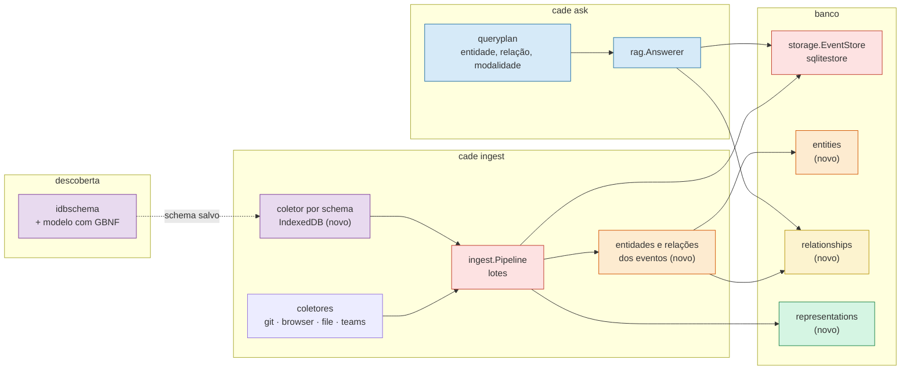

  

# cade — roadmap

O que falta para a v0.2.0, e em que ordem. A [v0.1.0](https://github.com/Chipskein/cade/releases/tag/v0.1.0) saiu em 2026-09-30; o que ela e a v0.0.0 entregaram, fase a fase (0 a 21) e com as medições, está no [CHANGELOG](../CHANGELOG.pt-BR.md), e os gráficos em [BENCHMARKS.pt-BR.md](BENCHMARKS.pt-BR.md). Qual componente chama qual está em [ARCHITECTURE.md](ARCHITECTURE.md). Os requisitos citados no código (`RF`, `RNF`, `CA`) estão em [USECASES.md](USECASES.md).

Cada fase é uma issue no GitHub, com as tasks e os arquivos de cada uma. Aqui fica a ordem, o porquê e o aceite resumido.

## Como cada entrega é feita

- Uma fase (ou parte dela) por vez. Cada task é um commit que passa no `go tool mage check` sozinho e muda no máximo 10 arquivos, contando testes e docs ([AGENTS.md](../AGENTS.md)).
- Cada entrega vem com testes (`go tool mage test`), a suíte (`go tool mage eval`) quando afeta busca ou plano, `go tool mage bench` quando afeta desempenho, e docs (README EN/PT, `docs/USECASES.md`, PRIVACY quando toca dados, CHANGELOG, e os diagramas de `docs/ARCHITECTURE.md` quando muda quem chama quem).
- Mudança de esquema é migração (`PRAGMA user_version`, com cópia quando reescreve dados), nunca `forget` + `ingest`: reimportar perde dados, porque o cache do Teams expira e o histórico do Chrome guarda só ~90 dias.
- Tudo continua local, sem rede em tempo de execução. Propostas que dependem de rede (por exemplo, consultar a API do GitHub para saber se um PR foi mergeado) ficam fora.

## Foco da v0.2.0

A v0.1.0 cuidou do risco no uso real: privacidade, respostas honestas, custo da resposta e imagens. A v0.2.0 faz o `cade` entender **quem e o quê** aparece nos eventos, e não só o que aconteceu. Nesta ordem:

1. **Base medida:** gravar menos no disco (#51), benchmarks reproduzíveis (#14) e um plano de espaço (#40), para comparar o antes e o depois das tabelas novas.
2. **Regras de privacidade antes dos dados novos:** as entidades concentram dados pessoais (pessoas, mensagens), então as lacunas da LGPD e do GDPR são levantadas antes (#25).
3. **Entidades e relacionamentos:** entidades (#20), relações entre elas (#21), representações multimodais (#22) e a busca que usa tudo isso (#24).
4. **IndexedDB por schema:** indexar outras aplicações que usam IndexedDB sem escrever um coletor para cada uma (#19).

Rostos, macOS e Windows ficam para a [v0.3.0](#v030).

## Situação

| Fase | Tema | Issue | Situação | Impacto | Esforço |
| ---- | ---- | ----- | -------- | ------- | ------- |
| 22 | [Transações em lote na ingestão](#fase-22--transações-em-lote-na-ingestão) | [#51](https://github.com/Chipskein/cade/issues/51) | feito | médio | baixo |
| 23 | [Benchmarks reproduzíveis](#fase-23--benchmarks-reproduzíveis) | [#14](https://github.com/Chipskein/cade/issues/14) | feito | médio | baixo |
| 24 | [Plano de espaço](#fase-24--plano-de-espaço) | [#40](https://github.com/Chipskein/cade/issues/40) | feito | médio | médio |
| 24a | [Compactar os vetores](#fase-24a--compactar-os-vetores) | [#65](https://github.com/Chipskein/cade/issues/65) | feito | médio | baixo |
| 24b | [Vetores em `int8`](#fase-24b--vetores-em-int8) | [#66](https://github.com/Chipskein/cade/issues/66) | feito | alto | médio |
| 24c | [Um vetor por texto](#fase-24c--um-vetor-por-texto) | [#67](https://github.com/Chipskein/cade/issues/67) | feito | médio | alto |
| 25 | [LGPD e GDPR](#fase-25--lgpd-e-gdpr) | [#25](https://github.com/Chipskein/cade/issues/25) | a fazer | alto | baixo |
| 26 | [Modelo de entidades](#fase-26--modelo-de-entidades) | [#20](https://github.com/Chipskein/cade/issues/20) | a fazer | alto | alto |
| 27 | [Relacionamentos](#fase-27--relacionamentos) | [#21](https://github.com/Chipskein/cade/issues/21) | a fazer | alto | médio |
| 28 | [Representações multimodais](#fase-28--representações-multimodais) | [#22](https://github.com/Chipskein/cade/issues/22) | a fazer | médio | médio |
| 29 | [Busca por entidades e relações](#fase-29--busca-por-entidades-e-relações) | [#24](https://github.com/Chipskein/cade/issues/24) | a fazer | alto | alto |
| 30 | [Schemas de IndexedDB via modelo local](#fase-30--schemas-de-indexeddb-via-modelo-local) | [#19](https://github.com/Chipskein/cade/issues/19) | em andamento | médio | alto |
| 31 | [Empacotamento da v0.2.0](#fase-31--empacotamento-da-v020) | — | a fazer | pré-requisito do lançamento | baixo |
| — | [Pendências](#pendências) | — | em aberto | — | — |
| — | [v0.3.0](#v030) | várias | depois | — | — |
| — | [A definir](#a-definir) | — | em aberto | — | — |

A tabela está na ordem sugerida:
- **Lotes e benchmarks primeiro (22, 23):** as tabelas novas das fases 26 a 28 aumentam a escrita por evento, e o tamanho e o tempo delas só podem ser comparados com uma base medida e reproduzível.
- **Espaço logo depois (24):** mede o tamanho por tabela na base da fase 23 e decide quantização, compressão e deduplicação antes de as fases 26 a 28 criarem tabelas novas, que já nascem no formato escolhido.
- **Alavancas de espaço (24a a 24c):** as escolhidas na fase 24, da mais barata para a mais cara. A 24a não tem perda e não muda a busca. A 24b reescreve os vetores e precisa do `evalRetrieval`. A 24c muda o caminho da busca e pode esperar se a 24b já bastar; a fase 28 (#22, representações) é a primeira tabela nova que depende do formato dos vetores.
- **LGPD antes das entidades (25):** a fase 26 cria a entidade `Person`. As regras (o que guardar, como exportar, como o `forget` apaga) precisam existir antes de os dados existirem.
- **Entidades, relações, representações e busca (26 a 29):** cada uma depende da anterior. Cada uma começa pelos casos da suíte (`go tool mage eval`) que falham hoje; sem um caso que falhe, a fase espera. A fase 27 começa pelo passo barato de [Contexto temporal](#contexto-temporal-e-relações-entre-eventos) (`timeline --around`), para ver se ele já resolve parte dos casos.
- **IndexedDB (30) independente:** não depende das anteriores e pode correr em paralelo a qualquer uma a partir da 22. Fica no fim da tabela porque é a que menos muda o que já existe.
- **Empacotamento (31) por último.**

### Onde cada fase entra no código

Os mesmos componentes dos diagramas de [ARCHITECTURE.md](ARCHITECTURE.md); em destaque, os que cada fase muda. As fases 23 a 25 são de medição e docs e não aparecem.

| Cor | Fase | Componente |
| --- | ---- | ---------- |
| vermelho | 22 | `ingest.Pipeline` grava em lotes; `sqlitestore` e o fake ganham a transação em lote |
| laranja | 26 | tabela `entities`, associação com eventos e a ligação feita na ingestão |
| amarelo | 27 | tabela `relationships`, consultas com vários saltos |
| verde | 28 | tabela `representations`, com as descrições de imagem da fase 19 migradas para ela |
| azul | 29 | `queryplan` (gramática, `guard`, regras) e `rag.Answerer` usando os candidatos do grafo |
| roxo | 30 | descoberta de schema com o modelo e o coletor genérico de IndexedDB |

---

## Fase 22 — Transações em lote na ingestão

**Issue:** [#51](https://github.com/Chipskein/cade/issues/51).

- **Problema:** cada evento é uma transação (`SaveEvent`, `UpdateEvent`). Na primeira ingestão de 3.620 eventos, o `cade` escreveu 485 MB no disco para um banco de 17 MB.
- **Mudança:** o `ingest.Pipeline` grava em transações de N eventos (N numa constante, escolhido medindo 50, 200 e 1.000). Uma interrupção perde no máximo o lote aberto, e a deduplicação (RF1.5) o recupera. Avaliar também `synchronous=NORMAL`. O `secure_delete=on` fica.
- **Aceite:** bytes escritos por evento caem, medidos em `/proc/PID/io` num banco em disco; o tempo da primeira ingestão não piora; interromper e rodar de novo dá os mesmos eventos (teste de regressão); `go tool mage eval` sem mudança.
- **Resultado** ([BENCHMARKS](BENCHMARKS.pt-BR.md#escrita-no-disco-na-ingestão-51)): lotes de 200 eventos (`eventsPerCommit`), gravados também depois de 2 s abertos (`batchMaxAge`). Na primeira ingestão de 2.287 eventos num SSD, 357 → 99 MB escritos (156 → 43 KB por evento), sem piorar o tempo (59 → 56 s). O `synchronous=NORMAL` já era o modo em uso (`go-sqlite3` com WAL).

---

## Fase 23 — Benchmarks reproduzíveis

**Issue:** [#14](https://github.com/Chipskein/cade/issues/14).

- **Problema:** o BENCHMARKS junta números de `bench/*.txt` e do CHANGELOG, com gráficos atualizados à mão, sem dizer com que comando, data e build cada um foi medido. Também existe só em português, sem o sufixo `.pt-BR`.
- **Mudança:** cada seção com o comando, a data, a máquina e o build; os números de hoje medidos de novo; seções sem comando reproduzível removidas ou marcadas como históricas; bytes escritos na ingestão (fase 22) incluídos; `BENCHMARKS.md` em inglês e `BENCHMARKS.pt-BR.md` em português.
- **Aceite:** todo número do BENCHMARKS pode ser reproduzido pelo comando ao lado dele; EN e PT com os links atualizados.
- **Resultado** ([BENCHMARKS](BENCHMARKS.pt-BR.md#máquina-e-builds)): cada seção com o comando, a data, o commit e o build; os números medidos de novo em 2026-09-30 (`f4e5379`), com a GPU a 120 W anotada; o que nenhum comando reproduz foi para [Histórico](BENCHMARKS.pt-BR.md#histórico); um glossário das métricas em linguagem simples; `BENCHMARKS.md` em inglês e `BENCHMARKS.pt-BR.md` em português.

---

## Fase 24 — Plano de espaço

**Issue:** [#40](https://github.com/Chipskein/cade/issues/40).

- **Problema:** o histórico cresce sem limite. Na base sintética são ~3,5 KB por evento; no banco real da fase 22, ~4,7 KB. Não se sabe em que tabela está o espaço.
- **Mudança:** medir o tamanho por tabela e índice (`events`, `chunks`, `chunks_fts`, vetores, `file_modifications`, `event_people`) com 1 mil, 10 mil e 100 mil eventos, e avaliar cada alavanca pelo espaço, pela busca (recall e MRR do `go tool mage evalRetrieval`) e pela ingestão: quantização dos vetores no sqlite-vec (`int8`, binário), compressão do texto, deduplicação, não duplicar a fonte (só viável para arquivos e git, em que a fonte continua lá) e estratégias diferentes para dados recentes e antigos.
- **Aceite:** a tabela de tamanho por tabela no BENCHMARKS; cada alavanca com o ganho e o custo; as escolhidas viram issues próprias, e as que couberem entram antes da fase 26.
- **Resultado** ([BENCHMARKS](BENCHMARKS.pt-BR.md#alavancas-de-espaço-40)):
  - Os vetores são 82% da base sintética e 79% do banco real (985 de 1.242 MB).
  - Três alavancas viraram fases: [24a](#fase-24a--compactar-os-vetores), [24b](#fase-24b--vetores-em-int8) e [24c](#fase-24c--um-vetor-por-texto). Juntas levam o banco real de ~1,24 GB para ~0,35 GB.
  - Ficaram de fora: comprimir o texto (−3%, e quebra os filtros SQL em `metadata`), guardar só a referência de `file`/`git` (−1%) e `bit` para dados antigos (perde um quarto do top-10).

---

## Fase 24a — Compactar os vetores

**Issue:** [#65](https://github.com/Chipskein/cade/issues/65).

- **Problema:** o vec0 não reaproveita as posições apagadas; no banco real, 89.270 de 335.872 (27%, ~262 MB) estão vazias.
- **Mudança:** reescrever `chunk_embeddings` só com os vetores vivos no fim do `reindex` e num comando explícito.
- **Aceite:** `ceil(vetores / 1024)` blocos depois de compactar; o mesmo top-k antes e depois.
- **Resultado** ([BENCHMARKS](BENCHMARKS.pt-BR.md#compactação-dos-vetores-65)): `cade compact`, sem gerar embedding, e `VACUUM` no fim do `reindex`. Numa cópia do banco real, 480 → 407 blocos (= ceil(415.963 / 1.024)) e 2.949,5 → 1.715,7 MB em 91 s, com as mesmas distâncias nas 54 consultas medidas. O `cade doctor` sugere compactar a partir de 20% de posições vazias.

---

## Fase 24b — Vetores em `int8`

**Issue:** [#66](https://github.com/Chipskein/cade/issues/66).

- **Problema:** cada vetor ocupa 3.072 bytes em `float32`.
- **Mudança:** `int8[768]` com cada vetor escalado pelo seu maior componente, numa migração com cópia. Nos vetores reais, mantém 99,4% do top-10 exato (a escala `unit` do sqlite-vec mantém 95,5%), com a mesma latência e 1/4 do espaço.
- **Aceite:** recall e MRR do `go tool mage evalRetrieval` iguais aos de hoje; `bytes/event` cai ~2,3 KB.
- **Resultado** ([BENCHMARKS](BENCHMARKS.pt-BR.md#vetores-em-int8-66)): migração 11, com cópia. Recall, MRR e rejeição iguais (1,00 / 0,87 / 1,00), e a calibração dos limiares também; `bytes/event` de 3.805 para 1.490 (−2,3 KB) em 100 mil eventos. Numa cópia do banco real, 1.799 → 837 MB em 28 s, 305 de 306 do top-6 mantidos e a busca sem filtro 25% mais rápida.

---

## Fase 24c — Um vetor por texto

**Issue:** [#67](https://github.com/Chipskein/cade/issues/67).

- **Problema:** 47% dos pedaços são de texto que outro evento já tem (uma página visitada várias vezes). O vetor é reaproveitado na ingestão, mas gravado de novo, e as cópias disputam o top-k.
- **Mudança:** pedaços, vetores e FTS5 por `content_hash`, com os eventos apontando para eles; os filtros de fonte e período (CA9.1) ganham outro desenho.
- **Aceite:** um pedaço por texto distinto; recall e MRR iguais ou melhores; filtros e `forget` com o mesmo resultado de hoje.
- **Resultado** ([BENCHMARKS](BENCHMARKS.pt-BR.md#um-conjunto-de-pedaços-por-texto-67)): migrações 12 (hash e caminho indexados por evento), 13 (primeira e última data por vetor) e 14 (pedaços por texto), com cópia. O filtro de período vai no vec0 como intervalo de datas e os eventos decidem: exato e o mais rápido dos três desenhos medidos. Recall, MRR e rejeição iguais (1,00 / 0,87 / 1,00). Numa cópia do banco real, 415.963 → 295.350 pedaços e vetores (um conjunto por texto), 837,5 → 767,4 MB em 53 s, e a busca 19–29% mais rápida; a chave do texto em `chunks` custa +30,5 MB.

---

## Fase 25 — LGPD e GDPR

**Issue:** [#25](https://github.com/Chipskein/cade/issues/25).

- **Problema:** muito já existe (tudo local, PRIVACY, `forget` por fonte, UID, texto e período, `secure_delete`, banco só do dono), mas ninguém comparou isso com a LGPD e o GDPR. Falta, por exemplo, exportar os dados de uma pessoa ou de uma fonte.
- **Mudança:** tabela "requisito → como o `cade` atende → lacuna" no PRIVACY (EN e PT), sem amarrar o `cade` a uma lei. Cada lacuna vira uma issue. As regras para a entidade `Person` (fase 26) e para dados biométricos (rostos, v0.3.0) ficam definidas aqui.
- **Aceite:** a tabela no PRIVACY; uma issue por lacuna; as regras para `Person` definidas antes da fase 26 começar.

---

## Fase 26 — Modelo de entidades

**Issue:** [#20](https://github.com/Chipskein/cade/issues/20).

- **Problema:** o `cade` guarda eventos, mas não os objetos que aparecem em vários deles (pessoa, arquivo, imagem, repositório, mensagem, URL).
- **O que já existe:** `event_people` (pessoas por evento, com as grafias juntadas por `listing.NameKey`), um evento por arquivo com as versões em `file_modifications`, e as descrições de imagem reaproveitadas pelo hash.
- **Mudança:** tabela `entities` com identificador estável, tipo numa enumeração e metadata livre por tipo, e a associação com os eventos. `Person` e `File` são preenchidas a partir do que já existe, numa migração com backup. O `forget` apaga as associações e as entidades que ficarem sem evento.
- **Aceite:** os casos da suíte que motivaram a fase passam; a migração tem teste; `go tool mage eval` não piora nos casos existentes.

---

## Fase 27 — Relacionamentos

**Issue:** [#21](https://github.com/Chipskein/cade/issues/21).

- **Antes:** o passo barato de [Contexto temporal](#contexto-temporal-e-relações-entre-eventos) (`cade timeline --around UID` e os vizinhos no tempo no `ask`), sem tabela nova. Só os casos que continuarem falhando justificam o grafo.
- **Mudança:** tabela `relationships` (origem, relação, destino, confiança, evento de onde saiu), com os tipos numa enumeração, restrição contra duplicatas e consultas com vários saltos por CTE recursiva. Os coletores gravam as relações que já sabem (quem enviou a mensagem, arquivo citado num commit). O `forget` de um evento apaga as relações derivadas dele.
- **Aceite:** os casos da suíte passam; nenhum banco de grafos externo; `go tool mage eval` não piora.

---

## Fase 28 — Representações multimodais

**Issue:** [#22](https://github.com/Chipskein/cade/issues/22).

- **Problema:** a descrição de imagem (fase 19) fica na metadata do evento. OCR, embeddings visuais e outras representações futuras não teriam onde ficar sem se acoplar à imagem.
- **Mudança:** tabela `representations` (modalidade, tipo, modelo, conteúdo, vetor no `sqlite-vec`). As descrições existentes migram para ela, e o `reindex --captions` passa a gravar lá. O `forget` apaga as representações derivadas.
- **Aceite:** a migração tem teste e `go tool mage evalCaptions` não muda; o tamanho do banco e o tempo do `ask`, antes e depois, no BENCHMARKS.

---

## Fase 29 — Busca por entidades e relações

**Issue:** [#24](https://github.com/Chipskein/cade/issues/24).

- **Problema:** perguntas como "documentos do projeto X que o João enviou" ou "imagens que o Pedro me mandou" dependem de quem enviou, do que está ligado a quê e da modalidade, não só da semelhança.
- **Mudança:** o `queryplan` ganha entidade, relação e modalidade (gramática GBNF, `guard`, regras); o `ask` usa o grafo para restringir ou ampliar os candidatos e depois aplica a busca híbrida de hoje. Perguntas sem relacionamento seguem o caminho atual. Pessoa entra como remetente ou citada; reconhecer pelo rosto fica para a v0.3.0.
- **Aceite:** casos novos nas suítes de plano e de recuperação (entidade + imagem, pessoa + imagem, pessoa + remetente + imagem, entidade + texto + relacionamento); `go tool mage eval` não piora nos casos existentes; os resultados mantêm a proveniência até o conteúdo original.

---

## Fase 30 — Schemas de IndexedDB via modelo local

**Issue:** [#19](https://github.com/Chipskein/cade/issues/19).

- **Problema:** cada aplicação com IndexedDB precisa de um coletor em código; só existe o do Teams. O `cade teams-schema` já resume a estrutura sem valores, mas o mapeamento para eventos é escrito à mão.
- **Mudança:** o modelo local atua como tradutor. Ele recebe o resumo do `idbschema` e poucas amostras e preenche um mapeamento declarativo para o evento do `cade`, com a saída restrita por gramática GBNF. O mapeamento é gerado uma vez por aplicação, salvo fora do código e editável. A indexação usa o schema salvo sem rodar o modelo. O decodificador do Chromium (`indexeddb`, `v8value`) não muda; um leitor do Firefox é acrescentado.
- **Aceite:** o schema do Teams produz os mesmos UID, hora, remetente e texto do `teamssource` de hoje (teste; o título e o tipo da conversa podem divergir); uma segunda aplicação é indexada sem código específico; o PRIVACY diz o que o modelo vê na descoberta.
- **Resultado:** `cade idb-discover`, `cade idb-check [--update] [--rekey]` e uma fonte do `ingest` por schema salvo, com leitor de IndexedDB do Firefox e do Floorp (`firefoxidb`, `smclone`). Com o Qwen3.5-2B na GPU (120 W), o rascunho do Teams sai em 6,4 s e acerta store, ids, remetente com lookup, texto e hora; o do WhatsApp Web, em 10,5 s, erra os campos que a cifragem confunde. Os dois foram revisados à mão (`testdata/idb-schemas/`). O do Teams bate com o `teamssource` em 3 mensagens reais e 5 de borda. O WhatsApp Web, cujo texto é cifrado, entra só por metadados: 9.633 mensagens numa cópia da base real, 85% com nome. A linguagem cresceu com casos reais: `required` (o Teams descarta corpo só de tags), `split`, `key_field` e `values` (chaves compostas do WhatsApp). Pendente: filtros de pessoa e direção do `ask` para fontes além do Teams.
- **Próximas tarefas** (mesma issue e branch, cada uma com até 10 arquivos):
  - O Discord não guarda mensagens no IndexedDB, mas o cache HTTP do navegador guarda as últimas respostas de `GET /api/v9/channels/<id>/messages`, só dos canais abertos e até o navegador descartá-las.
  - O texto do WhatsApp Web é cifrado no IndexedDB e não passa pelo cache HTTP; a fonte legítima é a exportação oficial de conversa (`.txt`).
  1. Leitor do cache HTTP do Firefox/Floorp (`cache2`): só origens e padrões de URL configurados; corpos JSON viram registros, com a URL no papel do store.
  2. Leitor do cache HTTP do Chrome (`Cache/Cache_Data`).
  3. Integração: schema com `records.url`, descoberta e `idb-check` sobre esses registros, e o schema revisado do Discord.
  4. Importação do `.txt` exportado do WhatsApp, com o mesmo UID do evento do IndexedDB, para completar o texto sem duplicar.
  5. Caminhos que leem o registro de dentro do item (`^.id`, `^.updateTime`), para mensagens aninhadas na conversa, como o cache do ChatGPT.
  6. Docs e PRIVACY (EN e PT).

---

## Fase 31 — Empacotamento da v0.2.0

O processo da v0.1.0 continua:

1. Trocar o cabeçalho do topo do CHANGELOG (EN/PT) pela versão e data, e escrever `docs/release-notes/v0.2.0.md`, avisando: as migrações com cópia (entidades e representações), o que muda no `ask --json` se a fase 29 mudar, e como gerar e editar um schema de IndexedDB.
2. Conferir os [critérios de release](#critérios-de-release).
3. Levar o `dev` para o `master` por PR com merge commit e criar a tag lá: `git tag v0.2.0 origin/master && git push origin v0.2.0`. O workflow testa, gera o binário e publica o release; uma tag fora do `master` falha sem publicar.

---

## Pendências

- **CI (fase 10, da v0.0.0):** registrar o tempo com o cache quente, um PR com teste ou `gofmt` quebrado ficando vermelho, e quanto o `eval.yml` leva em CPU.

---

## v0.3.0

Já têm issue, com as tasks e os arquivos de cada uma. Ficam para depois da v0.2.0:

| Issue | Tema | Por que depois |
| ----- | ---- | -------------- |
| [#23](https://github.com/Chipskein/cade/issues/23) | Rostos | depende das fases 25 a 28; precisa de outro runtime de inferência e de um modelo com licença compatível com a GPLv3; opt-in, porque é dado biométrico |
| [#53](https://github.com/Chipskein/cade/issues/53) | macOS (Apple Silicon, Metal) | 5 tasks, pronta para começar; não traz nada novo para quem já usa no Linux |
| [#54](https://github.com/Chipskein/cade/issues/54) | Windows 11 x86-64, só CPU | a maior issue aberta (12 tasks); depende da task 4 da #53 e usa o ponto de commit da fase 22 |
| [#57](https://github.com/Chipskein/cade/issues/57) | Decisão sobre criptografia do banco | investigação sem código; a fase 25 aponta para ela no PRIVACY |
| [#59](https://github.com/Chipskein/cade/issues/59) | Busca em áudios pela transcrição | depende das fases 25 e 28; falta escolher o modelo e o runtime (`mtmd` do llama.cpp ou whisper.cpp) com licença compatível com a GPLv3; opt-in |
| [#60](https://github.com/Chipskein/cade/issues/60) | Busca em vídeos pelos quadros e pela fala | depende da #59 e da fase 28; a decodificação (FFmpeg ou alternativa) é a decisão de licença mais difícil; opt-in |

---

## Avaliado e fora do plano

Pontos das revisões em `docs/TOCHECK/` (feitas para a v0.1.0) que já estão resolvidos ou que não seguem os princípios do projeto:

| Ponto | Por que fica fora |
| ----- | ----------------- |
| LICENSE, licença dos modelos, CI, binário pronto, versionamento | entregues na v0.0.0 (GPLv2, fases 9 e 10) |
| Avaliação de recuperação com recall e MRR | existe (`go tool mage evalRetrieval`, conjunto de teste, curva de escala); a fase 17 a usa |
| Busca híbrida com filtros de fonte, período e pessoa | entregue (fases 3 e 6); o reranking foi medido na fase 17 e voltou para "A definir" |
| Validação determinística do plano, regras para perguntas simples | existe (`queryplan/guard.go`, `rules.go`, gramática GBNF); casos novos entram na suíte de plano a cada fase |
| Modelo e dimensão do embedding no banco | existe (`embedding_model`, `embedding_dimensions`), e os limiares com o modelo para o qual valem (fase 17) |
| Estado real do PR pela API do GitHub | exige rede em tempo de execução; a fase 15 torna o nome honesto |
| Índice vetorial aproximado (FAISS, Annoy) | a busca exata leva ~106 ms em 100 mil eventos; reavaliar perto de 1 milhão (ver "A definir") |
| Interface comum de fontes | existe (`internal/ingest/sources.go`); uma fonte nova não mexe no núcleo |
| "Local-first com modelo pesado" | requisitos de hardware documentados na fase 8; perguntas simples já nem carregam modelo |

---

## A definir

Outras ideias entram aqui antes de virar fase: problema, mudança proposta e critério de aceite, como nas fases acima.

### Contexto temporal e relações entre eventos

- **Problema:** perguntas como "o que aconteceu antes desse commit?" ou "como essa decisão evoluiu?" dependem de ordem e vizinhança, não de semelhança.
- **Começo barato:** `cade timeline --around UID [--window 2h]` e, no `ask`, trazer os vizinhos no tempo de um evento citado. Sem tabela nova.
- **Depois:** ligações explícitas entre eventos (mesmo id de tarefa, mesmo arquivo citado num commit e numa mensagem, mesmo repositório), guardadas numa tabela com migração. Medir com casos novos na suíte de recuperação antes de decidir. É a [fase 27](#fase-27--relacionamentos) ([#21](https://github.com/Chipskein/cade/issues/21)).

### Contexto de projeto

Ligar commits, visitas e mensagens ao repositório e à branch em que se trabalhava (a branch não é guardada hoje). A verificar: de onde tirá-la sem rede (reflog, `HEAD` no momento do commit) e se melhora as respostas medidas.

### Nomes compostos no filtro de pessoa

Nomes com partícula ("de Souza"), sobrenomes compostos e a ignorância de acentos ("Sá" e "Sa") podem gerar falsos positivos ou negativos. Começar com casos na suíte de plano e em `event_people` para medir antes de mudar a regra.

### `cade ingest --watch`

Modo contínuo com intervalo configurável. A fase 20 (timer do systemd) resolve o essencial até lá.

### Modo daemon para o `ask`

- **Problema:** cada `cade ask` carrega os dois modelos. Com o cache de página frio, isso domina na GPU (7,7 s de 8,5 s). Em CPU, o que domina é ler as evidências, que um daemon não evita; a fase 17 reduziu esse custo com o `top_k` 6.
- **Mudança possível:** um processo que mantém os modelos carregados, atendendo o `cade ask` por um socket Unix só do dono, e que encerra depois de um tempo parado.
- **A verificar:** se vale a memória ocupada o tempo todo (~2,5 GB de GPU ou ~3,9 GB de RAM).

### Reranking dos candidatos

- **Medido na fase 17** ([BENCHMARKS](BENCHMARKS.pt-BR.md#reranking-fase-17-reprovado), `go tool mage evalRerank`): reordenar 30 candidatos com o `bge-reranker-v2-m3` antes do corte subiu o MRR de 0,83 para 0,91 com 1 mil e 10 mil eventos, mas o recall no teste caiu de 1,00 para 0,94 e o custo foi de 0,57 s por pergunta em CPU, mais 418 MB de modelo.
- **A verificar:** um reranker menor ou só em GPU; reordenar sem descartar (o reranker só troca a ordem dos `top_k` já escolhidos, o que não pode perder recall); casos novos na suíte em que a ordem mude a resposta.

### Índice vetorial aproximado

Reavaliar quando a curva de escala passar de 1 milhão de eventos ou a busca passar de ~500 ms em CPU. A quantização no próprio sqlite-vec foi medida na [fase 24](#fase-24--plano-de-espaço): o `int8` ([fase 24b](#fase-24b--vetores-em-int8), já em uso) guarda 1/4 do espaço e deixou a busca ~25% mais rápida, o que não muda a escala linear; o `bit` busca 16× mais rápido e perde um quarto do top-10, então pode servir de primeira passada com os vetores guardados reordenando os candidatos, se a latência apertar antes de outra biblioteca.

### Binário para arm64

`go tool mage dist` em `linux-arm64`, se houver quem use. Exige runner arm64 no workflow e conferir o llama.cpp com `LLAMA_NATIVE=OFF` lá.

### Busca em PDFs

As imagens foram para a fase 19, descritas pelo Qwen3.5 em vez do detector (YOLO/DETR) planejado na v0.0.0: isso dispensa outra biblioteca de inferência e o problema de licença do YOLO (AGPL-3.0). Os PDFs continuam aqui.

- **Encaixe:** extensão natural do pipeline (extração de texto → pedaços → `TextEmbedder` → `sqlite-vec` e `chunks_fts`), como eventos da fonte de arquivos, com a página no metadado para citar ("relatorio.pdf, p. 12").
- **PDFs escaneados:** renderizar a página como imagem e reaproveitar a descrição da fase 19, em vez de Tesseract. A verificar: a biblioteca de extração e renderização (licença compatível com a GPLv3, via cgo ou Go puro; veja [LICENSING.pt-BR.md](LICENSING.pt-BR.md)).
- **Avaliação e privacidade:** casos novos na suíte de recuperação, custo de ingestão por página em CPU, e `forget`/PRIVACY cobrindo o texto extraído.

---

## Critérios de release

A versão sai quando:

- [ ] a CI está verde no commit da tag;
- [ ] `go tool mage check` e `go tool mage eval` passam, com as métricas reportadas no conjunto de **teste**;
- [ ] recall, MRR e rejeição no teste ficam iguais ou melhores que o baseline da v0.1.0, em todos os tamanhos da curva de escala, e os casos novos das fases 26 a 29 passam;
- [ ] todas as migrações que reescrevem dados (entidades, representações) fazem backup antes e têm teste em `migrations_test.go`;
- [ ] `forget` (por fonte e por evento) apaga os dados de todas as tabelas novas: entidades órfãs, relações e representações (teste de privacidade);
- [ ] os bytes escritos por evento na primeira ingestão caíram (fase 22), e o tamanho do banco com as tabelas novas está medido contra o da fase 24;
- [ ] cada número do BENCHMARKS tem o comando que o reproduz, em EN e PT, e o baseline é atualizado com GPU, CPU e cold start;
- [ ] a tabela de requisitos da LGPD e do GDPR está no PRIVACY, e as regras para a entidade `Person` são seguidas;
- [ ] o schema de IndexedDB gerado para o Teams produz os mesmos eventos do coletor atual, e o PRIVACY diz o que o modelo vê na descoberta;
- [ ] README, PRIVACY e CHANGELOG estão atualizados, em inglês e português;
- [ ] as notas de versão avisam das migrações com cópia e de qualquer mudança no `ask --json`;
- [ ] nenhum nome real de pessoa, cliente ou empresa em código, testes, corpus ou documentação.
